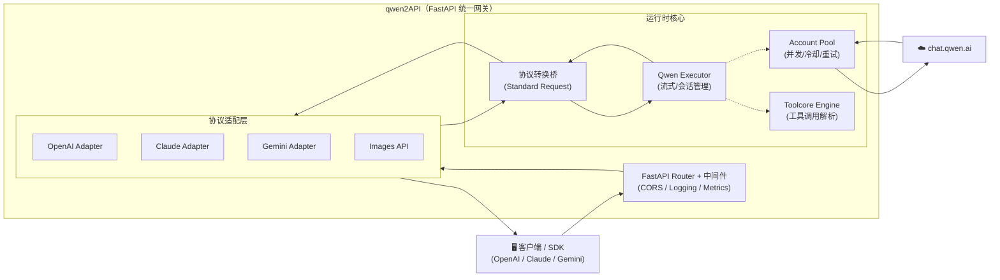

本页是 qwen2API 文档体系的起点，旨在为初次接触本项目的开发者提供清晰的全局认知。qwen2API 是一个企业级 AI 网关，其核心使命是将通义千问（chat.qwen.ai）的网页版对话能力转化为标准的 OpenAI、Anthropic Claude 和 Gemini API 接口。通过这一转换层，现有的 AI 应用无需修改代码即可无缝接入千问模型，同时获得账号池管理、工具调用解析、图片生成及可视化运维等企业级增强特性。本文档将帮助您快速理解项目定位、核心架构与功能边界，并指引后续的学习路径。

Sources: [README.md](README.md#L1-L18)

## 核心定位与价值主张

qwen2API 并非简单的 API 代理，而是一个功能完备的**协议转换与能力增强网关**。它解决了直接使用非官方或网页版 AI 服务时面临的接口不兼容、并发受限及管理困难等痛点。对于初学者而言，可以将本项目理解为一个“翻译官”兼“管家”：对外，它听懂 OpenAI/Claude/Gemini 等多种标准语言；对内，它高效调度千问网页版资源，并提供账号轮询、限流冷却、会话保持等高级管理能力。这种设计使得开发者能够以极低的迁移成本，在现有应用中集成千问的强大能力，同时享受企业级的稳定性与可控性。

Sources: [README.md](README.md#L20-L35)

## 系统架构全景

为了支撑多协议兼容与高并发场景，qwen2API 采用了分层解耦的架构设计。下图展示了从客户端请求到上游服务的完整数据流转过程，这是理解后续所有模块的基础。

该架构的核心在于**协议适配层**与**运行时核心**的分离。所有外部请求首先经过 FastAPI Router 和对应的适配器，被归一化为内部标准格式（Standard Request），再由统一的执行引擎处理。这种设计确保了新增协议或上游变更时，只需修改对应适配层，而无需触动核心业务逻辑。后端基于 Python FastAPI 构建，保证了异步 I/O 的高性能；前端则采用 React + Vite 提供可视化管理台，两者通过 Docker 容器化部署，实现了开箱即用的交付体验。

Sources: [README.md](README.md#L37-L85), [backend/main.py](backend/main.py#L145-L160)

## 关键能力矩阵

对于初学者，掌握以下核心能力是上手使用 qwen2API 的关键。下表总结了网关提供的主要功能及其对应的技术实现点，帮助您建立功能与代码的映射关系。

| 能力维度 | 核心功能 | 说明与价值 |
| :--- | :--- | :--- |
| **协议兼容** | OpenAI / Claude / Gemini 接口 | 支持 Chat Completions, Messages, GenerateContent 等主流标准，实现零代码迁移。 |
| **资源调度** | 账号池与并发控制 | 内置多账号轮询、动态冷却、故障自动重试，突破单账号速率限制。 |
| **工具增强** | Tool Calling 解析引擎 | 自动识别并转换三种协议的工具调用格式，支持工具结果回传与幻觉防护。 |
| **多模态** | 图片生成与文件处理 | 提供独立的 `/v1/images/generations` 接口，支持文件上传与上下文注入。 |
| **安全管控** | 待审批账户机制 | 公共 API 提交账号需管理员审核，数据隔离存储，防止恶意注入。 |
| **运维可观测** | WebUI 管理台与健康探针 | 可视化查看运行状态、管理 API Key；提供 `/healthz` 和 `/readyz` 探针。 |

这些能力共同构成了 qwen2API 的企业级特性。例如，**账号池**不仅仅是简单的列表轮询，它还结合了 `AccountStatsStore` 进行状态追踪和 `SessionAffinity` 实现会话粘滞，确保多轮对话的连贯性。**工具调用**方面，`Toolcore` 引擎不仅负责格式转换，还包含了指令解析、策略执行和流式状态机等复杂逻辑，以应对大模型输出不稳定的问题。

Sources: [README.md](README.md#L87-L120), [backend/main.py](backend/main.py#L95-L125)

## 接口与模型映射速查

在实际对接中，了解网关支持的端点和模型映射规则至关重要。qwen2API 默认将主流客户端的模型名称统一映射至 `qwen3.6-plus`，这意味着您在客户端调用 `gpt-4o` 或 `claude-3-5-sonnet` 时，实际请求会被路由到千问的对应模型。这种透明映射机制极大地简化了配置工作。

| 接口类型 | 路径 | 备注 |
| :--- | :--- | :--- |
| OpenAI Chat | `POST /v1/chat/completions` | 支持流式、工具调用、图片意图识别 |
| Anthropic Messages | `POST /anthropic/v1/messages` | Claude SDK 完全兼容 |
| Gemini Generate | `POST /v1beta/models/{model}:generateContent` | 支持流式与非流式 |
| Images Generation | `POST /v1/images/generations` | 独立图片生成链路 |
| Admin Management | `/api/admin/*` | 账号、Key、配置管理 |
| Health Check | `/healthz`, `/readyz` | K8s/Docker 健康探测 |

若传入的模型名未命中预设映射表，系统将直接透传该名称；若在管理台中配置了自定义映射，则以自定义规则为准。这种灵活性允许您在保持兼容性的同时，根据业务需求精细控制模型版本。

Sources: [README.md](README.md#L122-L165)

## 推荐学习路径

作为初学者，建议按照以下顺序阅读文档，以循序渐进地掌握 qwen2API：

1.  **动手实践**：首先阅读 [快速开始：Docker一键部署](2-kuai-su-kai-shi-docker-jian-bu-shi)，在本地跑通一个最小可用实例，获得直观体验。
2.  **配置理解**：接着查阅 [环境变量与配置详解](4-huan-jing-bian-liang-yu-pei-zhi-xiang-jie)，理解 `.env` 文件中各项参数的含义，学会调整网关行为。
3.  **架构深化**：当需要排查问题或二次开发时，深入研读 [架构总览：统一网关与协议转换](5-jia-gou-zong-lan-tong-wang-guan-yu-xie-yi-zhuan-huan) 及后续的运行时核心章节，理解数据流转细节。
4.  **专项突破**：根据实际需求，选择性阅读 [工具调用解析引擎（Toolcore）](12-gong-ju-diao-yong-jie-xi-yin-qing-toolcore)、[账号池：并发控制与限流冷却](10-zhang-hao-chi-bing-fa-kong-zhi-yu-xian-liu-leng-que) 等深度解析文档。

此路径遵循“先使用后理解，先整体后局部”的认知规律，能有效降低学习曲线。当前页面作为导航枢纽，请在探索过程中随时返回查阅相关概念定义。