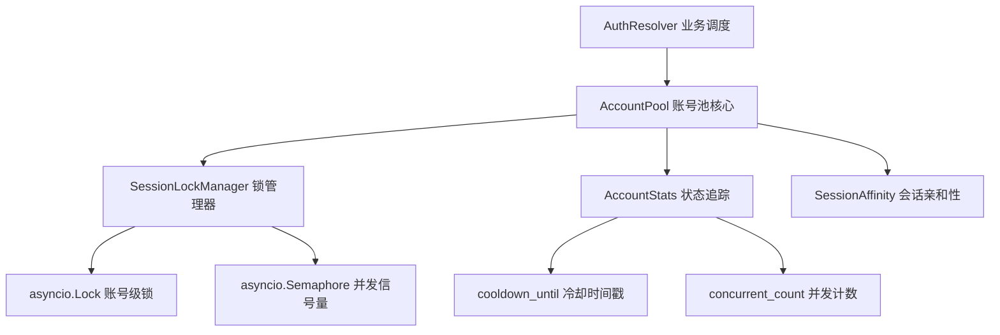
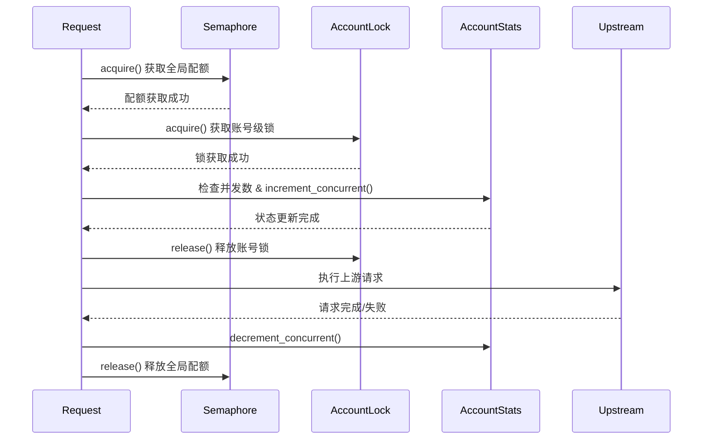

作为 qwen2API 网关的运行时心脏，**账号池（AccountPool）**负责统筹多账号状态、控制请求并发粒度、实施冷却熔断策略，确保上游 Qwen 服务在高负载下的稳定性与系统整体吞吐量的最优化。本页将深入剖析账号池的并发控制模型、限流冷却机制及其会话管理架构，揭示网关如何通过精准的账号调度抵御流量洪峰与上游限流。
Sources: [account_pool.py](backend/core/account_pool.py#L1-L30)

## 架构总览：分层调度与状态隔离

账号池的架构设计遵循**状态与调度分离**的核心原则，通过三层结构实现高并发环境下的精准流量控制：底层为 `AccountStats` 负责单一账号的原子状态记录（如冷却时间戳、并发计数）；中层为 `SessionLockManager` 提供基于 asyncio 的异步锁设施，保障并发修改的线程安全；顶层为 `AccountPool` 聚合全局账号视图，执行复杂的调度与筛选逻辑。在此架构下，`AuthResolver` 作为业务层入口，将账号选择与请求认证解耦，实现了从“获取可用账号”到“构建请求上下文”的无缝衔接。这种分层设计不仅降低了单模块的复杂度，还使得状态追踪、锁获取与策略判定能够独立演进与测试。

Sources: [account_pool.py](backend/core/account_pool.py#L26-L73), [account_stats.py](backend/core/account_stats.py#L1-L40), [session_lock.py](backend/core/session_lock.py#L1-L35)

## 状态追踪：AccountStats 与并发计数

`AccountStats` 是账号池状态管理的基石，为每个账号维护独立的运行时状态。其核心属性包括 `cooldown_until`（冷却截止时间戳）、`concurrent_count`（当前并发请求数）以及错误计数等诊断信息。并发计数机制通过 `increment_concurrent` 和 `decrement_concurrent` 方法实现原子性增减，确保在极短时间窗口内多个协程并发读取和修改状态时的数据一致性。当上游请求完成或异常中断时，系统必须调用 `decrement_concurrent` 释放配额，否则该账号将因并发计数泄漏而逐渐变为不可用状态。此设计将状态追踪的粒度精细到单账号级别，避免了全局锁带来的性能瓶颈，为后续的调度算法提供了精确的数据支撑。

| 状态属性 | 类型 | 作用说明 |
| :--- | :--- | :--- |
| `cooldown_until` | float | 账号冷却截止时间（Unix时间戳），大于当前时间则不可用 |
| `concurrent_count` | int | 当前正在进行的并发请求数，用于判断是否达到并发上限 |
| `last_used` | float | 最后一次使用时间戳，用于最少使用（LRU）调度策略 |
| `total_requests` | int | 历史总请求数，用于诊断与统计 |
| `failed_requests` | int | 历史失败请求数，用于计算错误率与熔断判定 |
Sources: [account_stats.py](backend/core/account_stats.py#L5-L65)

## 并发控制：会话锁与信号量机制

在高并发场景下，仅靠状态记录无法防止竞态条件，账号池引入了 `SessionLockManager` 构建双重并发控制防线。第一层是**账号级异步锁（asyncio.Lock）**，通过 `acquire_account_lock` 与 `release_account_lock` 方法，确保同一账号在同一时刻仅有一个协程能执行状态检查与更新操作（如检查并发数并递增），防止多个协程同时判定同一账号可用并超出并发限制。第二层是**全局并发信号量（asyncio.Semaphore）**，在系统层面限制总并发请求数，防资源耗尽。请求抵达时，协程首先尝试获取信号量配额，成功后再获取特定账号锁进行状态操作，使用完毕后依次释放账号锁与信号量。这种嵌套获取、逆序释放的锁协议，既保证了并发安全，又维持了系统的最大吞吐率。

Sources: [session_lock.py](backend/core/session_lock.py#L10-L80)

## 限流冷却：从降级到恢复的完整链路

当上游 Qwen 返回 429（Too Many Requests）或其他限流错误时，账号池的**限流冷却机制**被触发。`AuthQuota` 服务负责解析上游错误，并调用 `AccountPool.set_cooldown` 方法为特定账号注入冷却期。冷却期的时间长度由 `cooldown_seconds` 配置控制，默认为 60 秒。在冷却期内，该账号在 `select_account` 调度筛选时将被判定为不可用（`is_available` 检查失败），从而将流量引导至其他健康账号。冷却期结束后，账号自动恢复可用状态。若所有账号均进入冷却期，系统将根据配置返回 429 错误或排队等待，避免盲目重试导致雪崩效应。这种基于时间的退避策略，结合并发计数的状态追踪，实现了从“请求失败 -> 标记冷却 -> 流量转移 -> 自动恢复”的完整闭环，是网关抗压能力的核心保障。
Sources: [auth_quota.py](backend/services/auth_quota.py#L1-L50), [account_pool.py](backend/core/account_pool.py#L200-L250)

## 会话亲和性：上下文连续性保障

除了基于负载的通用调度，账号池还实现了**会话亲和性（Session Affinity）**机制，以满足 Qwen 上下文连续性的特殊需求。Qwen 的对话历史绑定在特定账号的会话 ID 上，若同一对话的后续请求切换账号，将导致上下文丢失。`SessionAffinity` 模块通过维护 `session_id -> account_id` 的映射关系，确保属于同一会话的请求始终路由至同一账号。当账号池执行 `select_account` 时，若请求携带 `session_id`，系统将优先查找亲和性映射；若亲和账号可用（未冷却且未达并发上限），则直接分配；若不可用，则降级为普通调度并清除映射关系。此机制在保障上下文连续性的同时，不牺牲系统的容错与负载均衡能力。
Sources: [session_affinity.py](backend/core/session_affinity.py#L1-L60), [account_pool.py](backend/core/account_pool.py#L260-L310)

## 调度算法：从池中筛选最优账号

账号池的核心调度逻辑位于 `select_account` 方法，该方法通过多级筛选与优先级排序，从账号池中选择最合适的账号执行请求。筛选过程遵循以下优先级：首先，排除处于冷却期（`cooldown_until > now`）的账号；其次，排除当前并发数已达上限（`concurrent_count >= max_concurrent`）的账号；再次，若请求携带会话 ID，优先匹配会话亲和性账号；最后，在剩余可用账号中，按 **最少并发优先** 策略选择 `concurrent_count` 最小的账号，若并发数相同则按 **LRU（最近最少使用）** 策略选择 `last_used` 最早的账号。这种复合调度策略既保证了请求的均匀分布，又兼顾了会话连续性与系统抗风险能力，是网关在高并发下维持稳定吞吐的关键。
Sources: [account_pool.py](backend/core/account_pool.py#L150-L200), [account_stats.py](backend/core/account_stats.py#L40-L65)

## 配置参数与性能调优

账号池的调度行为受 `Settings` 中多项配置参数的精细控制，合理的参数调整是性能优化的关键。`max_concurrent_per_account` 控制单账号最大并发数，该值需根据上游 Qwen 的账号级限流阈值设定，过低会导致账号利用率不足，过高则易触发上游 429 错误。`cooldown_seconds` 决定触发限流后的冷却时间，时间越长对上游越友好，但账号恢复可用的时间窗口也越长。开发者需在“吞吐量最大化”与“上游友好度”之间寻找平衡点，建议通过压测工具模拟真实流量，观察 429 错误率与平均响应时间，逐步逼近最优配置。

| 配置参数 | 默认值 | 调优建议 |
| :--- | :--- | :--- |
| `max_concurrent_per_account` | 1 | 若上游允许单账号多并发，可适当调高（如 2-3）以提升吞吐 |
| `cooldown_seconds` | 60 | 上游限流严格时可增加至 120-300，宽松可降至 30 |
| `account_selection_strategy` | lru | 支持轮询（round_robin）或随机（random），默认 LRU 适合长尾请求 |
Sources: [config.py](backend/core/config.py#L40-L90)

## 延伸阅读

理解账号池的并发与冷却机制后，建议继续探索以下关联模块，以获得网关运行时核心的完整图景：
- [账号池与状态存储](16-zhang-hao-chi-yu-zhuang-tai-cun-chu)：了解账号池的持久化机制与冷启动加载流程
- [会话管理与Chat ID预热池](11-hui-hua-guan-li-yu-chat-idyu-re-chi)：深入 Chat ID 的预热与分配策略，理解会话亲和性的底层依赖
- [认证与配额管理](18-ren-zheng-yu-pei-e-guan-li)：剖析上游 429 错误的解析与限流降级决策链路