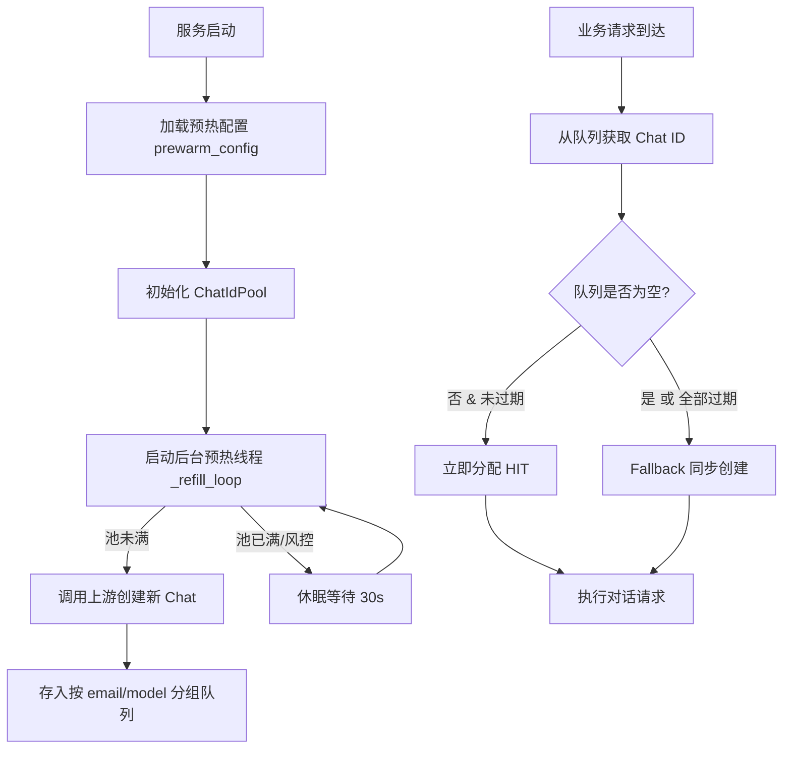
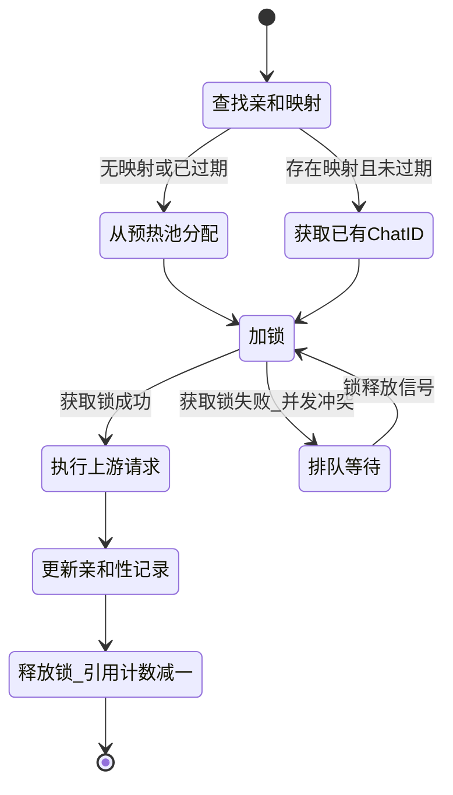

在多轮对话与高并发网关架构中，**会话管理**与**资源预热**是决定系统响应速度与稳定性的核心枢纽。本节将深入剖析 qwen2API 如何通过 Chat ID 预热池消除冷启动延迟，以及如何利用会话亲和性与锁机制保障多轮对话的上下文一致性，避免并发场景下的状态污染。

## 架构定位与核心问题

在网关将请求代理至上游 Qwen 服务时，每个会话需要绑定一个特定的 `chat_id` 以维持上下文连续性。然而，创建新的 `chat_id` 往往涉及网络 I/O 与上游服务器的初始化，这一过程在突发流量下会显著增加首字延迟（TTFT）。同时，如果并发请求随意复用或抢占同一 `chat_id`，将导致上游上下文混乱，产生“人格分裂”或信息泄露。为解决这两个问题，qwen2API 引入了 **预热池**（提前储备可用 Chat ID）与 **会话亲和性**（Session Affinity，绑定会话与 ID）机制。

Sources: [chat_id_pool.py](backend/services/chat_id_pool.py#L1-L11), [session_affinity.py](backend/core/session_affinity.py#L1-L10)

## Chat ID预热池机制

预热池的核心思想是**空间换时间**：系统在空闲时或低峰期预先向上游申请一批 `chat_id`，并将其缓存在本地队列中。当业务请求到达时，直接从池中分配，从而将耗时的创建操作从关键路径中移除。实测表明，该机制可每次请求节省 500ms~3000ms 的握手时延，在极端网络抖动场景下甚至可节省 5~6s。

Sources: [chat_id_pool.py](backend/services/chat_id_pool.py#L1-L4)

### 预热池生命周期

以下流程图展示了预热池从初始化、后台补充到分配回收的完整生命周期：

Sources: [chat_id_pool.py](backend/services/chat_id_pool.py#L86-L120), [main.py](backend/main.py#L124-L136)

### 预热策略与风控保障

预热行为通过配置文件与环境变量进行双重调优，并内置了严密的风控机制，防止预热本身对上游造成过大压力。

| 策略维度 | 实现机制 | 说明 |
|----------|----------|------|
| **按需补位** | 每 30 秒检查水位 | 仅当队列大小 < `target` 时才补位 |
| **风控限流** | 每轮每账号每模型最多补 1 个 | 避免短时间内大量调用上游 API 触发风控拦截 |
| **模型级熔断** | 单模型连续失败 3 次暂停该模型预热 | 屏蔽异常模型，保护整体预热通道 |
| **全局熔断** | 连续失败达 10 次触发 60s 冷却期 | 防止上游全面异常时本地空转消耗资源 |
| **过期淘汰** | TTL 默认 10 分钟 | `acquire()` 时检查存活期，过期丢弃并取下一个 |
| **Graceful Fallback** | 池空或过期时返回 `None` | 调用方自动降级到同步创建，**绝不阻塞请求** |

Sources: [chat_id_pool.py](backend/services/chat_id_pool.py#L40-L64), [chat_id_pool.py](backend/services/chat_id_pool.py#L186-L210)

## 会话亲和性与并发控制

获取到 `chat_id` 只是第一步，确保同一个多轮对话的后续请求能够准确命中同一个 `chat_id`，并在处理期间不被其他请求干扰，是会话管理的关键。

### 会话锁与亲和性映射

**会话亲和性**（Session Affinity）通过持久化 JSON 数据库记录 `session_key`（通常由客户端生成或网关分配）与 `chat_id`、`account_email` 的绑定关系。当携带相同 `session_key` 的请求到达时，系统优先复用已绑定的 `chat_id`，保证上下文连续。同时，亲和性记录还承载了上传文件元数据（`uploaded_files`）和消息哈希（`message_hashes`），确保附件与对话历史的完整追溯。

**会话锁**（Session Lock）则是在此基础上的并发安全屏障。当一个请求正在使用某个 `session_key` 关联的资源时，该 session 会被锁定。此时若有针对同一 `session_key` 的新请求到达，将被阻塞等待，直到前一个请求完成释放锁。这彻底杜绝了并发写入导致的上游上下文错乱，同时采用引用计数机制自动清理不再使用的锁对象，避免内存泄露。

Sources: [session_affinity.py](backend/core/session_affinity.py#L10-L31), [session_affinity.py](backend/core/session_affinity.py#L77-L112), [session_lock.py](backend/core/session_lock.py#L7-L40)

### 会话流转状态图

会话从请求接入、锁竞争到最终释放的状态变迁如下：

Sources: [session_lock.py](backend/core/session_lock.py#L13-L40), [session_affinity.py](backend/core/session_affinity.py#L90-L112)

## 上下文清理与回收

会话结束后，为了避免上游资源泄露和无效上下文累积，系统实现了自动化的**上下文清理**机制。当检测到会话超时（根据亲和性记录的 `expires_at` 字段）时，清理服务不仅会释放本地内存中的映射记录，还会根据 `UPSTREAM_AUTO_DELETE_ENABLED` 配置，调用上游 API 删除对应的对话上下文及远程上传文件，确保环境的干净隔离。该清理任务作为独立协程在后台每 5 分钟执行一次。

Sources: [context_cleanup.py](backend/services/context_cleanup.py#L12-L38), [session_affinity.py](backend/core/session_affinity.py#L145-L153)

## 总结

会话管理与预热池模块通过**预创建**、**亲和绑定**、**并发加锁**和**异步清理**四个维度的协同，构建了一个高性能且安全的会话运行时环境。理解这些机制，有助于在部署时合理调整预热池参数以应对流量洪峰，并在排查并发对话异常时快速定位锁冲突或亲和性失效问题。

对于资源调度的更广泛讨论，请参考 [账号池：并发控制与限流冷却](10-zhang-hao-chi-bing-fa-kong-zhi-yu-xian-liu-leng-que)；若需了解这些会话机制如何支撑复杂的工具调用流程，请继续阅读 [工具调用解析引擎（Toolcore）](12-gong-ju-diao-yong-jie-xi-yin-qing-toolcore)。