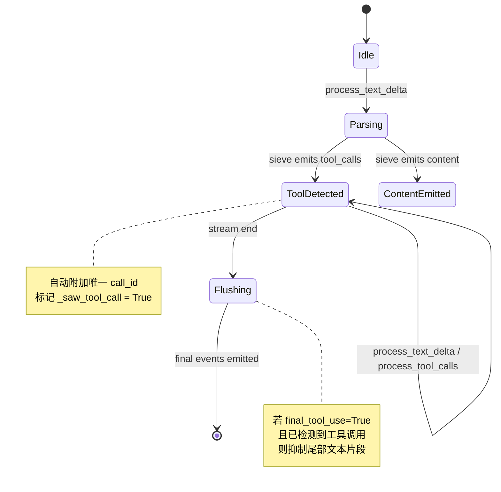

Toolcore 是 qwen2API 网关中负责工具调用全生命周期管理的核心子系统，位于协议适配层与上游执行引擎之间。它不直接执行工具，而是承担**请求归一化、流式解析、策略决策与上下文契约构建**四大职责，确保来自 OpenAI、Anthropic、Gemini 等不同协议的异构请求被统一转换为内部标准格式，并在流式响应中准确识别、补全和过滤工具调用片段。该模块通过严格的类型系统与状态机设计，解决了大模型在工具调用场景下常见的格式漂移、ID缺失及幻觉输出等问题，为上层业务提供确定性的工具交互语义。

Sources: [__init__.py](backend/toolcore/__init__.py#L1-L32)

## 核心数据模型与协议抽象

Toolcore 定义了一套与具体上游协议无关的规范数据模型，作为整个网关内部工具调用的“通用语言”。这套模型消除了不同 LLM 厂商在工具定义、调用参数及返回结果结构上的差异，使得后续的策略引擎与提示词构建器无需关心原始请求来源。

| 数据类型 | 核心字段 | 架构作用 |
| :--- | :--- | :--- |
| `ToolChoicePolicy` | AUTO, REQUIRED, NONE, FORCED | 标准化各协议对工具选择策略的枚举表达，支持强制指定或完全禁用 |
| `ToolDefinition` | name, parameters, aliases, client_name | 统一工具元数据描述，支持别名映射与客户端/模型名称解耦 |
| `CanonicalToolCall` | call_id, name, input | 规范化的工具调用指令，确保每个调用都有唯一标识符与结构化输入 |
| `CanonicalToolResult` | call_id, output, tool_name | 规范化的工具执行结果，通过 call_id 与调用指令精确关联 |
| `ToolCoreRequest` | messages, tools, tool_choice_policy, forced_tool_name | 聚合所有工具相关上下文的顶层容器，承载归一化后的完整请求状态 |

这些数据结构均使用 Python `dataclass(slots=True)` 实现，在保证内存效率的同时提供了清晰的类型约束。特别是 `ToolCoreRequest` 不仅包含消息历史和工具列表，还显式携带了 `tool_catalog` 和 `skill_catalog` 引用，使策略评估阶段能够访问完整的工具注册表信息，而不仅仅依赖序列化后的文本描述。

Sources: [types.py](backend/toolcore/types.py#L8-L51)

## 流式状态机与幻觉防护机制

在流式生成场景下，模型输出的工具调用往往以碎片化形式到达，且可能夹杂自然语言解释或格式错误的标记。`ToolStreamStateMachine` 通过封装 `ToolStreamSieve` 实现了增量解析与内容分流，是保障前端展示正确性和后端执行安全性的关键组件。

状态机在处理每个文本增量时，会将其传递给内部的筛分器（Sieve）。当筛分器识别出符合工具调用模式的片段时，状态机会立即为其分配全局唯一的 `call_id`（格式为 `toolu_{uuid}_{seq}`），并将事件类型标记为 `tool_calls`；普通文本则作为 `content` 事件透传。这种设计确保了即使上游模型未生成 ID，下游系统也能获得可追踪的调用句柄。

更为关键的是其**幻觉防护逻辑**：在流结束时的 `flush` 阶段，如果系统判定当前轮次已确认发生工具调用（`_saw_tool_call=True`）且处于最终工具使用模式，它会主动丢弃缓冲区中残留的文本片段。这一机制有效防止了模型在输出完工具调用 JSON/XML 后继续生成“好的，我将调用...”等冗余解释性文字，避免这些文字被误当作助手回复展示给用户或污染下一轮对话上下文。

Sources: [stream_state_machine.py](backend/toolcore/stream_state_machine.py#L17-L69)

## 策略决策与重复调用检测

Toolcore 内置了轻量级但可扩展的策略引擎，用于在运行时动态决定是否接受、重试或阻断特定的工具调用行为。当前的策略实现聚焦于**阻塞工具名的重试控制**与**同轮次重复调用检测**，为更复杂的配额管理和安全防护预留了接口。

`evaluate_tool_policy` 函数接收标准化请求、运行时状态及历史消息，返回一个 `ToolPolicyDecision`。当运行时状态中标记了 `blocked_tool_names` 且允许重试时，引擎会返回 `retry` 决策并附带具体原因，触发上层执行器重新规划或向模型注入纠正指令；否则默认返回 `accept`。这种将策略判断从执行循环中解耦的设计，使得新增限流规则或审计逻辑时无需修改核心调度代码。

为了支持防循环与去重，模块提供了 `recent_same_tool_identity_count_in_turn` 工具函数。该函数通过反向遍历当前轮次的助手消息，计算相同工具身份（Identity）的连续出现次数。工具身份的生成采用了语义感知策略：对于文件读取工具，仅比较目标路径；对于 Shell 命令，提取命令签名与工作目录；对于其他工具，则基于稳定序列化的输入 JSON 进行比对。这种细粒度的身份识别避免了因参数顺序变化或非关键字段差异导致的误判，为上层实现“禁止连续三次读取同一文件”等业务规则提供了可靠依据。

Sources: [policy.py](backend/toolcore/policy.py#L19-L74)

## 模块边界与导航指引

Toolcore 作为纯逻辑层，严格遵循无副作用原则：它不包含任何 HTTP 请求、数据库操作或文件系统访问代码，所有外部交互均通过传入的 `state`、`catalog` 等依赖对象完成。这种设计使其具备极高的可测试性，相关单元测试覆盖了从提示词构建回归到流式状态机边缘情况的完整验证矩阵。

在本页面中，我们聚焦于 Toolcore 的基础架构与核心原语。若您希望深入了解特定子系统的实现细节或集成方式，建议按以下路径继续阅读：

-   了解如何将各异构协议请求转换为 `ToolCoreRequest`：[请求归一化与单次飞行控制](26-qing-qiu-gui-hua-yu-dan-ci-fei-xing-kong-zhi)
-   掌握流式解析器的内部匹配算法与性能优化：[流式状态机与工具调用幻觉防护](24-liu-shi-zhuang-tai-ji-yu-gong-ju-diao-yong-huan-jue-fang-hu)
-   探索如何根据归一化结果构建符合模型要求的系统提示词：[提示词构建与上下文卸载](25-ti-shi-ci-gou-jian-yu-shang-xia-wen-xie-zai)
-   查看 V2 版本中指令解析与高级策略执行的演进：[Toolcore V2：指令解析与策略执行](23-toolcore-v2-zhi-ling-jie-xi-yu-ce-lue-zhi-xing)