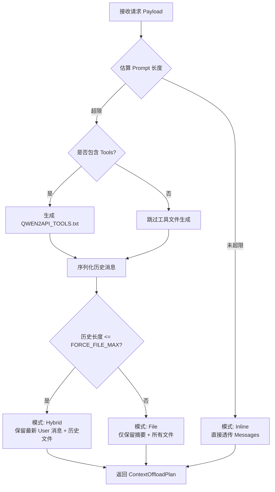
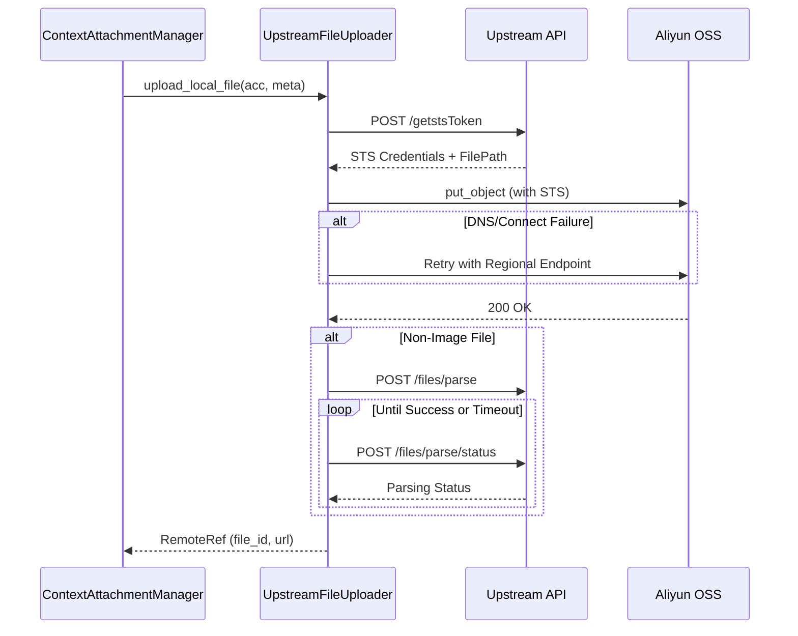

本页面深入解析 qwen2API 网关中的**上下文卸载（Context Offloading）**、**上游文件上传**及**会话级缓存**机制。该系统旨在解决大模型对话中 Token 限制与多轮交互状态保持的矛盾，通过将超长历史消息和工具定义序列化为文件并上传至上游 OSS，实现“无限”上下文窗口支持。同时，系统内置了基于 SHA256 的内容寻址缓存与会话亲和性绑定，确保在多账号池环境下文件访问的一致性与上传效率。对于高级开发者而言，理解此模块是掌握网关如何处理复杂 Agent 任务、长文档分析及降低 API 成本的关键。

## 上下文卸载策略与决策引擎

上下文管理的核心在于 `ContextOffloader`，它负责在请求发送前动态评估 Prompt 长度，并决定采用内联（Inline）、混合（Hybrid）还是纯文件（File）模式。该组件通过 `estimate_prompt_len` 方法精确计算消息与工具的字符开销，当历史记录超过 `CONTEXT_INLINE_MAX_CHARS` 阈值时，自动触发卸载流程。决策引擎不仅考虑文本长度，还会识别特殊的客户端配置（如 OpenClaw 或 Claude Code Profile），对特定格式的上下文进行清洗与分离，确保只有有效的任务指令保留在内联消息中，而冗长的背景知识被序列化到 `qwen2api_context_history.txt` 文件中。此外，工具定义（Tools）也会被独立提取并生成 `QWEN2API_TOOLS.txt`，避免工具 Schema 占用宝贵的对话窗口。

Sources: [context_offload.py](backend/toolcore/context_offload.py#L44-L166)

| 模式 | 触发条件 | 行为描述 | 适用场景 |
| :--- | :--- | :--- | :--- |
| **Inline** | `history_estimated <= CONTEXT_INLINE_MAX_CHARS` | 所有消息与工具定义直接放入 messages 数组 | 短对话、简单问答 |
| **Hybrid** | `CONTEXT_INLINE_MAX < history <= CONTEXT_FORCE_FILE_MAX` | 历史消息转为文件，但保留最新的用户指令与工具结果尾链在内联中 | 中等长度对话、需要强即时性的 Agent |
| **File** | `history_estimated > CONTEXT_FORCE_FILE_MAX_CHARS` | 几乎所有上下文均转为附件，内联仅保留系统提示与文件引用说明 | 长文档分析、代码库级任务 |

Sources: [context_offload.py](backend/toolcore/context_offload.py#L160-L186)

## 本地文件存储与生命周期管理

在文件上传至上游之前，网关使用 `LocalFileStore` 作为临时暂存区。该服务将生成的上下文文件或用户上传的附件写入 `data/context_files` 目录，并维护一份内存级元数据索引。每个文件记录包含唯一 ID、SHA256 哈希、MIME 类型及创建时间戳。为了防止磁盘空间耗尽，`LocalFileStore` 提供了 `cleanup_expired` 方法，定期清理超过 TTL 的临时文件。值得注意的是，一旦文件成功上传至上游 OSS，`ContextAttachmentManager` 会立即调用 `delete_path` 删除本地副本，确保本地存储仅作为瞬态缓冲区存在，而非持久化存储层。这种设计降低了网关实例的磁盘 I/O 压力，并简化了多实例部署时的状态同步问题。

Sources: [file_store.py](backend/services/file_store.py#L12-L106)

## 上游 OSS 上传与 STS 鉴权流水线

`UpstreamFileUploader` 实现了与阿里云 OSS 的安全直传协议。由于网关本身不持有长期有效的云存储凭证，它必须通过上游 API 获取临时安全令牌（STS）。上传流程首先调用 `/api/v2/files/getstsToken` 获取包含 AccessKeyId、Secret 及 SecurityToken 的凭证包，随后使用 `oss2.StsAuth` 初始化 Bucket 客户端。为了应对网络抖动，上传器内置了区域端点回退机制：当检测到 DNS 解析失败或连接错误时，会自动尝试构建区域性 Endpoint（如从加速域名回退到 `oss-{region}.aliyuncs.com`）。对于非图片类文件，上传完成后还需轮询 `/api/v2/files/parse/status` 接口，等待上游完成文档解析（如 PDF 转文本），只有当解析状态变为 `success` 后，文件才被视为可用。这一异步等待逻辑由 `CONTEXT_UPLOAD_PARSE_TIMEOUT_SECONDS` 配置控制，防止因解析超时阻塞整个请求链路。

Sources: [upstream_file_uploader.py](backend/services/upstream_file_uploader.py#L78-L184)

## 会话级缓存与账号亲和性绑定

为避免同一会话中重复上传相同文件，系统实现了 `UpstreamFileCache`。该缓存以 `(session_key, account_email, sha256, ext)` 为复合键，存储已上传文件的远程元数据。`session_key` 由 `derive_session_key` 函数根据 Surface 类型、Auth Token、Model 名称及首条用户消息等因子派生，确保同一逻辑会话在不同请求间共享缓存。更重要的是，文件上传与特定账号绑定：当缓存命中时，系统会优先获取该文件所属的账号；若该账号不可用，则需重新上传。这种**账号亲和性（Session Affinity）** 机制解决了上游平台文件隔离的问题——即 A 账号上传的文件 B 账号无法读取。当上传过程中遇到可重试错误（如网络超时）时，`_switch_account_on_retry` 会自动切换新账号并更新亲和性绑定，同时检查新账号下是否存在相同内容的缓存，最大化利用已有资源。

Sources: [context_attachment_manager.py](backend/services/context_attachment_manager.py#L209-L267), [upstream_file_cache.py](backend/core/upstream_file_cache.py#L34-L72)

| 缓存维度 | 字段 | 作用 |
| :--- | :--- | :--- |
| **会话标识** | `session_key` | 隔离不同用户/对话的缓存空间，防止跨会话污染 |
| **账号隔离** | `account_email` | 确保文件引用仅在上传者的账号上下文中有效 |
| **内容寻址** | `sha256` | 实现内容去重，相同内容的文件无需重复上传 |
| **时效控制** | `expires_at` | 自动淘汰过期缓存，适应上游文件生命周期 |

Sources: [upstream_file_cache.py](backend/core/upstream_file_cache.py#L10-L31)

## 容错降级与内联回退机制

上下文附件系统设计了多层防御以应对上游服务不可用的情况。当账号池耗尽、上传失败或解析超时时，`prepare_context_attachments` 不会直接抛出异常中断请求，而是触发 `_fallback_context_attachment_result` 降级逻辑。降级模式下，系统会将原本计划上传的文件内容（如历史摘要）重新注入到 messages 中，并附加 `SYSTEM_CONTEXT_PROMPT_NOTE` 提示模型当前处于降级状态。同时，返回结果中的 `attachment_fallback` 标志位会被置为 True，供上层调用者感知服务质量变化。这种“尽力而为”的策略保证了网关在上游文件服务波动时仍能提供基础的对话能力，尽管可能受限于 Token 窗口，但避免了完全的服务中断。对于手动上传的附件，若上传失败，系统也会在 fallback 消息中列出文件名，告知模型有哪些输入未能成功处理。

Sources: [context_attachment_manager.py](backend/services/context_attachment_manager.py#L89-L131), [context_attachment_manager.py](backend/services/context_attachment_manager.py#L304-L322)

## 延伸阅读

*   了解上下文卸载如何与提示词构建协同工作：[提示词构建与上下文卸载](25-ti-shi-ci-gou-jian-yu-shang-xia-wen-xie-zai)
*   深入理解账号池如何支持文件上传的并发控制：[账号池：并发控制与限流冷却](10-zhang-hao-chi-bing-fa-kong-zhi-yu-xian-liu-leng-que)
*   查看文件接口对外暴露的 API 规范：[图片生成与文件接口](9-tu-pian-sheng-cheng-yu-wen-jian-jie-kou)
*   探索附件预处理的完整链路：[附件预处理与上下文管理](21-fu-jian-yu-chu-li-yu-shang-xia-wen-guan-li)