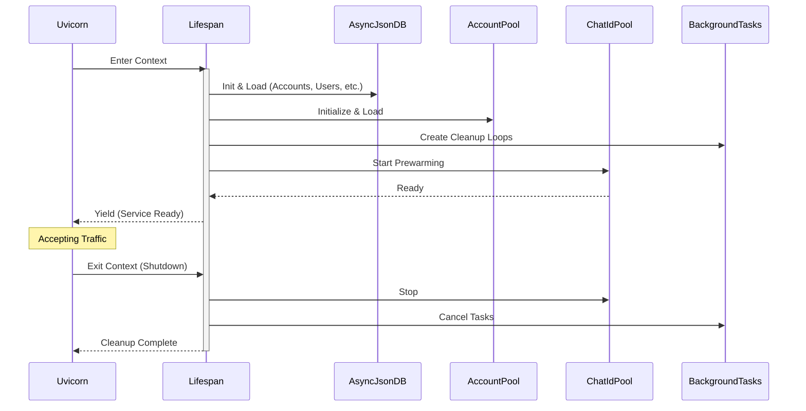

本文档深入解析 qwen2API 企业网关的后端启动机制、资源初始化顺序及优雅关闭流程。作为整个网关系统的“心脏”，`backend/main.py` 不仅定义了 FastAPI 应用实例，更通过 `lifespan` 上下文管理器编排了从数据库连接、账号池预热到后台清理任务的全链路生命周期。同时，`start.py` 作为开发环境的统一入口，封装了前后端进程的协同启动与信号处理逻辑，确保本地调试体验与生产环境行为的一致性。理解这一层是掌握网关并发模型与状态管理的基础。

## 应用启动编排与 Lifespan 上下文

qwen2API 采用 FastAPI 推荐的 `lifespan` 异步上下文管理器替代了传统的 `on_event` 钩子，确保了资源获取与释放的原子性与异常安全性。启动过程被严格划分为数据层初始化、服务组件装配、后台任务启动三个阶段，这种分层设计避免了循环依赖并明确了组件间的拓扑关系。在 `yield` 语句之前的代码块构成了服务的“就绪屏障”，只有当所有关键组件（如账号池、Chat ID 预热池）完成加载后，Uvicorn 才会开始接收外部流量，从而防止了冷启动期间的请求失败。

Sources: [main.py](backend/main.py#L67-L150)

## 核心组件初始化拓扑

在 `lifespan` 内部，组件的实例化遵循严格的依赖注入顺序。首先初始化的是基于 `AsyncJsonDB` 的持久化存储层，包括账号、用户、会话亲和性及文件缓存等六个独立数据库实例，它们为上层服务提供线程安全的异步读写能力。随后，业务服务层组件如 `AccountPool`、`QwenClient`、`LocalFileStore` 等被依次创建并挂载到 `app.state` 全局状态对象上。值得注意的是，`ChatIdPool` 的初始化位于启动序列的末端，它依赖于已就绪的 `QwenClient`，并通过读取配置动态调整预热模型列表与目标数量，这是优化首请求延迟的关键步骤。

| 组件类别 | 关键实例 | 初始化依赖 | 职责描述 |
| :--- | :--- | :--- | :--- |
| 数据存储 | `AsyncJsonDB` (x6) | Settings | 提供带文件锁的异步 JSON 持久化 |
| 统计/审计 | `AccountStatsStore`, `ApiKeyManager` | File System | 独立于主业务数据的统计与密钥管理 |
| 核心服务 | `AccountPool`, `QwenClient` | DB, Stats | 账号调度、上游请求执行 |
| 上下文管理 | `SessionAffinity`, `ContextOffloader` | DB, Settings | 会话粘滞、长上下文卸载 |
| 性能优化 | `ChatIdPool` | QwenClient, Config | Chat ID 预热，消除握手延迟 |
| 后台维护 | `garbage_collect_chats`, `cleanup_loop` | App State | 过期数据清理、API Key 记录维护 |

Sources: [main.py](backend/main.py#L72-L136)

## 请求中间件与指标采集管线

除了生命周期管理，`main.py` 还定义了全局 HTTP 中间件 `metrics_middleware`，它是网关可观测性的第一道防线。该中间件采用了**选择性拦截**策略，仅对 `/v1/` 前缀的业务 API 进行指标记录，自动跳过管理端点、静态资源及健康检查，避免了监控数据本身的噪声干扰。在性能敏感路径上，中间件实现了两项关键优化：一是通过 `Content-Length` 头预检请求体大小，对超限请求直接返回 413 状态码，防止恶意大报文耗尽内存；二是使用预编译正则 `_MODEL_PATTERN` 仅扫描请求体前 2KB 提取 `model` 字段，避免了对数百 KB 的完整 JSON Body 进行反序列化，将指标采集的 CPU 开销降至微秒级。

Sources: [main.py](backend/main.py#L20-L21), [main.py](backend/main.py#L163-L198)

## 进程启动器与信号协调机制

对于本地开发与调试场景，`start.py` 提供了一个跨平台的进程编排器。该脚本不仅仅是简单的命令包装，它内置了**端口冲突自愈**、**依赖自动安装**及**就绪状态探测**三大机制。在启动后端前，`kill_port` 函数会根据操作系统差异调用 `netstat` 或 `lsof` 强制释放被占用的端口，解决了开发者频繁重启时的痛点。后端进程启动后，脚本通过独立线程实时流式读取 stdout，一旦检测到 "Application startup complete" 或 "服务已完全就绪" 关键字即标记服务可用，实现了比固定 sleep 更可靠的启动同步。此外，脚本注册了 SIGINT/SIGTERM 信号处理器，确保在 Ctrl+C 中断时能级联终止前后端子进程，防止僵尸进程残留。

Sources: [start.py](start.py#L72-L99), [start.py](start.py#L132-L154), [start.py](start.py#L174-L186)

## 下一步阅读建议

掌握了入口与生命周期后，建议按照以下路径深入具体子系统：

-   了解启动阶段加载的配置项来源与模型映射规则：[配置管理：Settings与模型映射](15-pei-zhi-guan-li-settingsyu-mo-xing-ying-she)
-   探究 `AccountPool` 在运行时如何进行并发控制与限流：[账号池：并发控制与限流冷却](10-zhang-hao-chi-bing-fa-kong-zhi-yu-xian-liu-leng-que)
-   理解 `ChatIdPool` 预热背后的会话管理机制：[会话管理与Chat ID预热池](11-hui-hua-guan-li-yu-chat-idyu-re-chi)
-   查看网关对外暴露的健康检查端点实现：[健康检查与就绪探针](33-jian-kang-jian-cha-yu-jiu-xu-tan-zhen)