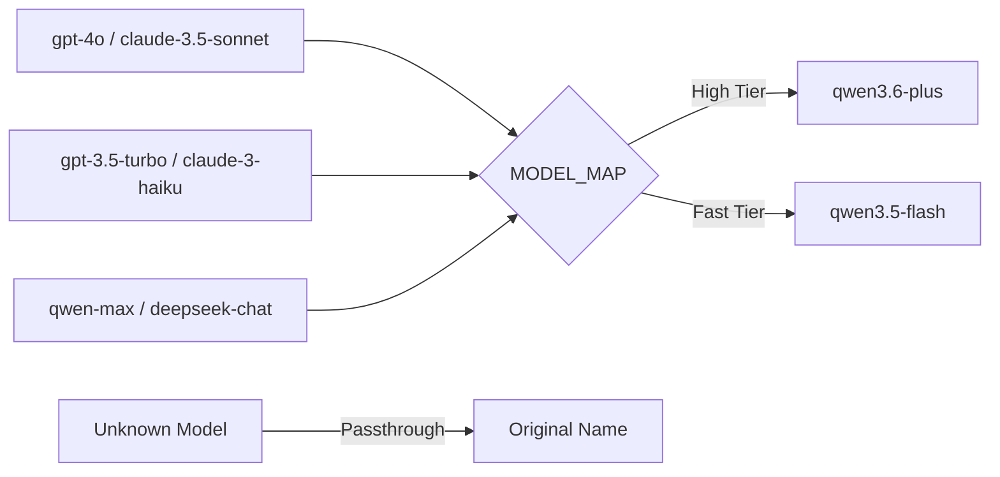
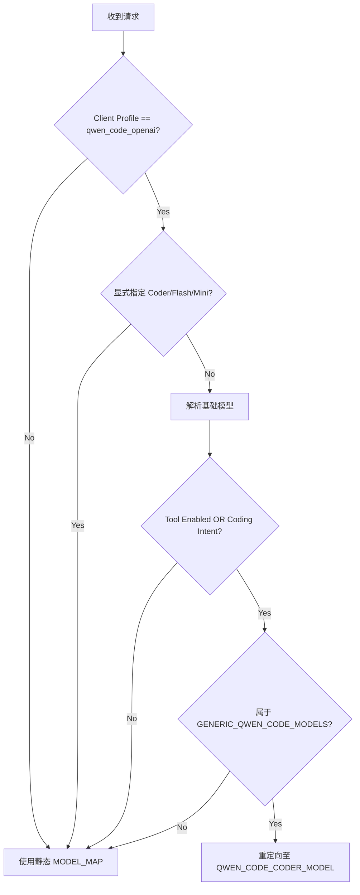

本页深入解析 qwen2API 网关的配置中枢 `backend/core/config.py`。该模块不仅定义了服务运行所需的所有环境变量与默认值，还实现了核心的**模型路由策略**与**动态配置持久化**机制。对于中级开发者而言，理解此模块是掌握网关如何将多协议请求（OpenAI/Anthropic/Gemini）统一映射至 Qwen 后端、以及如何通过智能路由优化代码生成任务的关键。配置系统采用 Pydantic Settings 实现类型安全的环境变量注入，同时结合硬编码映射表与运行时意图识别，构建了灵活且可预测的请求分发体系。

## Settings 配置类与环境变量体系

`Settings` 类继承自 `pydantic_settings.BaseSettings`，作为全局单例 `settings` 在应用启动时加载。它支持从 `.env` 文件及系统环境变量中自动读取配置，并提供严格的类型转换与默认值回退机制。配置项按功能域划分为服务基础、容灾限流、上游超时、上下文管理及功能开关等类别，确保各子系统解耦且可独立调优。例如，`ACCOUNT_SELECTION_STRATEGY` 允许在 "least_loaded" 等策略间切换，而 `REQUEST_MAX_BODY_BYTES` 则提供了防止内存溢出的安全边界。所有布尔型开关均兼容 "true/1/yes/on" 等多种真值表示法，提升了运维配置的容错性。

Sources: [config.py](backend/core/config.py#L10-L80)

### 核心配置项分类速查

| 配置域 | 关键变量 | 默认值 | 说明 |
| :--- | :--- | :--- | :--- |
| **服务基础** | `PORT`, `WORKERS`, `ADMIN_KEY` | 8080, 3, admin | 监听端口、Uvicorn 工作进程数及管理后台密钥 |
| **并发控制** | `MAX_INFLIGHT_PER_ACCOUNT`, `GLOBAL_MAX_INFLIGHT` | 1, 0 | 单账号最大并发数，全局并发上限（0为无限） |
| **容灾冷却** | `RATE_LIMIT_BASE_COOLDOWN`, `ACCOUNT_BUSY_TIMEOUT_SECONDS` | 600s, 900s | 触发限流后的基础冷却时间，账号繁忙超时阈值 |
| **上游超时** | `QWEN_UPSTREAM_REQUEST_TIMEOUT_SECONDS` | 60s | 非流式请求的上游响应超时时间 |
| **上下文** | `CONTEXT_INLINE_MAX_CHARS`, `CONTEXT_ATTACHMENT_TTL_SECONDS` | 4000, 1800s | 内联文本最大字符数，附件缓存生存时间 |
| **功能开关** | `TOOLCORE_V2_ENABLED`, `UPSTREAM_AUTO_DELETE_ENABLED` | false | 启用 Toolcore V2 引擎，上游文件自动清理 |

Sources: [config.py](backend/core/config.py#L12-L77)

## 静态模型映射与协议归一化

为了实现多协议兼容，网关维护了一个名为 `MODEL_MAP` 的静态字典，将 OpenAI、Anthropic、Gemini 及 DeepSeek 等第三方模型名称统一映射到实际的 Qwen 后端模型（如 `qwen3.6-plus` 或 `qwen3.5-flash`）。这种设计使得客户端无需修改代码即可通过更换模型名来切换底层能力。`resolve_model` 函数作为查找入口，若未命中映射表则原样返回模型名，保证了透传兼容性。此外，`GENERIC_QWEN_CODE_MODELS` 集合定义了被视为“通用代码模型”的白名单，这是后续智能路由决策的基础依据。

Sources: [config.py](backend/core/config.py#L143-L187)

### 模型映射关系示例

Sources: [config.py](backend/core/config.py#L143-L179)

## 智能代码模型路由策略

除了静态映射，网关还实现了基于意图的动态路由逻辑 `should_route_qwen_code_to_coder`。当客户端 Profile 为 `qwen_code_openai` 且请求满足特定条件时，系统会将原本指向通用模型（如 `qwen-plus`）的请求强制重定向至专用代码模型（由 `QWEN_CODE_CODER_MODEL` 指定）。触发重定向的条件包括：启用了工具调用（`tool_enabled=True`）或被识别为编码任务（`coding_intent=True`）。该逻辑内置了多重防护：若用户已显式指定 Coder 模型、Flash/Mini 等轻量模型，或解析后的目标已是 Coder 模型，则跳过重定向，避免过度干预用户意图。

Sources: [config.py](backend/core/config.py#L190-L246)

### 路由决策流程图

Sources: [config.py](backend/core/config.py#L208-L246)

## 配置持久化与 API Key 兼容层

尽管大部分配置通过环境变量注入，但部分运行时状态需要持久化存储。`load_prewarm_config` 和 `save_prewarm_config` 函数负责管理 Chat ID 预热池的配置，支持在服务重启后恢复预热策略。这些函数内置了异常捕获与目录自动创建逻辑，确保在文件系统不可用时能优雅降级至默认配置。此外，为了平滑迁移旧版本代码，`config.py` 保留了 `API_KEYS` 全局变量及 `load_api_keys` 等兼容接口，它们在内部委托给新的 `ApiKeyManager` 实现，使遗留代码无需重构即可继续访问认证数据。

Sources: [config.py](backend/core/config.py#L82-L136)  
Sources: [config.py](backend/core/config.py#L249-L281)

## 延伸阅读建议

掌握配置管理后，建议按照以下路径深入相关模块：
-   了解配置如何驱动账号调度：[账号池：并发控制与限流冷却](10-zhang-hao-chi-bing-fa-kong-zhi-yu-xian-liu-leng-que)
-   探究模型映射在协议适配层的实际应用：[OpenAI Chat Completions接口适配](6-openai-chat-completionsjie-kou-gua-pei)
-   学习代码路由策略依赖的工具调用引擎：[工具调用解析引擎（Toolcore）](12-gong-ju-diao-yong-jie-xi-yin-qing-toolcore)
-   查看完整的部署配置清单：[环境变量与配置详解](4-huan-jing-bian-liang-yu-pei-zhi-xiang-jie)