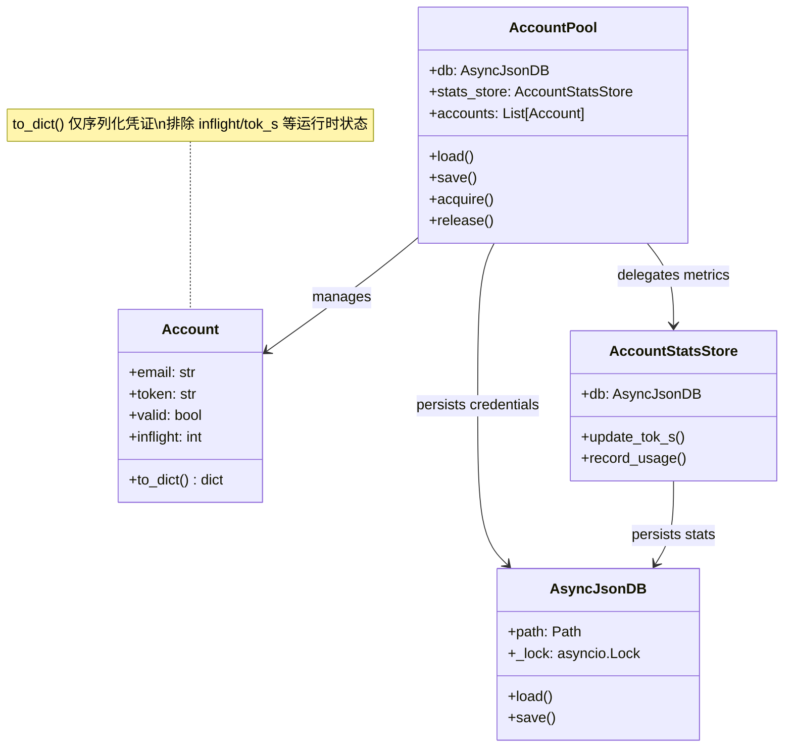
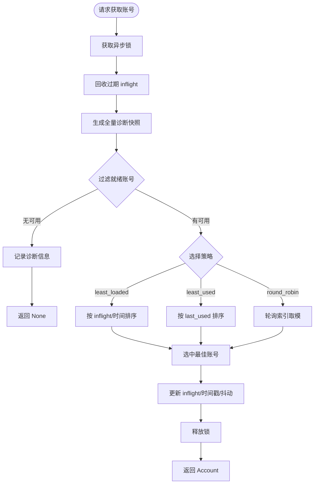

本页深入解析 qwen2API 网关中上游账号资源的管理核心。该系统采用**凭证与状态分离**的架构设计，通过 `AccountPool` 实现高并发下的资源调度与自我保护，利用独立的 `AccountStatsStore` 承载高频写入的性能指标，并借助 `AsyncJsonDB` 保障文件存储的原子性。这种分层存储策略有效避免了运行时统计数据的频繁序列化对凭证文件造成的 IO 压力与损坏风险，同时提供了精细化的限流冷却、故障隔离及多策略负载均衡能力，确保网关在大规模请求下维持稳定的上游连接可用性。

## 存储架构：凭证与状态的物理隔离

为了防止高频更新的统计数据（如 Token 速率、小时级用量）污染核心凭证文件，系统实施了严格的存储职责分离。`Account` 对象仅持久化身份认证所需的静态字段（email, password, token, cookies, proxy），而所有运行时产生的动态指标均被路由至独立的存储后端。这种设计确保了 `accounts.json` 仅在账号增删改等低频管理操作时发生写入，极大降低了文件锁竞争和数据损坏概率。

`Account.to_dict()` 方法明确界定了持久化边界，仅返回凭证与基础配置字段。与此同时，`AccountStatsStore` 使用独立的数据文件 `data/account_stats.json`，并通过 EMA（指数移动平均）算法平滑更新 tok/s 指标，支持按模型维度的精细化统计。在系统启动时，`AccountPool.load()` 会触发一次幂等的遗留数据迁移，将旧格式中混杂在凭证文件里的统计字段自动提取并转入新的统计存储中，保证了向后兼容性。

Sources: [account_pool.py](backend/core/account_pool.py#L126-L138)
Sources: [account_stats.py](backend/core/account_stats.py#L46-L125)
Sources: [account_pool.py](backend/core/account_pool.py#L154-L164)

## 账号生命周期与多重保护机制

每个上游账号都被建模为一个具有复杂状态机的实体，内置了多层自我保护逻辑以应对上游服务的限流与不稳定。`Account.is_available()` 方法是调度器的核心守门员，它依次检查账号有效性、限流冷却期以及连续失败触发的惩罚性冷却期。只有当所有检查均通过时，账号才会被标记为“就绪”状态参与调度。

| 状态码 | 触发条件 | 恢复机制 | 说明 |
| :--- | :--- | :--- | :--- |
| `valid` | 默认状态或 `mark_success` 调用 | - | 账号可正常参与调度 |
| `rate_limited` | 上游返回 429 或触发限流 | 指数退避 + 随机抖动 | 冷却时长随 `rate_limit_strikes` 倍增 |
| `cooldown` | 连续失败次数 ≥ 阈值 | 固定时长冷却 | 防止故障账号持续消耗请求配额 |
| `pending_activation` | 账号需二次验证或激活 | 管理员手动审批 | 阻止未激活账号进入生产流量 |
| `banned` / `auth_error` | 凭证失效或被封禁 | 需人工介入修复 | 永久标记不可用直至重置 |

限流冷却算法采用了带抖动的指数退避策略：`dynamic = min(MAX, BASE * 2^(strikes-1)) + jitter`。这种非线性增长能有效避免多个账号在同一时刻解除限流后再次集体触发上游风控。此外，系统还实现了**过期占用回收机制** (`_reclaim_stale_inflight`)，定期扫描 `inflight > 0` 但长时间未完成的请求，强制释放其占用的并发槽位，防止因异常中断导致的资源死锁。

Sources: [account_pool.py](backend/core/account_pool.py#L58-L74)
Sources: [account_pool.py](backend/core/account_pool.py#L549-L559)
Sources: [account_pool.py](backend/core/account_pool.py#L186-L204)
Sources: [account_pool.py](backend/core/account_pool.py#L525-L539)

## 调度策略与并发控制模型

`AccountPool` 提供了一个异步安全的资源获取接口，支持三种可配置的调度策略以适应不同的业务场景。所有获取操作均在 `asyncio.Lock` 保护下执行，确保在高并发环境下账号状态的一致性。调度器在每次选择前都会实时计算诊断快照，排除处于冷却、限流或满载状态的账号。

*   **Least Loaded (默认)**: 优先选择当前并发数 (`inflight`) 最低的账号，适用于长尾请求较多的场景，能最大化吞吐量。
*   **Least Used**: 优先选择最久未被使用的账号，实现请求在所有健康账号间的均匀分布，适合对账号磨损均衡有要求的场景。
*   **Round Robin**: 简单的顺序轮询，开销最小，但在账号数量较少时可能导致负载不均。

对于无法立即获取资源的场景，系统提供了 `acquire_wait` 和 `acquire_wait_preferred` 方法。这些方法内部维护了一个等待者队列 (`_waiters`)，当账号被 `release` 时会主动唤醒队首的等待事件。等待超时时间经过智能计算，取剩余超时与下一个账号预计就绪时间的较小值，既避免了无效空转，又保证了资源释放后的即时响应。

Sources: [account_pool.py](backend/core/account_pool.py#L400-L459)
Sources: [account_pool.py](backend/core/account_pool.py#L461-L516)
Sources: [account_pool.py](backend/core/account_pool.py#L518-L523)

## 底层持久化与并发安全

所有状态存储均构建于 `AsyncJsonDB` 之上，这是一个轻量级的异步 JSON 文件数据库封装。尽管底层使用的是文件系统而非关系型数据库，但通过 `asyncio.Lock` 实现了严格的串行化读写，确保了在多协程环境下的数据完整性。该组件在初始化时会自动创建目录结构，并在读取失败时优雅降级至默认数据，增强了系统的鲁棒性。

值得注意的是，虽然 `AsyncJsonDB` 提供了异步接口，但其实际的 IO 操作（`read_text` / `write_text`）在当前实现中是同步阻塞的。这一设计决策基于“配置文件体积通常很小”的假设，避免了引入线程池调度的额外复杂性。然而，这也意味着如果 `account_stats.json` 因长期运行变得过大，频繁的保存操作可能会短暂阻塞事件循环。因此，前述的凭证与状态分离架构不仅是逻辑上的解耦，更是性能层面的必要优化，它将高频小写入限制在独立的存储文件中，保障了核心调度路径的低延迟。

Sources: [database.py](backend/core/database.py#L9-L49)
Sources: [account_stats.py](backend/core/account_stats.py#L81-L87)

## 关联模块导航

理解账号池与状态存储后，建议继续探索以下相关主题以构建完整的架构认知：

*   **[账号池：并发控制与限流冷却](10-zhang-hao-chi-bing-fa-kong-zhi-yu-xian-liu-leng-que)**: 从运行时视角进一步了解账号池如何与请求处理链路集成。
*   **[待审批账户机制与安全管控](29-dai-shen-pi-zhang-hu-ji-zhi-yu-an-quan-guan-kong)**: 深入了解 `PendingAccountStore` 如何实现账号提交的安全审核流程。
*   **[Qwen客户端与执行引擎](17-qwenke-hu-duan-yu-zhi-xing-yin-qing)**: 查看获取到的 `Account` 对象如何在实际的上游请求中被消费与管理。
*   **[认证与配额管理](18-ren-zheng-yu-pei-e-guan-li)**: 了解 API Key 到上游账号的映射关系及配额限制逻辑。