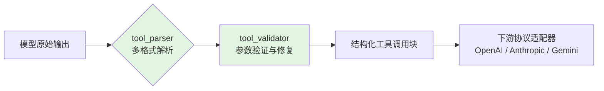
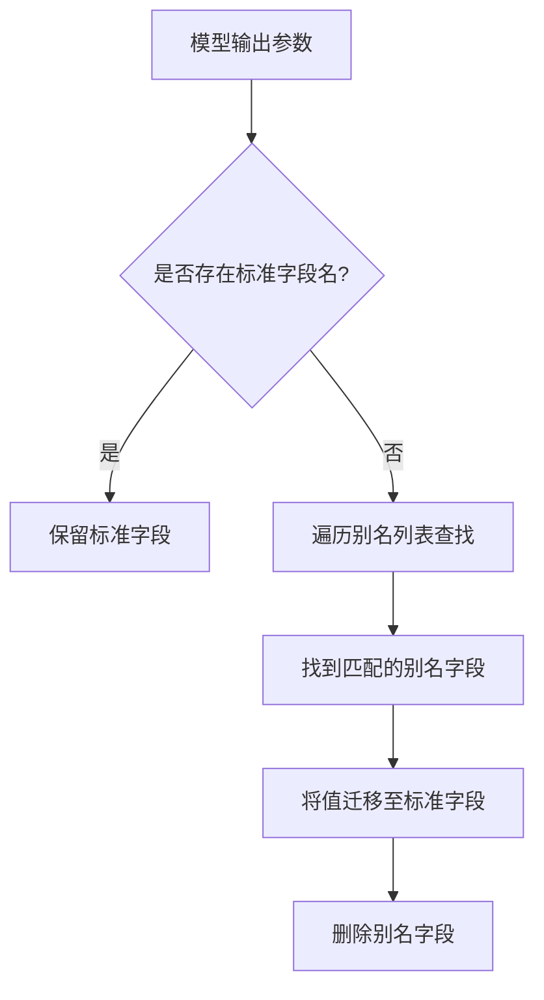

在 qwen2API 企业网关中，**工具解析与验证**模块是连接上游大模型输出与下游客户端工具链的关键桥梁。该模块的核心职责是将通义千问等模型返回的原始文本转化为结构化的工具调用指令，并对参数进行合规性校验，确保下游的 Claude Code 等客户端能够正确执行。本页将围绕 `backend/services/tool_parser.py` 与 `backend/services/tool_validator.py` 两个核心文件，深入剖析多格式解析策略、参数归一化逻辑与流式检测机制。

## 架构定位：从文本到结构化工具的转换层

工具解析与验证层位于网关的**服务层**，上承 `toolcore`（工具调用核心引擎），下接各种协议适配器。其架构价值体现在三个维度：**兼容性**（支持多种模型输出格式）、**健壮性**（容错解析与参数修复）、**实时性**（流式场景下的增量检测）。



上图呈现了工具解析与验证的完整数据流。模型返回的原始文本首先进入 `tool_parser` 的多格式解析管道，识别并提取工具调用意图；随后 `tool_validator` 对解析出的参数进行规范化校验和修复；最终输出标准化的工具调用块（`tool_use` blocks），供下游协议适配器消费。

Sources: [tool_parser.py](backend/services/tool_parser.py#L1-L839), [tool_validator.py](backend/services/tool_validator.py#L1-L181)

---

## 多格式解析策略：七级容错管道

`tool_parser.py` 的核心设计采用**多级回退（multi-level fallback）**策略，依次尝试从七种不同的格式中解析工具调用。这种设计源于上游模型输出格式的不确定性——通义千问可能在不同场景下输出 `##TOOL_CALL##` 哈希标记、XML 标签、纯 JSON 对象或代码块包裹的 JSON 等格式。

解析管道按优先级排列如下：

| 优先级 | 格式名称 | 识别特征 | 适用场景 |
|:---|:---|:---|:---|
| 1 | **DSML/详细解析** | 通过 `parse_textual_tool_calls` 处理 | Toolcore V2 标准格式（首选） |
| 2 | **哈希标记格式** | `##TOOL_CALL##` ... `##END_CALL##` | 早期通义千问协议 |
| 3 | **XML 标签格式** | `<tool_call>` ... `</tool_call>` | 带 XML 包装的工具调用 |
| 4 | **代码块格式** | `` ```tool_call\n{...}\n``` `` | Markdown 代码块包裹 |
| 5 | **旧 JSON 格式** | `{"type": "tool_use", "name": "..."}` | 类 OpenAI 的 JSON 对象 |
| 6 | **纯 JSON 格式** | `{"name": "...", "input": {...}}` | 最简 JSON 工具调用 |
| 7 | **文本回退** | 无匹配格式 | 返回普通文本块 |

解析入口函数 `_parse_tool_calls_via_toolcore` 首先调用 `toolcore` 引擎进行标准格式解析；若失败，则依次尝试后续六种格式，直至成功或最终回退为普通文本。每一级解析失败时都会记录详细的调试日志，便于问题定位。

Sources: [tool_parser.py](backend/services/tool_parser.py#L410-L608)

---

## 参数归一化：别名映射与类型修复

工具调用解析成功仅是第一步，参数内容的**规范化（Normalization）** 同样关键。`tool_parser.py` 中实现了针对常用工具的参数别名映射逻辑，以应对上游模型使用非标准字段名的场景。

以 `Read` 工具为例，模型可能输出 `filePath`、`path` 或 `filename` 来代替标准的 `file_path` 字段。`_coerce_read_input` 函数通过 `_pick_declared_key` 和 `_move_alias_value` 两个辅助函数，在工具定义（`tools` 参数）的 `properties` 中查找与别名匹配的实际字段名，并将值迁移到正确的位置。



类似地，`_coerce_shell_input` 处理 `command`、`workdir`、`description` 等字段的别名；`_coerce_search_files_input` 处理 `path` 与 `pattern` 的别名映射。对于 `AskUserQuestion` 和 `Agent` 等特殊工具，还实现了完整的默认值填充逻辑——例如将单个 `question` 字段自动扩展为 `questions` 数组格式。

这些归一化函数被组织为注册表 `TOOL_INPUT_COERCERS_BY_NAME`（按精确名称匹配）和 `TOOL_INPUT_COERCERS_BY_NORMALIZED_NAME`（按小写规范化名称匹配），在执行时根据工具名动态路由。

Sources: [tool_parser.py](backend/services/tool_parser.py#L235-L399)

---

## 流式检测：ToolSieve 增量解析器

在**流式输出（Streaming）** 场景下，工具调用标记可能被切分在多个数据块（chunk）中，无法等到全部内容接收完毕后再解析。`ToolSieve` 类专为这一场景设计，实现了增量式的工具调用检测与分离。

`ToolSieve` 维护三个状态变量：`pending`（待处理缓冲区）、`capture`（正在捕获的工具调用内容）和 `capturing`（是否处于捕获模式）。其核心工作流程分为两个阶段：

1. **检测阶段（`process_chunk`）**：接收新的文本 chunk，追加到 `pending` 缓冲区。通过 `_find_tool_start` 方法扫描多种工具调用起始标记（如 `{"name":`、`##tool_call##`、`<tool_call>` 等）。一旦检测到起始标记，将起始位置之前的文本作为安全内容输出，后续内容转入捕获模式。

2. **解析阶段（`_consume_tool_capture`）**：在捕获模式下，持续积累文本并尝试调用 `parse_tool_calls_silent` 进行解析。当解析成功（`stop_reason == "tool_use"`）时，立即分离出前缀文本和工具调用块；若解析失败则继续等待更多数据。

`flush` 方法在流结束时被调用，执行最后的解析尝试，确保残留内容得到正确处理。`_split_safe_content` 方法通过保留缓冲区末尾的少量字符，防止工具调用起始标记被意外截断。

Sources: [tool_parser.py](backend/services/tool_parser.py#L611-L784)

---

## 参数验证与修复：tool_validator

`tool_validator.py` 模块专注于**下游兼容性保障**，针对 Claude Code 等客户端的特定要求，对工具参数进行后置校验和修复。与 `tool_parser` 的归一化逻辑形成互补，`tool_validator` 更侧重于业务层面的参数结构完整性。

当前实现了四类工具的专项修复逻辑：

| 工具名称 | 修复内容 |
|:---|:---|
| **AskUserQuestion** | 将单数 `question` 扩展为 `questions` 数组；为每个问题填充默认的 `header`、`options` 和 `multiSelect` 字段；将字符串选项转换为标准对象格式 |
| **Agent** | 确保 `description` 和 `prompt` 字段存在，若缺失则填充默认值 |
| **Read** | 将 `path`、`filename` 等别名映射为标准的 `file_path` |
| **Bash** | 将 `cmd`、`script` 等别名映射为标准的 `command` |

`validate_and_fix_tool_call` 作为统一入口，根据工具名称分派到对应的修复函数。这种设计允许未来轻松扩展新的工具类型支持。

Sources: [tool_validator.py](backend/services/tool_validator.py#L11-L181)

---

## 格式纠错注入：inject_format_reminder

当上游模型使用了错误的工具调用格式（如输出纯 JSON 而非 DSML/XML 协议）时，网关需要向模型反馈纠错信息，引导其在下一轮次使用正确的格式。`inject_format_reminder` 函数通过在提示词末尾注入 `[纠正/CORRECTION]` 标记，强制模型遵循指定的 DSML/XML 协议。

该函数支持两种变体：`inject_format_reminder` 针对格式错误，`inject_format_reminder_for_allowed_tools` 针对使用了未声明工具名的场景。后者会额外检查工具名称是否在允许的列表内，若不匹配则将工具名修正为列表中的首个可用名称。两种注入方式均会自动定位提示词末尾的 `Assistant:` 分隔符，在正确位置插入纠错信息，避免破坏对话结构。

Sources: [tool_parser.py](backend/services/tool_parser.py#L787-L839)

---

## 工具名大小写规范化

通义千问在工具调用时可能输出大小写不一致的工具名（如 `bash` 与 `Bash`）。`_normalize_tool_name_case` 函数实现了大小写归一化逻辑：首先进行精确匹配；若失败则进行不区分大小写的模糊匹配。对于 `Bash`、`Edit`、`Write`、`Read`、`Grep`、`Glob`、`WebFetch` 等**大小写敏感的工具名**，会强制恢复为标准的大写形式；其余工具名则使用注册表中的原始大小写。

这一机制通过 `CASE_SENSITIVE_TOOL_NAMES` 集合显式声明哪些工具需要大小写敏感处理，在提升兼容性的同时保留了关键工具的命名严格性。

Sources: [tool_parser.py](backend/services/tool_parser.py#L18-L101)

---

## 总结与延伸阅读

工具解析与验证模块通过**多格式解析管线、参数alias归一化、流式增量检测、下游兼容性修复**四大核心机制，构建了一个高度容错的工具调用预处理层。其设计哲学是"先解析、再归一、后验证"，在最大兼容上游模型多样输出的同时，确保下游客户端接收到的始终是结构规范、语义正确的工具调用指令。

如需深入了解相关模块，建议继续阅读：
- [Toolcore V2：指令解析与策略执行](23-toolcore-v2-zhi-ling-jie-xi-yu-ce-lue-zhi-xing) — 了解工具调度的核心引擎
- [流式状态机与工具调用幻觉防护](24-liu-shi-zhuang-tai-ji-yu-gong-ju-diao-yong-huan-jue-fang-hu) — 深入流式场景下的状态管理
- [响应格式化与流式转换](20-xiang-ying-ge-shi-hua-yu-liu-shi-zhuan-huan) — 了解解析后数据如何格式化为各协议响应