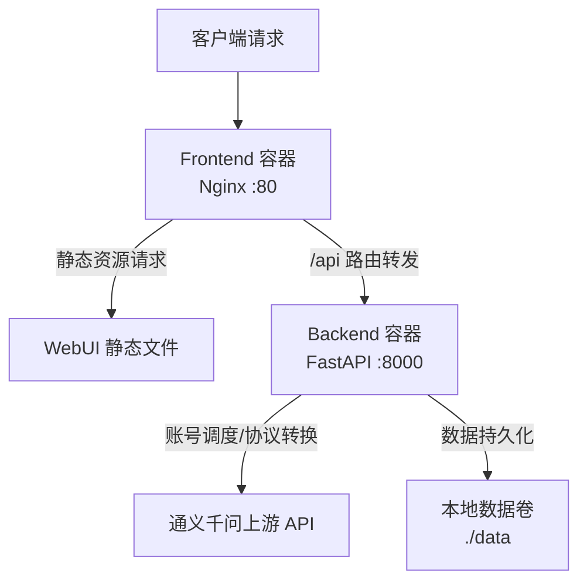
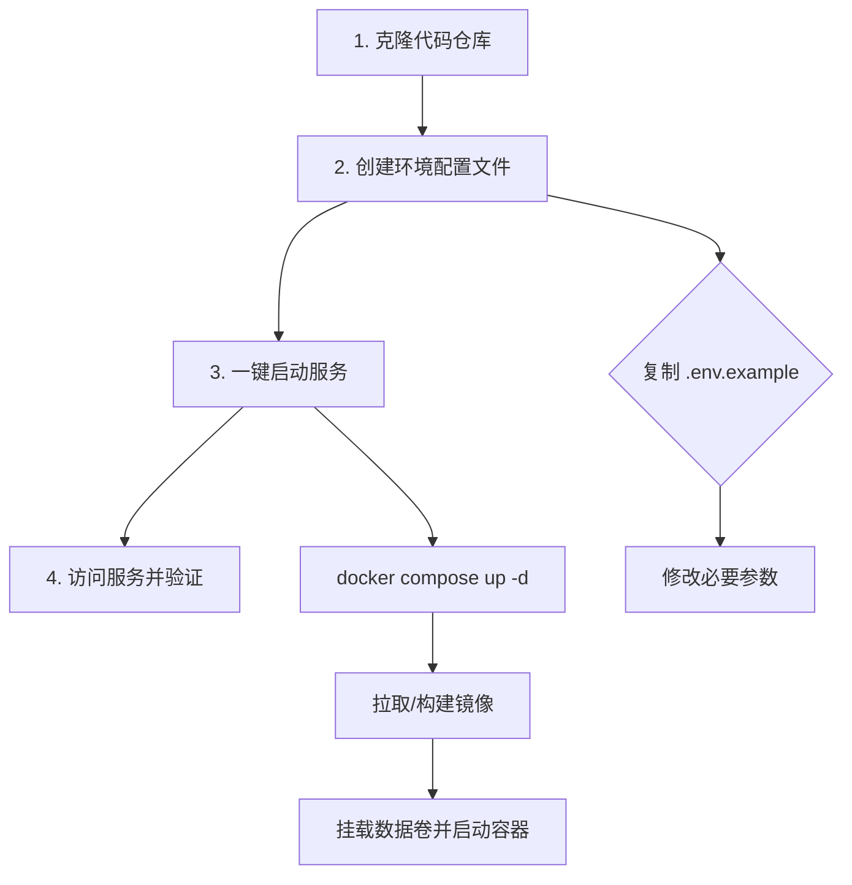

本指南旨在帮助开发者通过 Docker 实现项目的快速、标准化部署。qwen2API 采用前后端分离的容器化架构，后端基于 Python 运行时处理协议转换与核心网关逻辑，前端通过 Nginx 托管静态资源并提供 API 代理转发。通过 Docker Compose 编排，开发者可以在几分钟内将完整的网关服务及管理界面运行于本地或生产环境中，无需手动配置复杂的依赖环境。

Sources: [Dockerfile](Dockerfile#L1-L19), [docker-compose.yml](docker-compose.yml#L1-L46), [frontend/Dockerfile](frontend/Dockerfile#L1-L24)

## 架构概览：双容器协作模式

在深入部署步骤之前，理解系统的容器化拓扑结构至关重要。本项目的 Docker 部署方案严格遵循“一进程一容器”原则，将系统拆分为 **Backend** 与 **Frontend** 两个独立协作的容器。Backend 容器运行 FastAPI 应用，负责处理所有外部 API 请求、账号池管理及协议适配；Frontend 容器运行 Nginx，不仅负责提供 WebUI 静态资源，还作为智能反向代理将 `/api` 色路由的请求转发至 Backend 容器，从而实现前后端的统一入口与安全隔离。



Sources: [docker-compose.yml](docker-compose.yml#L13-L46), [frontend/nginx.conf](frontend/nginx.conf#L1-L35)

## 环境准备与前置条件

在启动部署流程前，请确保您的运行环境满足以下基础设施要求。Windows 环境下推荐使用 Docker Desktop，并确保 WSL 2 后端已正确安装与启用，以保证容器网络的性能与文件系统挂载的兼容性。

| 依赖项 | 最低版本要求 | 验证命令 | 说明 |
| :--- | :--- | :--- | :--- |
| **Docker Engine** | >= 20.10 | `docker --version` | 容器运行时核心 |
| **Docker Compose** | >= 2.0 | `docker compose version` | 容器编排工具，V2 版本作为 Docker 插件集成 |
| **磁盘空间** | >= 2GB | - | 用于存储镜像与运行时数据 |
| **内存** | >= 2GB | - | 保证 Python 运行时与 Nginx 正常运作 |

Sources: [README.md](README.md#L1-L80)

## 部署流程：从零到一

整个部署流程被抽象为四个连贯的步骤：获取代码、配置环境变量、构建镜像与启动服务。以下流程图清晰地展示了这一标准操作路径，帮助开发者在宏观上建立对部署生命周期的认知。



### 步骤一：获取源码

通过 Git 克隆项目至本地工作目录。若处于 Windows 环境，请确保 Git Bash 或终端的换行符转换配置不会破坏 Shell 脚本的执行权限。

```bash
git clone <repository-url>
cd qwen2API
```

### 步骤二：配置环境变量

环境变量是控制网关行为的核心入口。项目提供了 `.env.example` 作为模板，您需要将其复制为 `.env` 文件并根据实际情况修改关键参数。在 Docker 部署模式下，`docker-compose.yml` 会自动读取与当前目录同级的 `.env` 文件。

```bash
# 复制环境变量模板
copy .env.example .env
```

对于首次部署的**最小化可用配置**，您仅需关注以下核心参数：

| 变量名 | 必填 | 默认值 | 说明 |
| :--- | :--- | :--- | :--- |
| `ACCOUNTS` | 是 | - | 通义千问账号配置，JSON 格式字符串或文件路径 |
| `API_KEY` | 否 | `sk-...` | 访问本网关所需的 API 密钥，用于鉴权拦截 |

> **注意**：更详尽的配置参数（如账号池策略、模型映射等）请参考 [环境变量与配置详解](4-huan-jing-bian-liang-yu-pei-zhi-xiang-jie) 页面。

Sources: [.env.example](.env.example#L1-L20)

### 步骤三：构建与启动

使用 Docker Compose 一键启动所有服务。该命令将自动构建前后端镜像（如本地不存在）、创建隔离的容器网络并挂载数据卷。

```bash
docker compose up -d --build
```

**首次执行行为解析**：
1. **Backend 构建**：基于 `python:3.11-slim`，安装 `requirements.txt` 中的依赖，拷贝 `backend` 及根目录核心代码，最终通过 `start.py` 启动 Uvicorn 服务监听 8000 端口。
2. **Frontend 构建**：采用多阶段构建，首阶段使用 `node:20-alpine` 编译 React 项目，次阶段将产物拷贝至 `nginx:alpine` 并配置反向代理规则。
3. **网络初始化**：创建桥接网络，Frontend 容器可通过内部 DNS 解析访问 `backend:8000`。
4. **数据持久化**：将宿主机的 `./data` 目录挂载至 Backend 容器的 `/app/data`，用于存储账号状态、上下文缓存等运行时数据。

Sources: [docker-compose.yml](docker-compose.yml#L13-L46), [Dockerfile](Dockerfile#L1-L19), [frontend/Dockerfile](frontend/Dockerfile#L1-L24)

### 步骤四：验证服务状态

服务启动后，可通过以下方式进行健康检查与功能验证：

1. **访问 WebUI**：打开浏览器访问 `http://localhost`，默认情况下 Frontend 容器映射了宿主机的 80 端口，您应能看到 qwen2API 管理界面。
2. **API 探针测试**：通过 `curl` 或 Postman 向网关发送测试请求，验证协议转换与账号调度是否正常。

```bash
# 健康检查
curl http://localhost/api/health

# 模型列表查询
curl http://localhost/api/v1/models \
  -H "Authorization: Bearer YOUR_API_KEY"
```

Sources: [frontend/nginx.conf](frontend/nginx.conf#L1-L35), [backend/api/probes.py](backend/api/probes.py#L1-L1)

## Docker Compose 编排细节

为了实现开箱即用，`docker-compose.yml` 进行了精密的架构设计，以下是核心配置的深度解读。

**Backend 容器配置**：
- **重启策略**：配置为 `unless-stopped`，确保进程异常退出或宿主机重启时服务能够自动恢复。
- **数据卷映射**：`./data:/app/data` 实现了运行时数据的持久化，避免容器重建导致账号状态与预热池丢失。
- **环境变量注入**：直接引用 `.env` 文件，将敏感配置与镜像解耦。
- **健康检查**：内置了基于 `/health` 端点的探针机制，Docker 引擎将根据返回状态自动判定容器健康度。

**Frontend 容器配置**：
- **端口映射**：仅暴露 `80:80`，对外提供单一入口，所有 `/api` 请求由 Nginx 代理至 Backend，遵循最小权限与安全闭合原则。
- **依赖关系**：配置了 `depends_on` 且绑定 Backend 的健康状态，确保后端服务完全就绪后再启动前端代理，避免出现 502 网关错误。

Sources: [docker-compose.yml](docker-compose.yml#L1-L46)

## 常见问题与故障排查

在部署过程中，可能会遇到因环境差异或配置遗漏导致的问题。以下表格归纳了高频故障及其排查路径：

| 症状 | 可能原因 | 排查命令/方案 |
| :--- | :--- | :--- |
| 容器启动后立即退出 | `.env` 文件缺失或语法错误 | `docker compose logs backend` 查看启动日志 |
| WebUI 可访问但 API 返回 502 | Backend 服务未就绪或 Nginx 代理配置异常 | 检查 `docker compose ps` 中 Backend 健康状态；检查 `frontend/nginx.conf` 代理地址 |
| 账号状态重启后丢失 | 未正确挂载 `./data` 数据卷 | 检查 `docker-compose.yml` 中的 volumes 配置，确认宿主机目录有写权限 |
| Windows 下挂载目录为空 | Docker Desktop 文件共享未配置 | 在 Docker Desktop Settings -> Resources -> File Sharing 中添加项目路径 |

Sources: [docker-compose.yml](docker-compose.yml#L1-L46), [Dockerfile](Dockerfile#L1-L19)

## 后续步骤

完成 Docker 部署仅是使用 qwen2API 的起点。为了更好地驾驭网关的强大功能，建议您按照以下路径继续探索：

1. **深入配置**：了解如何通过环境变量定制账号池策略、模型别名映射与限流规则，请移步 [环境变量与配置详解](4-huan-jing-bian-liang-yu-pei-zhi-xiang-jie)。
2. **理解架构**：探究网关如何实现 OpenAI、Anthropic 等多协议的统一转换，请移步 [架构总览：统一网关与协议转换](5-jia-gou-zong-lan-tong-wang-guan-yu-xie-yi-zhuan-huan)。
3. **管理运维**：学习如何通过 WebUI 监控账号状态与管理配额，请移步 [WebUI管理台使用](27-webuiguan-li-tai-shi-yong)。