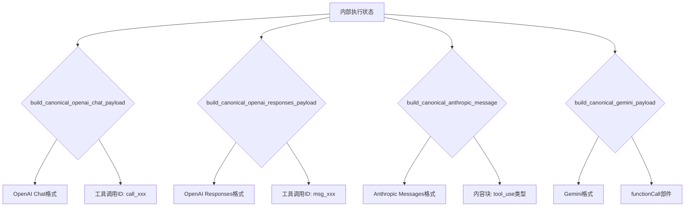

本模块负责将内部模型执行结果转换为符合OpenAI、Anthropic、Gemini等外部API协议的标准化响应格式，并实现流式输出的增量式转换。该模块位于服务层，是协议适配的最后一道处理关口，确保不同客户端能够无缝接入统一的模型网关。

## 架构定位与核心职责

响应格式化与流式转换模块位于`backend/services/response_formatters.py`和`backend/services/openai_stream_translator.py`两个核心文件中，与`backend/services/responses_compat.py`协同工作。该模块的核心职责包括：

1. **格式标准化**：将内部执行状态转换为不同API标准格式（OpenAI Chat Completions、Responses、Anthropic Messages、Gemini GenerateContent）
2. **工具调用适配**：处理工具调用名称的客户端可见性映射
3. **流式传输**：实现增量式的SSE（Server-Sent Events）流式响应
4. **内容清理**：移除工具调用标记，保留用户可见的纯文本内容

Sources: [response_formatters.py](backend/services/response_formatters.py#L1-L50) [openai_stream_translator.py](backend/services/openai_stream_translator.py#L1-L50)

## 格式化器架构设计

格式化器采用分层的设计模式，分为基础格式化器（canonical formatters）和协议特定格式化器（protocol-specific formatters）。

### 基础格式化器（Canonical Formatters）
位于`backend/toolcore/formatter.py`的格式化器负责生成标准化的内部表示：



Sources: [formatter.py](backend/toolcore/formatter.py#L30-L186)

### 协议特定格式化器（Protocol-specific Formatters）
位于`backend/services/response_formatters.py`的格式化器在基础格式化器之上添加协议特定逻辑：

| 格式化函数 | 目标协议 | 主要特性 |
|-----------|---------|---------|
| `build_openai_completion_payload` | OpenAI Chat Completions | 支持tool_calls数组，标准finish_reason |
| `build_openai_response_payload` | OpenAI Responses | 支持output数组结构，response_id链式引用 |
| `build_anthropic_message_payload` | Anthropic Messages | 支持thinking内容块，content多类型 |
| `build_gemini_generate_payload` | Gemini GenerateContent | 支持functionCall部件，简化参数结构 |

Sources: [response_formatters.py](backend/services/response_formatters.py#L70-L191)

## 工具调用名称映射机制

工具调用适配采用两层映射机制确保内部工具名称与客户端可见名称的一致性：

```python
def _client_visible_tool_name(name: str, tool_catalog) -> str:
    if tool_catalog is None:
        return name
    canonical = tool_catalog.get_canonical_name(name)  # 获取规范名称
    if canonical is None:
        return name
    return tool_catalog.get_client_name(canonical)  # 转换为客户端名称
```

**映射示例**：
- 内部名称：`bridge-0`（工具桥接器内部标识）
- 规范名称：`timeMcp.currentTime`（MCP工具规范名称）
- 客户端名称：`mcp__timeMcp__currentTime`（OpenAI兼容格式）

这种映射机制支持工具目录的动态配置，允许同一个工具在不同客户端协议中使用不同的公开名称。

Sources: [response_formatters.py](backend/services/response_formatters.py#L32-L66)

## 内容清理与标记移除

内容清理是响应格式化中的关键安全措施，用于防止工具调用标记泄露给最终用户：

```python
def sanitize_visible_answer_text(answer_text: str, *, tool_use: bool) -> str:
    """移除工具调用标记，保留用户可见的纯文本内容"""
```

**清理策略**：
1. **DSML标记检测**：识别`<|DSML|tool_calls>`和`<|DSML|invoke>`标记
2. **传统标记检测**：识别`##TOOL_CALL##`和`<tool_call>`标记
3. **代码块保护**：忽略代码块内的标记（如````xml`中的DSML）
4. **工具不存在提示移除**：移除"Tool X does not exist"类错误信息

**清理规则**：
- 当`tool_use=True`时：返回第一个工具标记之前的所有文本
- 当`tool_use=False`时：保留完整文本
- 文本为空时：返回空字符串

Sources: [response_formatters.py](backend/services/response_formatters.py#L20-L51)

## 流式转换器架构

流式转换器负责将内部流式执行事件转换为符合SSE协议的分块响应。系统包含两种流式转换器：

### OpenAI流式转换器（OpenAIStreamTranslator）
位于`backend/services/openai_stream_translator.py`，专为OpenAI Chat Completions设计：

```python
class OpenAIStreamTranslator:
    def __init__(self, *, completion_id: str, created: int, model_name: str, 
                 client_profile: str, toolcore_enabled: bool = True):
        self.state_machine = ToolStreamStateMachine()  # 流式状态机
        self.pending_chunks = []  # 待发送块缓存
        self.answer_fragments = []  # 答案片段累积
```

**工作流程**：
1. **初始化阶段**：设置状态机，准备客户端配置
2. **增量处理**：`on_delta()`方法处理每个流事件
3. **工具调用检测**：状态机识别工具调用起始位置
4. **内容缓冲**：累积文本片段，直到工具调用开始
5. **最终化**：`finalize()`方法生成完成块和用量信息

Sources: [openai_stream_translator.py](backend/services/openai_stream_translator.py#L20-L100)

### Responses流式转换器（ResponsesStreamTranslator）
位于`backend/services/responses_compat.py`，专为OpenAI Responses API设计：

**核心特性**：
- **序列号管理**：确保SSE事件的有序性
- **多输出项支持**：支持text、function_call、file等多种输出类型
- **增量参数传输**：工具调用参数分块传输（每块128字符）
- **状态同步**：流式传输与最终payload的状态一致性

Sources: [responses_compat.py](backend/services/responses_compat.py#L100-L200)

## 流式状态机集成

流式转换器集成了`ToolStreamStateMachine`，用于在流式输出中实时检测工具调用：

**状态机事件类型**：
```python
# 文本内容事件
event.type == "content" and event.text: "文本片段"
# 工具调用事件  
event.type == "tool_calls" and event.calls: "工具调用列表"
```

**检测策略配置**：
```python
def _resolve_tool_text_detection_mode(client_profile: str) -> str:
    if client_profile == "openclaw_openai_profile":
        return "strict_prefix"  # 严格前缀检测
    return "accept_any_tool_syntax"  # 接受任何工具语法
```

**工具调用完成模式**：
```python
def _resolve_tool_call_finalize_mode(client_profile: str) -> str:
    if client_profile == "claude_code_openai_profile":
        return "buffered_tool_calls_only"  # 缓冲工具调用
    return "directive_driven_tool_calls"  # 指令驱动
```

Sources: [openai_stream_translator.py](backend/services/openai_stream_translator.py#L80-L120)

## 协议适配逻辑对比

不同协议的格式化器在处理工具调用时有显著差异：

| 协议 | 工具调用表示 | 参数序列化 | 文本清理策略 |
|------|------------|-----------|------------|
| **OpenAI Chat** | `tool_calls`数组，每个包含`id`、`function` | JSON字符串 | 工具调用时完全移除文本 |
| **OpenAI Responses** | `function_call`输出项，独立的`output`数组项 | JSON字符串 | 根据`tool_use`标志选择性保留 |
| **Anthropic** | `tool_use`内容块，直接嵌入`content`数组 | JSON对象 | 保留thinking块，移除工具标记 |
| **Gemini** | `functionCall`部件，`parts`数组元素 | 原生对象 | 移除DSML标记，保留可见文本 |

Sources: [formatter.py](backend/toolcore/formatter.py#L30-L186) [response_formatters.py](backend/services/response_formatters.py#L70-L191)

## 使用量计算与令牌统计

格式化器集成了令牌使用量计算功能，确保响应包含准确的令牌统计信息：

```python
def calculate_usage(prompt: str, answer_text: str, tool_calls: list, 
                   extra_prompt_tokens: int = 0) -> dict[str, int]:
    input_tokens = count_tokens(prompt) + extra_prompt_tokens
    output_tokens = count_tokens(completion_text_for_usage(answer_text, tool_calls))
    return {
        "input_tokens": input_tokens,
        "output_tokens": output_tokens,
        "total_tokens": input_tokens + output_tokens
    }
```

**特殊处理**：
- **附加提示词令牌**：包含上下文附件等额外提示词的令牌数
- **工具调用令牌**：工具调用参数计入输出令牌
- **推理文本令牌**：Anthropic协议的thinking内容单独统计

Sources: [formatter.py](backend/toolcore/formatter.py#L30-L80)

## 客户端配置适配

系统支持基于客户端配置的差异化格式化策略：

**客户端配置检测**：
```python
def detect_openai_client_profile(headers: dict, req_data: dict) -> str:
    # 基于User-Agent、SDK标识等检测客户端类型
    return client_profile
```

**差异化处理**：
1. **Claude Code**：工具调用缓冲模式，避免增量工具调用
2. **OpenClaw**：严格前缀检测，要求工具调用以特定字符开始
3. **标准客户端**：标准流式工具调用支持

Sources: [openai_stream_translator.py](backend/services/openai_stream_translator.py#L120-L140)

## 错误处理与边界情况

格式化器包含完善的错误处理和边界情况处理：

**错误处理策略**：
1. **工具不存在处理**：移除"Tool does not exist"错误信息
2. **空输入处理**：空文本返回空字符串
3. **工具目录缺失**：tool_catalog为None时跳过名称映射
4. **参数序列化异常**：JSON序列化失败时使用空对象

**边界情况**：
- **工具调用无参数**：输入为空字典`{}`
- **混合内容**：文本与工具调用混合时的清理策略
- **重复工具调用ID**：避免重复发送相同工具调用

Sources: [response_formatters.py](backend/services/response_formatters.py#L20-L51) [responses_compat.py](backend/services/responses_compat.py#L200-L300)

## 测试覆盖率与验证

系统包含完整的测试验证，确保格式化逻辑的正确性：

**测试重点**：
1. **标记清理测试**：验证DSML标记的正确移除
2. **工具名称映射测试**：验证内部名称到客户端名称的转换
3. **流式传输测试**：验证SSE分块的正确性
4. **协议兼容性测试**：验证不同API协议的格式正确性

测试文件位于`tests/test_response_formatters.py`和`tests/test_responses_stream_translator.py`，确保格式化器在各种边界情况下的稳定性。

Sources: [test_response_formatters.py](tests/test_response_formatters.py#L1-L28)

## 性能优化策略

格式化器采用多种性能优化策略：

1. **惰性计算**：令牌统计在需要时计算，避免不必要的开销
2. **缓冲机制**：流式转换器累积文本片段，减少SSE事件数量
3. **对象复用**：标准请求对象在整个处理链中复用
4. **增量序列化**：大型工具参数分块序列化，避免内存峰值

## 扩展性与维护性

系统设计考虑了扩展性和维护性：

**扩展点**：
1. **新协议支持**：通过添加新的基础格式化器函数实现
2. **客户端配置**：通过扩展client_profile检测逻辑
3. **工具目录**：通过tool_catalog接口扩展工具映射
4. **流式策略**：通过配置不同的检测模式和完成模式

**维护性保障**：
.UML图文档化架构关系
.类型注解确保接口一致性
.测试套件覆盖关键路径
.日志记录关键格式化决策

响应格式化与流式转换模块作为qwen2API网关的核心组件，确保了不同客户端协议的无缝接入，为上层应用提供了统一的模型调用接口，同时保持了底层实现的灵活性和可扩展性。