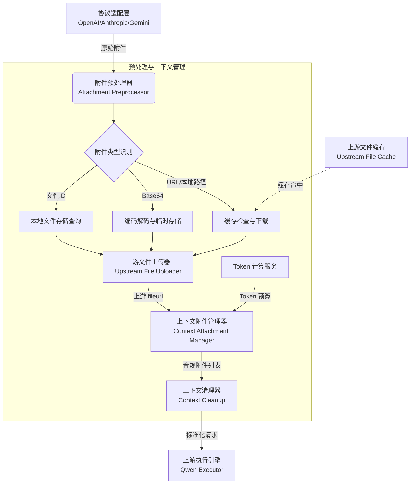
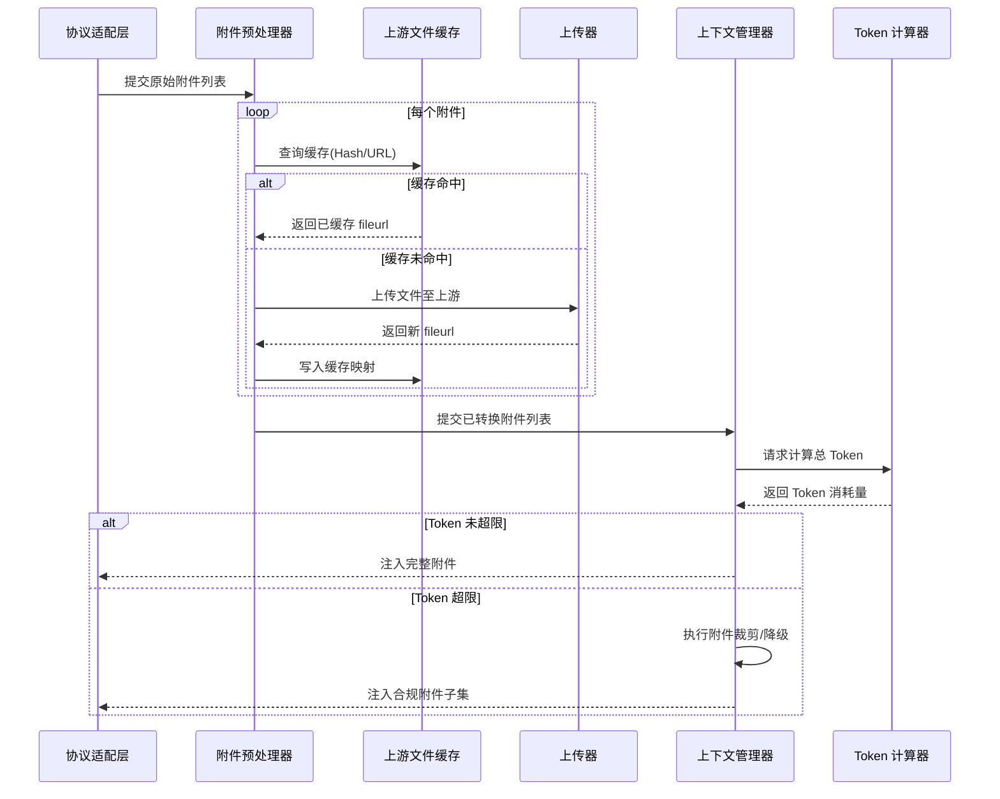

在多模态大模型的网关架构中，**附件预处理**与**上下文管理**构成了请求从“协议适配层”向“上游执行引擎”流转的核心数据准备阶段。本模块负责将 OpenAI、Anthropic 等不同协议规范下的异构附件（URL、Base64、本地文件 ID 等）统一转化为通义千问上游所能接受的 `fileurl` 格式，并在此过程中完成上下文长度的合规性校验与缓存管理。它不仅是数据格式的转换器，更是上下文窗口的守护者，确保进入执行引擎的请求既格式合规又尺寸安全。Sources: [attachment_preprocessor.py](backend/services/attachment_preprocessor.py#L1-L10), [context_attachment_manager.py](backend/services/context_attachment_manager.py#L1-L10)

## 架构定位与职责边界

附件预处理与上下文管理位于网关的服务层，承接由 API 层解析出的原始请求，为上游 Qwen 执行引擎提供标准化的上下文输入。其核心职责可拆解为三大领域：**附件形态归一化**（将多种输入源统一转换为上游 URL）、**上下文配额管控**（基于 Token 计算防止溢出）以及**生命周期管理**（缓存复用与自动清理）。这三者共同构成了一个防御性中间层，使得上层协议适配无需关心底层文件上传细节，下层执行引擎无需处理非法的附件格式。Sources: [context_attachment_manager.py](backend/services/context_attachment_manager.py#L1-L15)

## 附件形态归一化：从异构到统一

不同协议对于多模态内容的表达方式存在显著差异：OpenAI 倾向于使用 `image_url` 或 Base64 编码，Anthropic 使用 `source` 对象，而本系统的文件接口则可能返回文件 ID。**附件预处理器** (`AttachmentPreprocessor`) 的首要任务是将这些异构数据源提取并转化为内部统一的 `Attachment` 数据结构，进而通过上游文件上传器获取可供 Qwen 直接消费的 `fileurl`。

系统定义了清晰的附件类型枚举 (`AttachmentType`)，涵盖 `url`、`base64`、`file_id` 等多种形态。预处理器根据类型采取不同策略：对于外部 URL，会先校验合法性并通过缓存检查是否已上传过；对于 Base64 数据，先进行解码验证与临时文件落盘；对于内部文件 ID，则直接从本地 `FileStore` 检索。这种基于类型枚举的策略模式，保证了扩展新型附件格式时无需修改核心预处理逻辑。Sources: [attachment_types.py](backend/runtime/attachment_types.py#L1-L20), [attachment_preprocessor.py](backend/services/attachment_preprocessor.py#L15-L45)

| 附件输入源 | 典型协议 | 预处理策略 | 输出格式 |
| :--- | :--- | :--- | :--- |
| 外部 URL | OpenAI `image_url` | 校验 URL 合法性，查询缓存或下载后上传 | Qwen `fileurl` |
| Base64 编码 | OpenAI/Anthropic | 解码验证，写入临时文件后上传 | Qwen `fileurl` |
| 本地文件 ID | 自定义 Files API | 从 `FileStore` 获取文件路径及元数据 | Qwen `fileurl` |

## 上下文配额管控：Token 预算与附件裁剪

大模型上下文窗口是稀缺资源，附件（尤其是图片与长文档）往往会消耗大量 Token。**上下文附件管理器** (`ContextAttachmentManager`) 在将附件注入请求上下文前，会执行严格的 Token 预算检查。它结合 `TokenCalc` 服务预估当前文本与附件的 Token 消耗量，若总消耗超出模型上下文限制，则会根据预设策略进行裁剪。

裁剪策略通常遵循“文本优先，附件降级”的原则：优先保留核心文本提示词，对超出预算的附件按添加顺序进行裁剪或降级处理（例如移除高分辨率图片或截断长文档）。这种防御性设计确保了请求在到达上游前即被截断至合规尺寸，避免了因上游返回 `Context Length Exceeded` 错误而导致的请求完全失败，提升了系统的健壮性。Sources: [context_attachment_manager.py](backend/services/context_attachment_manager.py#L50-L90)

## 缓存复用与生命周期管理

由于上游文件上传操作耗时且消耗配额，系统引入了**上游文件缓存** (`UpstreamFileCache`) 机制。当预处理器遇到 URL 或文件哈希已存在于缓存时，可直接复用之前上传获得的 `fileurl`，从而大幅缩短请求处理时间。缓存键通常基于文件内容的哈希值或唯一标识构建，确保相同内容的文件不会重复上传。

与此同时，缓存与临时文件的无序堆积会占用大量存储空间。**上下文清理器** (`ContextCleanup`) 负责在请求结束后或系统空闲时执行清理任务，移除过期的临时文件与过时的缓存记录。缓存的生命周期通常与配置的 TTL（Time-To-Live）或上游文件的有效期对齐，通过定期扫描与惰性删除相结合的方式，维持存储空间的健康状态。Sources: [upstream_file_cache.py](backend/core/upstream_file_cache.py#L1-L30), [context_cleanup.py](backend/services/context_cleanup.py#L1-L25)

## 核心模块协作流程

当包含附件的请求进入系统时，各模块按照“识别-预处理-校验-注入-清理”的流水线协同工作。以下流程图展示了一个典型多模态请求在附件处理与上下文管理阶段的完整流转过程，凸显了缓存命中与未命中时的不同处理路径，以及 Token 超限时的降级逻辑。

通过这种模块化的流水线设计，系统实现了附件处理逻辑与业务主流程的解耦。开发者可以独立扩展新的附件类型识别器，调整 Token 计算策略，或替换缓存实现，而无需触及网关的核心请求转发逻辑。这种架构选择在应对多模态技术快速演进的需求时，提供了极佳的系统弹性。Sources: [attachment_preprocessor.py](backend/services/attachment_preprocessor.py#L45-L80), [context_attachment_manager.py](backend/services/context_attachment_manager.py#L90-L120)

如需了解文件上传至上游的具体实现与存储机制，请继续阅读 [文件存储与上传](22-wen-jian-cun-chu-yu-shang-chuan)；若对 Token 计算的底层逻辑与模型映射策略感兴趣，可参考 [配置管理：Settings与模型映射](15-pei-zhi-guan-li-settingsyu-mo-xing-ying-she)。