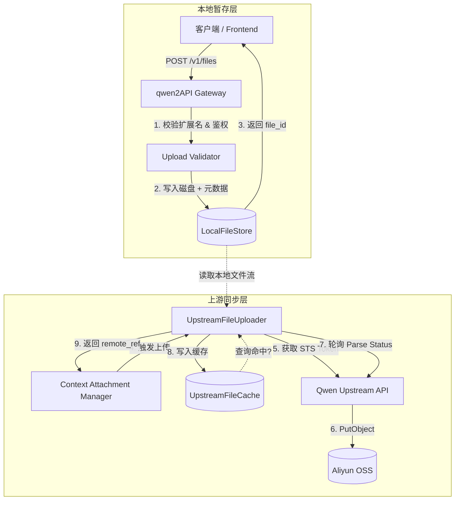

本页面详解 qwen2API 网关中的文件处理子系统。该子系统采用**“本地暂存 + 异步上游同步”**的双层架构，旨在解决大模型 API 对文件上下文（Context）和视觉理解（Vision）能力的支持问题。对于中间件开发者而言，理解这一机制对于排查附件丢失、上传超时及 Token 消耗异常至关重要。系统不仅提供了兼容 OpenAI 标准的 `/v1/files` 接口，还内置了针对阿里云 OSS 的 STS 临时凭证上传链路及解析状态轮询机制，确保文件在发送给模型前已完成服务端预处理。

Sources: [files_api.py](backend/api/files_api.py#L25-L59), [upstream_file_uploader.py](backend/services/upstream_file_uploader.py#L92-L146)

## 双层存储架构设计

qwen2API 的文件处理并非简单的透传，而是实现了一个完整的缓冲与转换层。这种设计解耦了客户端上传速度与上游模型服务处理速度之间的强依赖，同时为多账号池环境下的文件复用提供了基础。



**本地暂存层**负责快速响应客户端请求，将文件持久化到 `data/context_files` 目录并生成唯一 ID；**上游同步层**则在构建模型请求时按需触发，通过 STS 凭证直传 OSS，并等待服务端完成文档解析或图片索引。这种分离确保了即使上游解析耗时较长，也不会阻塞用户的文件上传交互。

Sources: [file_store.py](backend/services/file_store.py#L12-L54), [upstream_file_cache.py](backend/core/upstream_file_cache.py#L34-L64)

## 本地文件存储服务 (LocalFileStore)

`LocalFileStore` 是文件系统的核心抽象，它管理着文件的物理存储与元数据索引。为了保证高并发下的安全性与可追溯性，该服务实施了严格的命名规范与原子写入策略。

| 特性 | 实现细节 | 作用 |
| :--- | :--- | :--- |
| **ID 生成** | `uuid.uuid4().hex` | 避免文件名冲突，提供全局唯一标识符 |
| **安全命名** | `{id}_{safe_name}{suffix}` | 保留原始文件名语义，同时防止路径遍历攻击 |
| **异步 I/O** | `asyncio.to_thread` | 避免磁盘读写阻塞事件循环，保障网关吞吐量 |
| **元数据持久化** | `AsyncJsonDB` | 独立于文件内容的 JSON 存储，支持快速检索与恢复 |
| **所有权标记** | `owner_token` | 绑定上传者身份，支持后续的权限校验与隔离 |

当调用 `save_bytes` 时，系统会自动计算文件的 SHA256 哈希值并记录创建时间戳。这些元数据不仅是本地管理的依据，也是后续上游去重缓存的关键键值。文件按 `purpose`（如 `upload`, `context`, `vision`）分目录存储，便于运维人员进行分类清理或挂载卷管理。

Sources: [file_store.py](backend/services/file_store.py#L34-L54), [file_store.py](backend/services/file_store.py#L87-L105)

## 上游 OSS 直传与解析轮询

为了支持大文件与多模态内容，网关实现了基于阿里云 OSS STS（Security Token Service）的直传机制。这避免了网关成为带宽瓶颈，同时利用上游服务的原生解析能力。

### STS 直传流程
1.  **凭证获取**：使用当前账号池中的有效 Token 向 `/api/v2/files/getstsToken` 申请临时 AK/SK 及上传路径。
2.  **智能路由**：优先使用加速域名，若遇 DNS 或连接失败，自动降级至区域 Endpoint（`_build_regional_endpoint`）。
3.  **对象写入**：通过 `oss2.StsAuth` v4 签名直接将本地文件流推送至指定 Bucket。

### 解析状态机
对于非图片类文件（如 PDF, DOCX），上传完成后必须等待上游完成文本提取。`UpstreamFileUploader` 内置了一个同步轮询循环：

```python
# 伪代码逻辑示意
deadline = time.time() + CONTEXT_UPLOAD_PARSE_TIMEOUT_SECONDS
while time.time() < deadline:
    status = await poll_parse_status(file_id)
    if status == "success": break
    if status in ("failed", "error"): raise Error
    await asyncio.sleep(1.0)
```

该机制确保了只有当文件在上游真正“就绪”后，才会将其引用注入到模型的 Prompt 上下文中。如果超时未就绪，系统将抛出明确异常，防止模型产生幻觉或忽略附件。

Sources: [upstream_file_uploader.py](backend/services/upstream_file_uploader.py#L92-L184), [upstream_file_uploader.py](backend/services/upstream_file_uploader.py#L63-L75)

## 上传缓存与去重策略

在多轮对话或多用户共享同一文档的场景下，重复上传会造成巨大的资源浪费。`UpstreamFileCache` 通过四元组 `(session_key, account_email, sha256, ext)` 实现了精确的去重机制。

*   **缓存键设计**：结合会话隔离（`session_key`）与账号隔离（`account_email`），确保不同租户间的文件引用不会串扰。SHA256 保证内容一致性，而非仅依赖文件名。
*   **生命周期管理**：每个缓存条目包含 `expires_at` 字段。系统在读取时会自动过滤过期条目，并在后台定期执行 `cleanup_expired` 以释放内存与存储空间。
*   **原子更新**：`set` 操作采用“先删后增”模式，确保同一逻辑文件的缓存记录始终唯一，避免脏数据积累。

此缓存层位于本地存储与上游 OSS 之间，使得相同的附件在第二次被引用时可实现“零延迟”加载，显著提升多轮对话的响应体验。

Sources: [upstream_file_cache.py](backend/core/upstream_file_cache.py#L50-L64), [upstream_file_cache.py](backend/core/upstream_file_cache.py#L10-L31)

## API 接口规范与安全校验

网关对外暴露了兼容 OpenAI 格式的文件接口，但在内部实施了更严格的安全策略。

### 接口端点
*   **上传**: `POST /v1/files` 或 `POST /api/files/upload`
*   **删除**: `DELETE /v1/files/{file_id}` 或 `DELETE /api/files/{file_id}`

### 安全校验机制
1.  **扩展名白名单**：通过 `CONTEXT_ALLOWED_USER_EXTS` 环境变量配置，拒绝不在列表中的文件类型，从源头阻断恶意脚本上传。
2.  **空文件检测**：显式检查 `raw` 字节长度，防止无效占位符进入存储系统。
3.  **所有权验证**：删除操作强制校验 `owner_token`，非文件所有者无法删除他人上传的文件，保障多租户环境下的数据安全。

返回体中除了标准的 `id`, `bytes`, `created_at` 外，还额外包含了 `content_block` 结构体。这是为了适配 Anthropic/Claude 等协议的附件引用格式，使前端能够直接使用返回值构造消息体，无需二次转换。

Sources: [files_api.py](backend/api/files_api.py#L15-L23), [files_api.py](backend/api/files_api.py#L62-L77)

## 下一步阅读建议

掌握了文件存储与上传机制后，建议继续阅读以下章节以理解文件如何最终参与模型推理：

*   **[附件预处理与上下文管理](21-fu-jian-yu-chu-li-yu-shang-xia-wen-guan-li)**：了解上传的文件如何被转换为模型可理解的 Context Block，以及如何处理多图/多文档拼接。
*   **[上下文缓存与文件管理](13-shang-xia-wen-huan-cun-yu-wen-jian-guan-li)**：深入探讨文件引用在会话级别的缓存策略，以及与 Chat ID 预热池的联动机制。
*   **[Toolcore V2：指令解析与策略执行](23-toolcore-v2-zhi-ling-jie-xi-yu-ce-lue-zhi-xing)**：当文件作为工具调用的参数时，Toolcore 如何解析并传递文件引用。