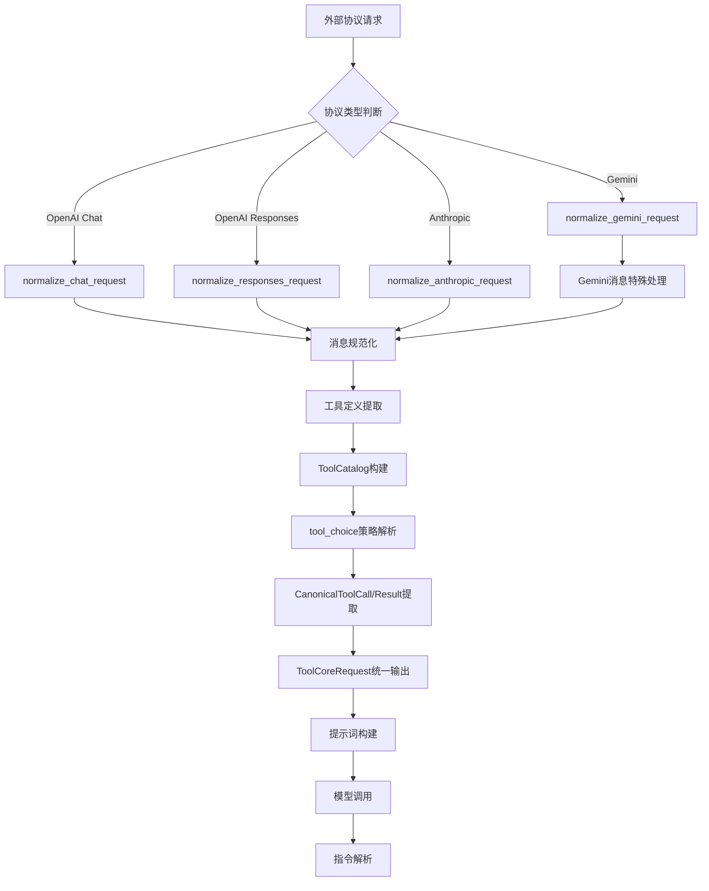
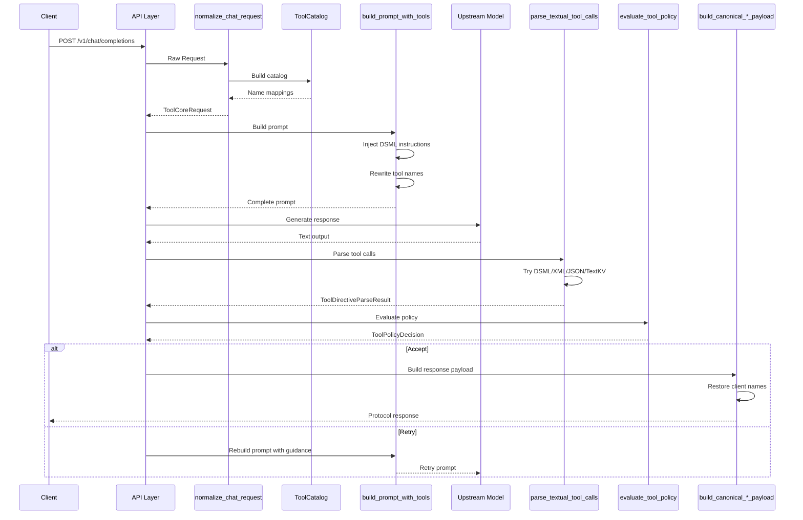

Toolcore V2 是 qwen2API 网关的核心工具调用引擎，负责将多协议工具调用请求归一化为统一内部格式，解析模型输出中的工具调用指令，并根据策略规则执行相应的决策。该模块实现了协议适配层与上游执行引擎之间的关键桥接，确保 OpenAI、Anthropic、Gemini 等不同协议的工具调用语义能够准确转换为上游通义千问模型可理解的 DSML/XML 格式指令，同时保障工具调用的安全性、幂等性和正确性。

## 核心架构：请求归一化与指令解析

Toolcore V2 的核心设计遵循"归一化-解析-决策-执行"的处理管道。所有外部协议请求首先通过请求归一化模块转换为内部统一的 `ToolCoreRequest` 数据结构，随后由提示词构建模块生成包含 DSML 工具指令块的提示词，模型输出后由指令解析器提取工具调用，最终通过策略执行器进行验证和决策。这种分层架构确保了协议适配与核心逻辑的解耦，使得新增协议支持只需扩展归一化入口，而无需修改核心处理流程。

Sources: [types.py](backend/toolcore/types.py#L1-L51), [__init__.py](backend/toolcore/__init__.py#L1-L32)

### 统一数据模型：ToolCoreRequest

`ToolCoreRequest` 是 Toolcore V2 的核心数据结构，承载归一化后的工具调用请求的所有关键信息。该数据类使用 slots 优化内存布局，包含消息历史、工具定义列表、工具选择策略、强制工具名称、已解析的工具调用列表和工具结果列表等字段。其中 `tool_choice_policy` 字段采用枚举类型 `ToolChoicePolicy`，支持四种策略：AUTO（自动决定）、REQUIRED（必须调用工具）、NONE（禁止调用工具）和 FORCED（强制调用指定工具）。`ToolDefinition` 结构存储单个工具的元信息，包括名称、描述、参数 schema、客户端名称、模型桥接名称和别名列表，其中 `client_name` 是客户端可见的工具名称，`model_name` 是发送给模型的桥接标识符（如 `bridge-0`、`bridge-1`），这种双名称设计允许在保持客户端协议语义的同时向模型隐藏工具的真实身份。

Sources: [types.py](backend/toolcore/types.py#L27-L51)

### 多协议请求归一化

请求归一化模块提供四个入口函数，分别处理不同协议格式的请求：`normalize_chat_request` 处理 OpenAI Chat Completions 格式，`normalize_responses_request` 处理 OpenAI Responses API 格式，`normalize_anthropic_request` 处理 Anthropic Messages 格式，`normalize_gemini_request` 处理 Gemini GenerateContent 格式。所有函数最终输出统一的 `ToolCoreRequest` 对象，确保下游处理逻辑的一致性。归一化过程包括消息格式转换、工具定义提取、tool_choice 策略解析和工具调用/结果的规范化。对于 Gemini 协议，消息归一化需要特别处理 `functionCall` 和 `functionResponse` 结构，将其转换为 OpenAI 风格的 `tool_calls` 和 `tool` 角色消息，同时通过 `ToolCatalog` 进行客户端名称与模型桥接名称的双向映射。

Sources: [request_normalizer.py](backend/toolcore/request_normalizer.py#L399-L506)

### 工具目录：名称映射与验证

`ToolCatalog` 类是工具名称管理的核心组件，作为请求级别工具声明的唯一真实来源。该类维护三个关键映射：`_tools_by_name` 存储规范名称到工具定义的映射，`_alias_map` 存储所有别名（包括客户端名称、模型名称和其他别名）到规范名称的映射，以及反向查找接口用于将模型输出的桥接名称还原为客户端名称。核心方法 `get_canonical_name` 将任意客户端可见名称转换为规范声明名称，`get_model_name` 获取发送给模型的桥接标识符，`get_client_name` 将模型输出的名称还原为客户端协议期望的名称。这种设计确保了工具调用的端到端一致性：客户端使用原始工具名称（如 `get_weather`），模型收到桥接名称（如 `bridge-0`），模型输出桥接名称后由网关还原为客户端期望的原始名称。

Sources: [tool_catalog.py](backend/toolcore/tool_catalog.py#L10-L139)

## 指令解析：从模型输出到工具调用

指令解析模块负责从模型生成的文本输出中提取结构化的工具调用信息。Toolcore V2 支持两种解析路径：流式状态解析和文本后解析。流式状态解析在流式输出过程中实时累积状态信息，最终由 `parse_state_tool_calls` 函数将状态工具调用列表转换为规范格式。文本后解析由 `parse_textual_tool_calls` 函数执行，支持四种工具调用格式：DSML 标记格式（`##TOOL_CALL##...##END_CALL##`）、DSML/XML 格式（`<|DSML|tool_calls>`）、JSON 格式和 TextKV 格式。解析器按优先级顺序尝试各格式解析器，首次成功匹配即返回结果。`ToolDirectiveParseResult` 数据类承载解析结果，包含规范化的工具调用列表 `canonical_calls`、工具块列表 `tool_blocks` 和停止原因 `stop_reason`（`tool_use` 或 `end_turn`）。

Sources: [directive_parser.py](backend/toolcore/directive_parser.py#L1-L114)

### 流式状态解析

流式状态解析通过 `ToolStreamStateMachine` 类实现，该类在流式输出过程中维护解析状态并实时提取工具调用事件。状态机内部使用 `ToolStreamSieve` 组件处理文本片段，识别 DSML 标记和工具调用结构。`process_text_delta` 方法接收增量文本片段，返回 `ToolStreamEvent` 列表，事件类型包括 `content`（普通文本）和 `tool_calls`（工具调用）。`process_tool_calls` 方法处理上游直接提供的工具调用结构（如某些模型的特殊输出格式）。`flush` 方法在流结束时完成所有待处理事件，并根据 `final_tool_use` 参数决定是否过滤工具调用片段前的文本内容。状态机通过 `_attach_call_ids` 方法为缺少 ID 的工具调用自动生成唯一标识符（格式：`toolu_{uuid[:8]}_{sequence}`）。

Sources: [stream_state_machine.py](backend/toolcore/stream_state_machine.py#L1-L69)

### 多格式文本解析

文本后解析支持四种格式的自动识别和解析，通过 `parse_tool_calls_detailed` 函数统一调度。DSML 格式解析器 `parse_dsml_format` 识别 `<|DSML|tool_calls>` 标记结构，提取工具名称和参数。XML 格式解析器 `parse_xml_format` 处理传统 XML 工具调用标记。JSON 格式解析器 `parse_json_format` 使用带修复功能的 JSON 解析器处理格式不规范的 JSON 结构。TextKV 格式解析器 `parse_textkv_format` 作为后备方案处理简单的键值对格式。解析器返回包含 `calls` 列表、`source` 字段（标识成功解析器）和 `saw_tool_syntax` 布尔值（标识是否检测到工具语法特征）的字典结构。在 `parse_textual_tool_calls` 函数中，解析结果经过参数规范化（`normalize_arguments`）后转换为 `CanonicalToolCall` 对象列表。

Sources: [parser.py](backend/toolcall/parser.py#L1-L74), [directive_parser.py](backend/toolcore/directive_parser.py#L57-L114)

## 策略执行：工具调用的验证与决策

策略执行模块通过 `evaluate_tool_policy` 函数评估工具调用的执行策略，返回 `ToolPolicyDecision` 数据结构指示决策类型和原因。当前实现主要检测被阻止的工具名称（`blocked_tool_names`），当检测到被阻止工具且存在允许的工具列表且启用重试机制（`can_retry_after_output` 为真）时，返回 `retry` 决策并附带被阻止工具名称作为原因，否则返回 `accept` 决策允许工具调用执行。`recent_same_tool_identity_count_in_turn` 函数通过工具身份标识（`_tool_identity`）检测当前轮次中相同工具调用的重复次数，为防止无限循环提供数据支持。工具身份标识生成策略针对不同工具类型采用不同的签名方式：读取工具使用目标路径（`read::{path}`），列表工具使用稳定化的输入 JSON（`list_directory::{json}`），Shell 工具使用命令和工作目录签名（`bash::{command}::{workdir}`），其他工具使用工具名称和输入 JSON。

Sources: [policy.py](backend/toolcore/policy.py#L1-L74)

### 策略决策数据结构

`ToolPolicyDecision` 数据类使用 slots 优化，包含两个字段：`kind` 字段表示决策类型（当前支持 `accept`、`retry`），`reason` 字段存储决策原因的可选字符串。策略执行器根据决策类型采取不同行动：`accept` 决策允许工具调用继续执行，`retry` 决策触发重试机制，由上游执行引擎重新生成响应。`evaluate_tool_policy` 函数接收 `StandardRequest` 对象、状态对象、历史消息列表和重试能力标志作为参数，从状态对象中提取被阻止工具列表进行验证。这种设计为未来扩展更复杂的策略规则（如配额限制、权限控制、频率限制）预留了接口。

Sources: [policy.py](backend/toolcore/policy.py#L9-L12)

## 提示词构建：工具指令注入

提示词构建模块负责将工具定义转换为模型可理解的 DSML 指令块，并与历史消息、系统提示词和技能上下文组合为完整的提示词。核心函数 `build_prompt_with_tools` 接收系统提示词、消息列表、工具定义、客户端配置、工具选择模式等参数，输出完整的提示词字符串。构建过程包括：工具引用重写（将客户端工具名称替换为模型桥接名称）、系统提示词处理、工具指令块生成、历史消息渲染、最新用户消息提取和优先级标注、技能上下文注入等步骤。对于 OpenCode 协议的特殊情况，构建器会注入覆盖指令，强制模型使用 DSML 格式而非协议原生工具格式。

Sources: [prompt_builder.py](backend/toolcore/prompt_builder.py#L200-L399)

### DSML 工具指令块格式

`build_tool_instruction_block` 函数生成 DSML 工具指令块，包含强制性的工具调用格式说明、参数规则、桥接工具槽位列表和工具选择约束。指令块以 `=== MANDATORY TOOL CALL INSTRUCTIONS ===` 标记开始，明确告知模型这是网关注入的桥接工具系统，而非平台原生工具。核心格式规范使用 DSML/XML 标记：`<|DSML|tool_calls>` 作为根元素，`<|DSML|invoke name="TOOL_NAME">` 标记单个工具调用，`<|DSML|parameter name="PARAM_NAME">` 标记参数节点。字符串值使用 `<![CDATA[...]]>` 包裹以处理特殊字符，对象和数组支持嵌套 XML 结构。工具选择约束根据 `tool_choice_mode` 动态生成：`required` 模式强制至少调用一个工具，`none` 模式禁止调用工具，`forced` 模式强制调用指定工具。每个工具的描述包含名称、简短描述和参数键列表，帮助模型快速理解工具用途。

Sources: [prompt_contract.py](backend/toolcore/prompt_contract.py#L106-L211)

### 历史消息渲染与上下文管理

历史消息渲染通过 `_extract_text` 函数处理，支持文本、多部分内容、工具调用和工具结果等多种消息结构。用户消息提取函数 `_extract_user_text_only` 专门处理用户角色消息，过滤系统提示词注入的内容。工具调用历史渲染函数 `_render_history_tool_call` 将历史工具调用转换为 DSML 格式，使用 `compact_history_tool_input` 函数压缩大型文本参数（如 `content`、`new_string` 字段超过 160 字符时替换为 `[omitted N chars]`），防止历史上下文过长。构建器通过 `_has_tool_continuation_after_latest_user` 函数检测最新用户消息后是否存在工具调用续接，决定是否显示最新用户消息的优先级标注行。工具引用重写通过 `_rewrite_tool_name_references` 函数使用正则表达式替换所有客户端工具名称为模型桥接名称，确保提示词中的一致性。

Sources: [prompt_builder.py](backend/toolcore/prompt_builder.py#L1-L200)

### Opencode 协议特殊处理

对于 OpenCode 客户端配置（`OPENCLAW_OPENAI_PROFILE` 且系统提示词检测为 OpenCode 格式），提示词构建器会注入特殊的覆盖指令块。该指令块以 `=== OPENCODE TOOL FORMAT OVERRIDE ===` 标记开始，明确告知模型忽略系统提示词中描述的原生工具语法，统一使用网关的 DSML 工具调用格式。覆盖指令强调立即调用工具而非输出计划文本，防止模型在调用工具前输出"I will inspect the directory first"等纯文本声明。这种设计处理了 OpenCode 协议工具格式与网关桥接格式的不兼容问题，确保工具调用的一致性。

Sources: [prompt_builder.py](backend/toolcore/prompt_builder.py#L235-L250)

## 任务会话：持久化对话管理

任务会话模块管理跨请求的持久化对话上下文，通过会话亲和性机制复用上游聊天 ID，避免重复发送历史消息。核心函数 `plan_persistent_session_turn` 分析当前请求的消息历史，计算消息摘要哈希列表，与现有会话记录比对，决定是否复用现有聊天 ID。会话计划 `PersistentSessionPlan` 数据类包含启用标志、复用聊天标志、简化提示词、完整提示词、当前哈希列表、现有聊天 ID、账号邮箱、原因说明等字段。当会话复用启用且历史消息前缀匹配现有哈希列表时，构建器生成续接提示词 `build_continuation_prompt`，仅包含新增消息部分和工具摘要，大幅减少上游输入长度。

Sources: [task_session.py](backend/toolcore/task_session.py#L200-L320)

### 会话历史哈希与续接

会话历史条目 `SessionHistoryEntry` 包含消息内容的 SHA-256 摘要和渲染后文本。`extract_session_history_entries` 函数遍历消息列表，为每条消息生成渲染文本并计算哈希，过滤空内容消息。`render_session_message` 函数处理不同角色消息的渲染：用户消息提取纯文本内容，助手消息处理工具调用标记，系统消息保留原样，工具角色消息包装为 `[Tool Result]` 块。续接提示词以 `=== SAME TASK SESSION CONTINUATION ===` 标记开始，强调这是同一任务的续接，包含工具调用格式提醒、可用工具列表摘要和新增消息部分。重试重基提示词 `build_retry_rebase_prompt` 在重复工具调用、探索循环、被阻止工具等场景下生成指导性提示，引导模型避免重复错误。

Sources: [task_session.py](backend/toolcore/task_session.py#L144-L199)

### 会话持久化与清理

`persist_session_turn` 异步函数在工具调用完成后将助手消息哈希追加到会话记录，更新会话亲和性存储的聊天 ID 绑定和消息哈希列表。`clear_invalidated_session_chat` 函数在会话失效时清除会话亲和性记录。会话管理通过 `app.state.session_affinity` 组件实现，支持 TTL 过期自动清理。`build_anthropic_assistant_history_message` 和 `build_openai_assistant_history_message` 函数将工具调用块转换为协议特定的助手消息格式，用于历史记录追加。这些函数确保跨请求会话的一致性，避免上游因历史不完整导致的工具调用重复或状态丢失。

Sources: [task_session.py](backend/toolcore/task_session.py#L399-L477)

## 单次飞行控制：请求去重与共享

单次飞行控制模块 `RequestSingleflight` 实现请求级别的去重和结果共享，防止短时间内相同请求的重复执行。该类维护两个字典：`_inflight` 存储正在执行的请求条目（`SingleflightEntry` 包含键、所有者 ID、创建时间和 Future 对象），`_completed` 存储已完成请求的结果和时间戳。`start_or_join` 方法检查是否存在相同键的已完成请求或正在执行的请求，存在则返回现有结果或 Future 对象供等待，不存在则创建新条目。`complete` 方法标记请求成功并缓存结果，`fail` 方法标记请求失败并传播异常。结果缓存使用 TTL 机制（默认 60 秒），过期结果通过 `_prune_completed` 方法自动清理。这种设计在工具调用频繁且结果可复用的场景下显著降低上游负载。

Sources: [request_singleflight.py](backend/toolcore/request_singleflight.py#L1-L78)

### 并发安全与异常处理

单次飞行控制使用 `asyncio.Lock` 保护共享状态，确保并发请求的线程安全。`_consume_future_exception` 回调函数在 Future 对象完成时自动消费异常，防止未处理异常警告。`start_or_join` 方法返回三元组：现有条目（需等待）、是否为新请求、已完成结果（如存在）。当请求失败时，`fail` 方法将异常传播给所有等待者，确保失败状态的一致传递。`forget` 方法用于手动清理特定键的条目，适用于请求被取消或结果不再需要的场景。该设计遵循 Go 语言 singleflight 模式的核心理念，将并发请求合并为单次执行，有效控制上游调用频率。

Sources: [request_singleflight.py](backend/toolcore/request_singleflight.py#L22-L56)

## 响应格式化：多协议输出构建

响应格式化模块将规范化的工具调用结果转换为各协议期望的响应格式。`build_canonical_openai_chat_payload` 函数构建 OpenAI Chat Completions 响应，工具调用使用 `tool_calls` 字段包装，包含 ID、类型、函数名称和参数 JSON 字符串，非工具调用响应使用普通 `content` 字段。`build_canonical_openai_responses_payload` 函数构建 OpenAI Responses API 响应，输出使用 `output` 数组，支持 `message` 类型（文本内容）和 `function_call` 类型（工具调用）混合输出。`build_canonical_anthropic_message` 函数构建 Anthropic Messages 响应，内容块支持 `thinking` 类型（推理文本）、`text` 类型（普通文本）和 `tool_use` 类型（工具调用）。`build_canonical_gemini_payload` 函数构建 Gemini GenerateContent 响应，工具调用使用 `functionCall` 结构，参数直接作为对象而非 JSON 字符串。

Sources: [formatter.py](backend/toolcore/formatter.py#L1-L186)

### 工具名称还原与内容过滤

所有格式化函数使用 `_client_tool_name` 辅助函数将模型输出的桥接名称还原为客户端原始名称，确保响应协议的一致性。`_strip_dsml_markup` 函数作为安全网过滤输出文本中的 DSML 标记，防止在旧版筛器未识别 DSML 格式时泄露内部标记。该函数通过 `find_tool_markup_tag_outside_ignored` 查找第一个 DSML 标记位置，返回标记前的纯文本内容。对于 Gemini 格式，当工具调用存在时响应使用 `functionCall` 部分，否则使用纯文本部分，`finishReason` 统一设置为 `STOP`。这些设计确保网关输出的协议合规性和内容安全性。

Sources: [formatter.py](backend/toolcore/formatter.py#L111-L186)

## 典型工作流程：端到端处理示例

以下展示一个典型的工具调用请求处理流程：客户端发送 OpenAI Chat 请求，包含消息历史和工具定义列表，`normalize_chat_request` 函数首先将请求转换为 `ToolCoreRequest`，构建 `ToolCatalog` 管理工具名称映射，解析 `tool_choice` 参数确定策略（如 `required`）。随后 `messages_to_prompt` 函数提取系统提示词和消息历史，`build_prompt_with_tools` 构建完整提示词，注入 DSML 工具指令块和工具名称重写。模型生成输出后，`parse_textual_tool_calls` 解析 DSML 标记提取工具调用，`evaluate_tool_policy` 验证工具是否被允许执行。若策略决策为 `accept`，`build_canonical_openai_chat_payload` 构建响应，将桥接名称还原为客户端名称，返回包含 `tool_calls` 字段的助手消息。若决策为 `retry`，触发重试机制重新生成响应。

