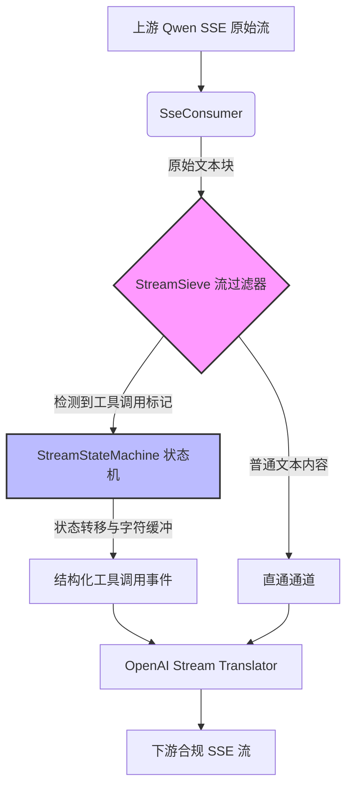
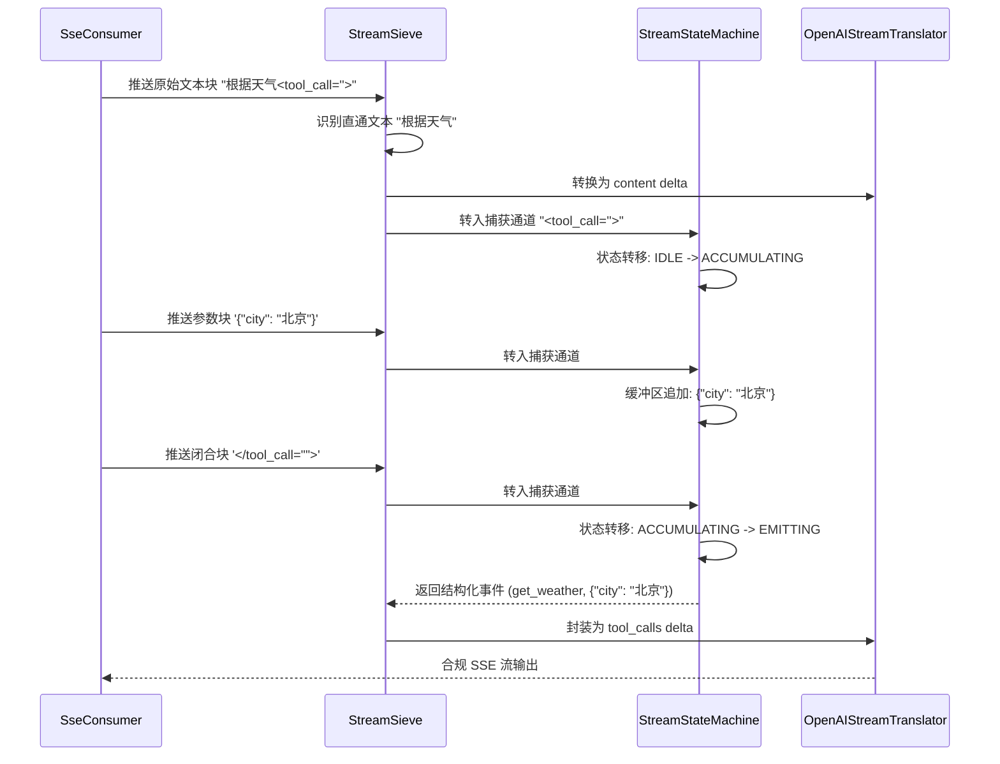

在构建基于大语言模型（LLM）的流式网关时，**流式状态机**与**工具调用幻觉防护**构成了守护数据流完整性与可靠性的核心防御机制。传统的请求-响应模式在流式场景下会遭遇特有的挑战：模型可能在输出中途突然决定进行工具调用，或者在未明确指示的情况下输出不符合规范的标记片段，这种不可预测的“幻觉”输出若直接透传给下游客户端，将导致严重的协议解析错误甚至系统崩溃。本文档将深入剖析 qwen2API 网关中 `toolcore` 模块如何通过确定性有限状态机对非结构化的文本流进行实时约束与重构，以及 `StreamSieve` 如何作为流过滤器拦截并修正这些幻觉输出，确保上游模型产生的每一个字节都严格符合 OpenAI 兼容协议的规范要求。
Sources: [stream_state_machine.py](backend/toolcore/stream_state_machine.py#L1-L42), [stream_sieve.py](backend/toolcore/stream_sieve.py#L1-L31)

## 架构定位与核心概念

在 Toolcore V2 体系内，流式状态机与流过滤器处于**运行时流处理管道**的核心位置。当上游 SSE 消费者（`SseConsumer`）接收到 Qwen 模型的原始流式块时，这些数据块并不直接面向客户端暴露，而是必须经过流过滤器的审查与状态机的结构化重组。这一过程本质上是一个**降维与重塑**的操作：将不可预测的、可能包含非标准工具调用标记（如残缺的 XML、错位的 JSON）的文本流，转化为具备严格状态转移边界的确定性事件流。这种设计不仅解决了协议适配问题，更重要的是在架构层面建立了一道针对大模型“幻觉输出”的防线，将不可控的生成式输出转化为可控的指令执行流。
Sources: [stream_state_machine.py](backend/toolcore/stream_state_machine.py#L44-L91), [roundtrip.py](backend/toolcore/roundtrip.py#L1-L25)

## 有限状态机：解析与重构引擎

`StreamStateMachine` 是整个流式工具调用的解析中枢，其设计遵循严格的有限状态机（FSM）范式。状态机定义了四个核心状态：**IDLE**（空闲/纯文本）、**PENDING**（检测到标记头，等待确认）、**ACCUMULATING**（缓冲区积累模式，捕获工具调用参数）和**EMITTING**（发射结构化事件）。状态转移的驱动力来自于输入字符与预定义标记（如 `<tool_call="">`、`</tool_call="">` 等）的匹配。在 ACCUMULATING 状态下，所有输入字符被暂存于缓冲区，直到遇到闭合标记触发向 EMITTING 状态的转移，此时缓冲区内容将被整体解析为结构化的函数名与参数，从而避免了在流式传输中因部分接收导致的 JSON 解析失败。这种基于状态转移的缓冲策略，从根本上消除了流式场景下增量解析的脆弱性。
Sources: [stream_state_machine.py](backend/toolcore/stream_state_machine.py#L44-L114), [types.py](backend/toolcore/types.py#L1-L15)

### 状态转移矩阵

状态机的正确性依赖于其状态转移的完备性。下表详细描述了在不同状态下接收到特定输入时的转移逻辑与副作用，这种严格的矩阵定义确保了无论上游输入如何无序，状态机总能表现出确定性行为。

| 当前状态 | 输入事件 | 目标状态 | 副作用 / 动作 | 异常防护机制 |
| :--- | :--- | :--- | :--- | :--- |
| **IDLE** | 匹配到标记开头 `<tool` | **PENDING** | 记录部分匹配位置，暂存字符 | 防止误判普通文本中的 `<tool` 字符串 |
| **PENDING** | 匹配完整标记 `<tool_call="">` | **ACCUMULATING** | 清空文本直通通道，初始化参数缓冲区 | 标记完整性校验，拒绝畸形标记 |
| **PENDING** | 不匹配完整标记 | **IDLE** | 将暂存字符作为普通文本发射 | 避免因截断导致的文本丢失 |
| **ACCUMULATING** | 匹配闭合标记 `</tool_call="">` | **EMITTING** | 解析缓冲区为函数名与参数，生成结构化事件 | 缓冲区 JSON 修复与容错解析 |
| **ACCUMULATING** | 普通字符 | **ACCUMULATING** | 追加字符至参数缓冲区 | 缓冲区溢出保护与内存限制 |
| **EMITTING** | 事件发射完成 | **IDLE** | 清空缓冲区，重置解析上下文 | 确保状态完全复位，无残余数据污染 |

Sources: [stream_state_machine.py](backend/toolcore/stream_state_machine.py#L116-L170), [stream_state_machine.py](backend/toolcore/stream_state_machine.py#L172-L220)

## 流过滤器：幻觉拦截与降级策略

如果说状态机是重构引擎，那么 `StreamSieve` 则是前哨的防御系统。大模型在流式生成中常表现出“工具调用幻觉”：在未收到工具调用指令时突然输出工具标记，或输出格式错乱的残缺标记。`StreamSieve` 的核心职责是**前瞻性检测**与**优雅降级**。当检测到输入流中出现了疑似工具调用标记的片段时，Sieve 不会立即将其交给状态机，而是先进行“观望”（Lookahead），确认这是真实的工具调用意图还是短暂的幻觉。若判定为幻觉（例如标记后紧跟着无意义的乱码或突然中断），Sieve 会触发降级策略，将这些标记片段还原为普通文本输出，从而在用户侧表现为自然语言的补全，而非系统级的报错。这种“宁可降级，不可崩溃”的设计哲学，是保障网关高可用性的关键。
Sources: [stream_sieve.py](backend/toolcore/stream_sieve.py#L33-L90), [stream_sieve.py](backend/toolcore/stream_sieve.py#L92-L145)

### 幻觉类型与应对策略

针对上游模型可能产生的各类异常输出，流过滤器实现了多维度的识别与差异化处理策略，确保在极端情况下系统的韧性。

| 幻觉类型 | 特征描述 | Sieve 检测机制 | 降级 / 处理策略 | 对下游的影响 |
| :--- | :--- | :--- | :--- | :--- |
| **残缺标记** | 输出 `<tool_cal` 后中断或转回普通文本 | 前缀匹配超时或后续字符不闭合 | 视为普通文本透传，剥离特殊标记 | 表现为文本中的残留字符，不影响协议 |
| **错位嵌套** | 在工具调用参数体内再次出现 `<tool_call="">` | 缓冲区深度计数与层级校验 | 忽略内层标记，视为参数字符串的一部分 | 保证外层工具调用的完整性 |
| **参数格式错误** | 闭合标记内包含非法 JSON 或非结构化文本 | 状态机 EMITTING 阶段的解析失败 | 触发 `fallback_textkv.py` 容错解析器 | 转换为键值对格式或纯文本参数传递 |
| **未授权调用** | 模型自行生成工具调用，但请求未启用工具 | 请求上下文中的 `tools` 配置检查 | 强制降级为文本输出，剥离所有调用标记 | 防止未声明的工具被执行 |

Sources: [stream_sieve.py](backend/toolcore/stream_sieve.py#L147-L200), [fallback_textkv.py](backend/toolcall/fallback_textkv.py#L1-L25)

## 协同机制：从原始字节到结构化事件

状态机与流过滤器的协同工作构成了一个严密的闭环。当 `SseConsumer` 将原始块推入 `StreamSieve` 时，Sieve 首先进行字符级扫描。对于所有非工具标记相关的字符，Sieve 直接放入“直通通道”，由 `OpenAIStreamTranslator` 转换为 `content` 增量输出；一旦扫描到可能的标记前缀，Sieve 激活“捕获通道”，将后续字节导入 `StreamStateMachine`。状态机在 ACCUMULATING 状态下默默消耗字节，直到完整的工具调用结构被闭合。此时，状态机触发 EMITTING 事件，将解析出的 `function.name` 和 `function.arguments` 交还给 Sieve，Sieve 再将其封装为标准的 OpenAI `tool_calls` 增量格式推送至下游。这种双通道架构确保了文本内容与工具调用在时间轴上的严格保序，避免了乱序到达导致的客户端状态混乱。
Sources: [roundtrip.py](backend/toolcore/roundtrip.py#L27-L75), [openai_stream_translator.py](backend/services/openai_stream_translator.py#L1-L35)

## 幻觉防护的深层设计：上下文感知与强制阻断

除了基于字符模式的被动检测，qwen2API 的流式防护体系还融入了**上下文感知**能力。在 `TaskSession` 管理的请求生命周期内，策略执行器（`Policy`）会根据当前的对话历史、启用的工具列表以及模型的指令遵从度动态调整 Sieve 的过滤阈值。例如，当请求上下文中根本没有声明任何工具时，Sieve 会进入“强制阻断模式”，将所有形似工具调用的输出无条件降级为文本；而在执行多轮工具调用时，Sieve 会根据 `DirectiveParser` 解析出的指令树，预判下一个可能被调用的工具，从而放宽对特定标记的匹配条件，提高解析成功率。这种结合了宏观请求上下文与微观字符流的动态防御机制，使得系统在面对复杂多变的模型行为时，既不过度敏感导致功能受损，也不过度宽松引入安全风险。
Sources: [policy.py](backend/toolcore/policy.py#L1-L40), [task_session.py](backend/toolcore/task_session.py#L1-L50), [directive_parser.py](backend/toolcore/directive_parser.py#L1-L30)

## 总结与延伸

流式状态机与工具调用幻觉防护机制是 qwen2API 网关实现高可靠协议转换的基石。通过 `StreamStateMachine` 的确定性状态转移和 `StreamSieve` 的前瞻性过滤，系统成功将大模型不可控的生成特性封装在可控的流处理管道内，确保了对外暴露的 API 接口始终符合 OpenAI 规范的严格契约。这种设计不仅提升了系统的健壮性，也为后续实现更复杂的 Agent 编排与多工具协同奠定了坚实的流控基础。当理解了流式数据的重塑过程后，下一步需要探讨的是这些被解析出的工具调用指令是如何被构建并注入到上游模型的提示词中，以及当上下文过长时如何进行卸载，请参考 [提示词构建与上下文卸载](25-ti-shi-ci-gou-jian-yu-shang-xia-wen-xie-zai)。此外，关于整个 Toolcore V2 体系的宏观指令解析流程，可回溯至 [Toolcore V2：指令解析与策略执行](23-toolcore-v2-zhi-ling-jie-xi-yu-ce-lue-zhi-xing)。