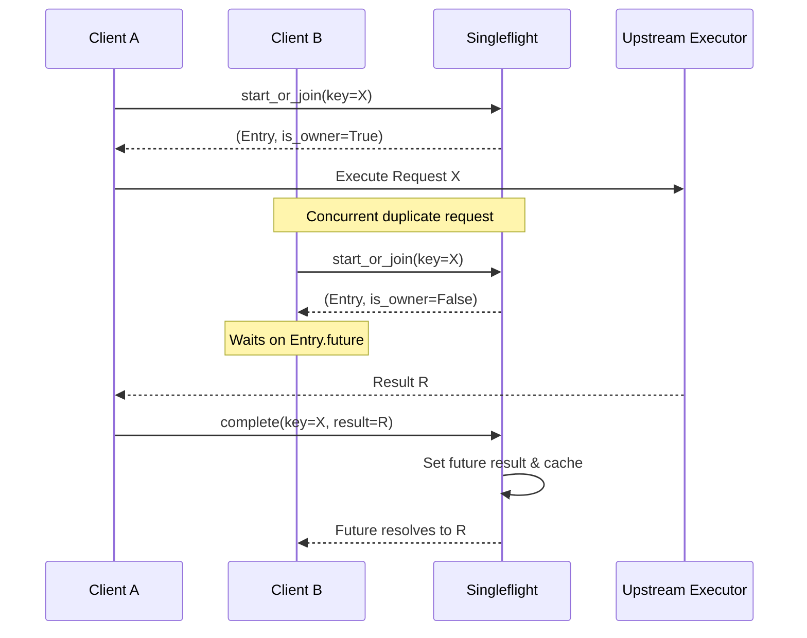

本页深入解析 qwen2API 网关中两个关键的请求预处理机制：**请求归一化（Request Normalization）**与**单次飞行控制（Singleflight Control）**。前者作为多协议适配的“通用翻译层”，将 OpenAI、Anthropic、Gemini 及 Responses API 等异构请求统一转换为内部标准的 `ToolCoreRequest` 结构，确保下游核心逻辑的协议无关性；后者作为并发优化原语，通过请求去重与结果共享机制，防止相同语义的请求在极短时间内重复消耗上游资源。这两个模块共同构成了网关从“接入”到“执行”之间的关键防御与转换屏障。

## 请求归一化架构：从异构协议到标准内核

请求归一化器（Normalizer）是 Toolcore 引擎的入口门户。其核心设计原则是 **“宽进严出”**：对外兼容各厂商 API 的字段差异与容错空间，对内输出强类型、结构一致的 `ToolCoreRequest` 对象。这一过程不仅包含字段映射，还涉及工具名称桥接（Bridge Naming）、技能目录提取以及历史工具调用记录的标准化重建。

```mermaid
flowchart LR
    subgraph "协议适配层 (API Layer)"
        A1[OpenAI Chat] --> N1[normalize_chat_request]
        A2[Responses API] --> N2[normalize_responses_request]
        A3[Anthropic] --> N3[normalize_anthropic_request]
        A4[Gemini] --> N4[normalize_gemini_request]
    end

    subgraph "归一化核心 (Normalizer Core)"
        N1 & N2 & N3 & N4 --> NM[_normalize_messages]
        N1 & N2 & N3 & N4 --> NT[_normalize_tools / _normalize_*_tools]
        N1 & N2 & N3 & N4 --> TC[_parse_tool_choice]
        NT --> Cat[ToolCatalog<br/>bridge-N 映射]
        NM & NT & TC --> Builder[ToolCoreRequest Builder]
    end

    subgraph "标准内核 (Canonical Core)"
        Builder --> OUT[ToolCoreRequest]
        OUT --> |messages| MSG[List[Dict]]
        OUT --> |tools| TLS[List[ToolDefinition]]
        OUT --> |policy| POL[ToolChoicePolicy]
        OUT --> |tool_calls| TCL[List[CanonicalToolCall]]
    end
```

归一化流程严格遵循“工具优先”策略，特别是在 Gemini 适配中，必须先构建 `ToolCatalog` 才能正确解析消息体中的 `functionCall` 和 `functionResponse`，将其中的客户端可见名称转换为内部模型使用的 `bridge-N` 别名。这种顺序依赖确保了多轮对话中工具引用的一致性，避免了因名称不匹配导致的上下文断裂。所有归一化函数最终都返回相同的 `ToolCoreRequest` 数据结构，使得后续的提示词构建、流式状态机等模块无需感知原始请求来源。

Sources: [request_normalizer.py](backend/toolcore/request_normalizer.py#L481-L506)

## 消息与工具定义的标准化清洗

归一化器对输入数据执行了深度的防御性编程处理。对于消息列表，`_normalize_messages` 能够容忍字符串、字典或列表等多种输入形态，并自动过滤非字典类型的脏数据，确保输出始终是标准的 `[{"role": ..., "content": ...}]` 格式。对于工具定义，不同协议的解析逻辑被封装在独立的私有函数中，但都统一输出为 `ToolDefinition` 对象。

| 特性 | OpenAI / Responses | Anthropic | Gemini |
| :--- | :--- | :--- | :--- |
| **工具源字段** | `tools[].function` | `tools[]` | `tools[].functionDeclarations` |
| **参数Schema字段** | `parameters` | `input_schema` | `parameters` |
| **名称桥接** | 自动分配 `bridge-N` | 自动分配 `bridge-N` | 自动分配 `bridge-N` |
| **排除机制** | 支持 `excluded_tool_names` | 不支持 | 不支持 |
| **特殊处理** | 解析 assistant 消息中的历史 tool_calls | 无 | 需结合 ToolCatalog 转换 functionResponse |

在工具解析过程中，系统会自动生成 `model_name`（如 `bridge-0`, `bridge-1`），并将原始的客户端工具名保存在 `client_name` 字段中。这种**双名制**设计是网关实现协议解耦的关键：上游模型只看到稳定的 `bridge-N` 标识符，而响应格式化阶段则通过 `ToolCatalog` 反向映射回客户端期望的原始名称。此外，OpenAI 适配器还支持通过 `excluded_tool_names` 参数动态剔除特定工具，这为内部技能注入或冲突规避提供了灵活的控制手段。

Sources: [request_normalizer.py](backend/toolcore/request_normalizer.py#L37-L89)
Sources: [request_normalizer.py](backend/toolcore/request_normalizer.py#L91-L117)
Sources: [request_normalizer.py](backend/toolcore/request_normalizer.py#L222-L253)

## 工具选择策略与历史调用重建

`tool_choice` 参数的归一化不仅仅是字符串转换，更是意图的策略化表达。`_parse_tool_choice` 函数将各协议中五花八门的控制指令（如 `"auto"`, `"required"`, `"any"`, `{"type": "function", ...}`）统一映射为 `ToolChoicePolicy` 枚举（AUTO, REQUIRED, NONE, FORCED）。当指定强制调用某个工具时，归一化器会校验该工具是否存在于当前声明的工具集中，若不存在则立即抛出异常，实现了**早期失败（Fail-Fast）** 验证，避免无效请求穿透到昂贵的上游推理环节。

除了静态配置，归一化器还负责从历史消息中“考古”出已发生的工具调用。`_canonical_tool_call_from_assistant_message` 遍历 assistant 角色的消息，提取 `tool_calls` 数组并将其转换为 `CanonicalToolCall` 对象。这一步骤至关重要，因为它将分散在消息流中的隐式状态显式化为结构化数据。对于参数解析，该函数具备极强的鲁棒性：即使 `arguments` 是非法 JSON 字符串，也会尝试将其包装为 `{"value": raw_string}` 而非直接崩溃，保证了对话上下文的连续性。这些标准化的调用记录随后被用于构建完整的工具执行上下文，支撑起多轮工具交互的状态追踪。

Sources: [request_normalizer.py](backend/toolcore/request_normalizer.py#L303-L339)
Sources: [request_normalizer.py](backend/toolcore/request_normalizer.py#L342-L374)

## 单次飞行控制：并发去重与结果复用

在高并发场景下，多个客户端可能同时发起完全相同的请求（例如前端重试、缓存击穿或批量任务中的重复子任务）。`RequestSingleflight` 组件通过**请求合并**机制解决这一问题。它维护了两个核心状态表：`_inflight` 记录正在执行中的请求及其关联的 Future 对象，`_completed` 缓存近期已完成的结果。当新请求到达时，系统首先检查是否有匹配的 inflight 条目，若有则直接等待同一个 Future；若已有缓存结果且未过期，则立即返回缓存值。



该实现采用了异步锁（`asyncio.Lock`）保护状态变更，确保在协程调度间隙不会发生竞态条件。值得注意的是，`complete` 方法不仅设置 Future 结果，还会触发 `_prune_completed` 清理过期的缓存条目，防止内存泄漏。对于失败的请求，`fail` 方法会将异常传播给所有等待者，但不会缓存错误结果，这意味着下一次相同请求仍会尝试重新执行，符合“瞬时故障可重试”的工程直觉。`forget` 方法则提供了手动清除状态的逃生舱，适用于需要强制刷新或取消监听的特殊场景。

Sources: [request_singleflight.py](backend/toolcore/request_singleflight.py#L26-L78)

## 归一化与单次飞行的协同边界

虽然归一化器和单次飞行器都是请求预处理管线的一部分，但它们在职责上有着清晰的界限。**归一化是单次飞行的前置条件**：只有经过归一化生成的 `ToolCoreRequest` 才能提供稳定、可哈希的语义键（Key）用于去重判断。如果直接使用原始 JSON 请求体作为 Key，字段顺序差异、默认值缺失或协议特有的冗余字段都会导致本应合并的请求被误判为不同请求。

在实际集成中，建议的调用链路为：`Raw Request → Normalizer → Hashable Key Generator → Singleflight → Executor`。归一化后的 `ToolCoreRequest` 包含了清洗后的消息、排序后的工具列表以及标准化的策略枚举，这些字段组合起来才能构成真正代表“用户意图”的唯一标识。同时，由于 Singleflight 的 `result_ttl_seconds` 默认为 60 秒，开发者应根据业务场景调整此参数：对于实时聊天场景可设为 0 或极短值以避免读到陈旧回复；对于确定性查询或嵌入计算则可适当延长以最大化缓存收益。这种分层设计使得网关既能应对突发流量冲击，又能保持对复杂协议生态的优雅兼容。

Sources: [request_normalizer.py](backend/toolcore/request_normalizer.py#L18-L24)