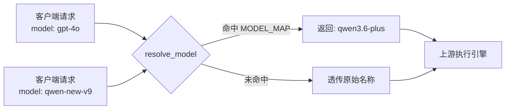
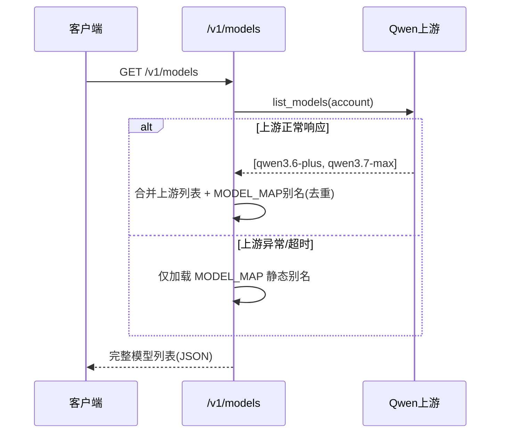

本页详解 qwen2API 网关如何通过静态映射表与动态合并机制，将多厂商（OpenAI、Anthropic、Gemini、DeepSeek）及 Qwen 旧版模型名称统一转换为上游实际可用的 Qwen 模型标识。该策略是网关实现“协议无关性”的核心基础，使得下游客户端无需感知上游模型迭代即可保持业务连续性。文档涵盖核心映射表结构、解析函数逻辑、代码生成专用模型路由、以及 `/v1/models` 端点的混合列表构建机制。

## 核心映射表 MODEL_MAP 架构

网关的模型别名系统基于 `backend/core/config.py` 中定义的全局常量 `MODEL_MAP` 构建。这是一个纯粹的静态字典映射，采用 **O(1)** 时间复杂度的哈希查找，确保在高并发请求下模型解析不会成为性能瓶颈。映射表按厂商分组维护，涵盖了从 GPT-4o、Claude-3.5-Sonnet 到 Gemini-2.5-Pro 等主流模型的兼容别名，并将它们统一指向当前上游支持的最佳 Qwen 模型版本（如 `qwen3.6-plus` 或 `qwen3.5-flash`）。这种设计实现了上游模型版本的集中式管理：当 Qwen 发布新版本时，运维人员仅需更新此单一配置点，所有下游别名自动生效，无需修改任何适配器代码。

Sources: [config.py](backend/core/config.py#L143-L176)

| 源厂商 | 典型别名示例 | 目标上游模型 | 策略说明 |
| :--- | :--- | :--- | :--- |
| OpenAI | gpt-4o, gpt-4-turbo, o1 | qwen3.6-plus | 旗舰/推理模型映射至最强通用版 |
| OpenAI | gpt-4o-mini, gpt-3.5-turbo | qwen3.5-flash | 轻量/高速模型映射至 Flash 版 |
| Anthropic | claude-3.5-sonnet, claude-opus-4-6 | qwen3.6-plus | Sonnet/Opus 系列统一映射 |
| Anthropic | claude-3-haiku | qwen3.5-flash | Haiku 系列映射至 Flash 版 |
| Gemini | gemini-2.5-pro / flash | qwen3.6-plus / flash | 按 Pro/Flash 等级对齐 |
| Qwen Legacy | qwen-max, qwen-plus | qwen3.6-plus | 旧版通义千问别名平滑迁移 |
| DeepSeek | deepseek-chat, deepseek-reasoner | qwen3.6-plus | 第三方国产模型兼容层 |

## 解析函数与透传机制

模型解析的核心入口是 `resolve_model(name: str)` 函数。该函数遵循 **“显式映射优先，未知名称透传”** 的设计原则。当传入的模型名存在于 `MODEL_MAP` 中时，返回对应的上游真实模型 ID；若不存在，则原样返回输入值。这一透传机制至关重要，它保证了网关的前向兼容性：即使上游 Qwen 发布了新模型且尚未添加到映射表中，开发者仍可直接使用新模型的真实 ID 进行调用，而不会被网关拦截或报错。此外，针对特定预览版模型（如 `qwen3.7-plus-preview`），映射表支持将其指向内部测试通道标识（如 `qwen-latest-series-invite-beta-v16`），从而实现灰度发布与内测流量的精确路由。

Sources: [config.py](backend/core/config.py#L178-L179)

## 代码生成专用模型路由

除了通用对话模型映射外，网关还实现了针对代码生成任务的专用模型路由策略。通过 `QWEN_CODE_CODER_MODEL` 环境变量，管理员可以指定一个专门优化过代码能力的模型（默认为 `qwen3-coder-plus`）。`resolve_qwen_code_model` 函数会忽略用户传入的通用模型别名，强制将代码相关请求重定向至该专用模型。配合 `GENERIC_QWEN_CODE_MODELS` 集合与 `_looks_like_coder_model` 辅助函数，系统能够识别哪些请求属于“通用代码任务”或“显式 Coder 模型调用”，从而在 Toolcore 工具调用链路中自动触发模型升级。这种分层路由确保了代码补全、函数生成等场景始终使用最优模型，而不受全局默认映射的影响。

Sources: [config.py](backend/core/config.py#L182-L200)

## /v1/models 端点的混合列表策略

`/v1/models` API 端点采用了 **“上游真实模型 + 本地别名补全”** 的混合构建策略，以同时满足客户端自动发现与别名可用性的双重需求。当网关成功连接上游并获取模型列表时，响应数据以上游返回的真实模型 ID 为主体，随后遍历 `MODEL_MAP` 将所有未在响应中出现的别名追加到列表末尾。若上游不可用或查询失败，则降级为仅返回 `MODEL_MAP` 中定义的静态别名列表。这种设计确保了无论上游状态如何，客户端始终能获取到一个非空的、包含所有兼容别名的模型清单，避免了因上游临时故障导致客户端模型选择器清空的问题。去重逻辑通过 `seen` 集合保证，防止同一模型 ID 在列表中重复出现。

Sources: [models.py](backend/api/models.py#L22-L64)

## 别名系统的测试验证体系

模型映射的正确性通过 `tests/test_model_aliases.py` 中的多层级测试用例严格保障。单元测试直接验证 `resolve_model` 函数对关键别名（特别是预览版到内部通道的映射）的解析准确性。集成测试则通过 Mock 上游客户端，验证 `/v1/models` 端点在“上游有数据”和“上游无数据”两种场景下的列表合并逻辑，确保别名既不会丢失也不会重复。特别值得注意的是，测试用例显式检查了 `qwen3.7-plus-preview` 这类特殊映射的存在性，防止在重构过程中意外删除关键的灰度路由规则。这套测试体系构成了别名策略的安全网，使得配置变更可以在部署前被充分验证。

Sources: [test_model_aliases.py](tests/test_model_aliases.py#L9-L57)

## 下一步阅读建议

理解模型映射后，建议继续阅读以下页面以掌握完整的请求处理链路：

-   [配置管理：Settings与模型映射](15-pei-zhi-guan-li-settingsyu-mo-xing-ying-she)：了解 `MODEL_MAP` 之外的其他关键配置项及其环境变量覆盖方式。
-   [OpenAI Chat Completions接口适配](6-openai-chat-completionsjie-kou-gua-pei)：查看模型解析结果如何在具体的 Chat 请求中被传递给上游执行引擎。
-   [Qwen客户端与执行引擎](17-qwenke-hu-duan-yu-zhi-xing-yin-qing)：深入理解解析后的模型 ID 如何影响上游连接选择与参数构造。
-   [限流策略与错误处理](32-xian-liu-ce-lue-yu-cuo-wu-chu-li)：了解当映射到的上游模型触发限流时，网关的降级与重试机制。