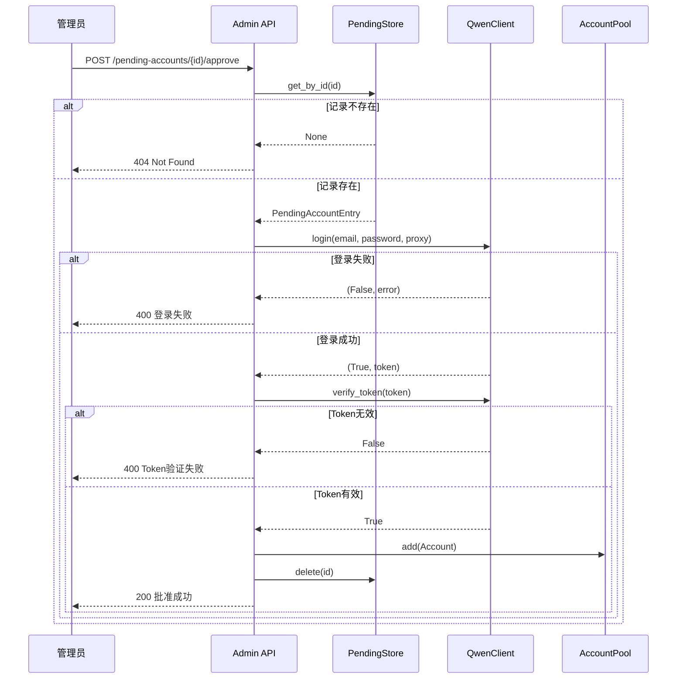

待审批账户机制是 qwen2API 企业网关中用于隔离“凭证提交”与“生产可用”状态的安全缓冲层。该机制通过独立的 `PendingAccountStore` 存储尚未验证的账户凭证，确保只有经过管理员显式批准且通过实时登录校验的账户才能进入核心账号池参与流量调度。这种设计有效防止了无效凭证、错误配置或恶意提交的账户直接污染生产环境，同时为批量账户接入提供了标准化的审核工作流。本文档将深入解析该机制的数据模型、审批流转逻辑及安全管控策略。

## 待审批数据模型与隔离存储

待审批账户采用与生产账户完全物理隔离的存储策略，避免未验证数据混入 `accounts.json`。系统定义了专用的 `PendingAccountEntry` 数据模型，包含邮箱、密码、代理配置及提交者 API Key 等元数据，但不包含任何运行时状态（如 token、并发数、限流标记等）。这种精简模型确保了待审批队列仅作为“凭证暂存区”存在，不承担业务调度职责。

| 字段 | 类型 | 说明 | 安全/审计意义 |
| :--- | :--- | :--- | :--- |
| `id` | UUID | 全局唯一标识符 | 用于审批/拒绝操作的原子寻址，避免邮箱变更导致的竞态 |
| `email` | str | 账户邮箱 | 业务主键，创建时强制去重校验 |
| `password` | str | 账户密码 | 仅在审批瞬间用于登录换取 Token，不落盘到生产池 |
| `proxy` | Optional[str] | 网络代理地址 | 支持独立于全局配置的账户级代理 |
| `submitted_by_api_key` | str | 提交者的 API Key | **审计追踪**：记录谁提交了该账户，便于溯源 |
| `created_at` | float | 提交时间戳 | 支持基于时间的过期清理或排序 |

存储层使用 `AsyncJsonDB` 封装的 `data/pending_accounts.json` 文件，配合 `asyncio.Lock` 保证并发写入安全。加载时对每条记录进行 Pydantic 校验，损坏条目仅记录警告而不阻塞启动，保证了系统的容错性。

Sources: [pending_account_store.py](backend/core/pending_account_store.py#L13-L22)
Sources: [pending_account_store.py](backend/core/pending_account_store.py#L26-L54)

## 审批流转与实时校验逻辑

批准一个待审批账户并非简单的数据库记录移动，而是一个包含“实时凭证验证”的事务性操作。当管理员调用 `/api/admin/pending-accounts/{id}/approve` 接口时，系统会执行严格的四步校验流程，确保进入生产池的账户在当前时刻是真实可用的。

这一流程的关键在于**即时性校验**：即使账户在提交时是有效的，若在审批前密码被修改或账号被封禁，审批操作将直接失败并返回具体错误信息，不会将“僵尸账户”移入生产池。只有当 `login` 和 `verify_token` 双重检查均通过后，系统才会构建完整的 `Account` 对象加入 `AccountPool`，并立即从待审批存储中删除原记录，完成状态迁移。

Sources: [admin.py](backend/api/admin.py#L782-L828)

## 拒绝机制与安全审计

拒绝操作（Reject）设计为纯粹的删除动作，不包含任何凭证尝试或网络请求。当管理员判定某个提交不合规或不再需要时，调用 `/api/admin/pending-accounts/{id}/reject` 接口，系统仅执行 `store.delete(id)` 并从持久化文件中移除该条目。这种“静默丢弃”策略避免了向潜在恶意提交者泄露任何关于账户状态的反馈信息。

在安全审计方面，所有待审批操作均受 `verify_admin` 依赖注入保护，要求请求头携带有效的 `Bearer` Token（必须是 `ADMIN_KEY` 或已注册的 API Key）。此外，`PendingAccountEntry` 中记录的 `submitted_by_api_key` 字段为事后审计提供了关键线索，管理员可以通过查询待审批列表识别特定 API Key 的提交行为，结合日志系统中的 `[审批]` 标签追踪账户的生命周期变更。值得注意的是，列出待审批账户的接口刻意过滤了 `password` 字段，仅返回元数据，防止敏感凭证在管理界面或 API 响应中意外泄露。

Sources: [admin.py](backend/api/admin.py#L831-L853)
Sources: [admin.py](backend/api/admin.py#L758-L779)
Sources: [admin.py](backend/api/admin.py#L79-L89)

## 生命周期管理与集成要点

待审批账户存储作为网关的一等公民组件，在应用启动阶段即完成初始化。在 `lifespan` 上下文中，`PendingAccountStore` 先于账号池加载，确保在服务就绪前所有暂存数据已恢复至内存。该实例被挂载到 `app.state.pending_account_store`，供管理 API 随时访问。

对于中间件开发者或运维人员，需特别注意以下集成边界：
1.  **无自动晋升**：待审批账户永远不会自动变为可用，必须经过显式审批。这区别于某些系统的“试用即生效”模式。
2.  **无过期清理**：当前实现不包含 TTL 机制，长期未审批的记录会永久保留在 `pending_accounts.json` 中，建议定期通过管理接口清理积压条目。
3.  **独立于浏览器自动化**：由于轻量镜像不包含浏览器环境，待审批机制仅支持已有凭证的验证，不支持自动注册或页面激活流程。若需此类功能，需参考 [WebUI管理台使用](27-webuiguan-li-tai-shi-yong) 中的完整部署方案。

Sources: [main.py](backend/main.py#L107-L111)
Sources: [admin.py](backend/api/admin.py#L405-L413)

## 延伸阅读

理解待审批机制后，建议按以下路径继续探索相关模块：
-   了解审批通过后账户如何参与调度：[账号池：并发控制与限流冷却](10-zhang-hao-chi-bing-fa-kong-zhi-yu-xian-liu-leng-que)
-   掌握管理接口的认证体系：[认证与配额管理](18-ren-zheng-yu-pei-e-guan-li)
-   查看前端如何展示审批队列：[WebUI管理台使用](27-webuiguan-li-tai-shi-yong)