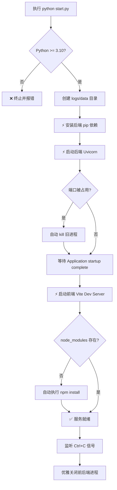

本文档专为初次接触 qwen2API 的开发者设计，指导您在不使用 Docker 的情况下，直接通过源码在本地 Windows 或类 Unix 环境中启动完整的企业网关服务。本地源码运行模式保留了前后端分离的开发体验，支持前端 Vite 热更新与后端 Uvicorn 实时重载，是进行功能调试、协议适配验证及二次开发的首选方式。通过统一的启动脚本，您可以一键完成依赖安装、端口清理及服务编排，无需手动配置复杂的进程管理工具。

Sources: [start.py](start.py#L1-L7)

## 环境准备与前置条件

在开始之前，请确保您的开发环境满足以下基础运行时要求。qwen2API 采用了较新的 Python 异步特性与 Node.js 构建工具链，版本过低可能导致启动失败或运行时异常。启动脚本内置了 Python 版本检查机制，若低于 3.10 将自动终止并提示错误，而前端构建则依赖于 npm 生态的标准化支持。

| 依赖项 | 最低版本 | 说明 | 验证命令 |
| :--- | :--- | :--- | :--- |
| Python | 3.10+ | 后端运行时，需支持 `match/case` 等新语法 | `python --version` |
| Node.js | 18+ | 前端 Vite 构建与开发服务器 | `node -v` |
| npm | 9+ | 前端包管理器（随 Node.js 安装） | `npm -v` |
| Git | 2.x | 代码克隆与版本管理 | `git --version` |

除运行时外，还需注意网络环境对依赖安装的影响。后端依赖包含 `curl_cffi` 等编译型库，Windows 用户可能需要预装 Visual C++ Build Tools；前端依赖若下载缓慢，建议提前配置 npm 镜像源。项目根目录下的 `.env.example` 提供了默认配置模板，本地运行时建议复制为 `.env` 并根据实际路径调整 `ACCOUNTS_FILE` 等数据文件位置，避免使用容器专用的 `/workspace` 绝对路径。

Sources: [start.py](start.py#L27-L30), [.env.example](.env.example#L12-L18)

## 一键启动流程详解

项目提供了跨平台的 `start.py` 编排脚本，封装了从环境检测到服务就绪的全链路逻辑。该脚本采用顺序执行模型，依次完成后端依赖安装、后端服务启动、前端服务启动三个阶段，并通过信号监听实现优雅退出。在 Windows 环境下，脚本会自动切换 shell 调用方式并启用端口占用自动清理机制，确保开发体验的一致性。

启动过程中，脚本会将后端标准输出实时转发至控制台，并通过检测 `Application startup complete` 关键字来判断服务是否真正可用，超时阈值为 300 秒。这种“就绪探测”机制避免了前端已启动但后端 API 尚未初始化导致的请求失败问题。对于前端，脚本仅在检测到 `node_modules` 缺失时触发安装，已安装环境下直接启动开发服务器，显著缩短重复启动耗时。

Sources: [start.py](start.py#L102-L154), [start.py](start.py#L47-L69)

## 服务架构与访问端点

本地源码运行模式下，前后端以独立进程形式共存，通过 HTTP 协议交互。后端作为 API 网关承载所有业务逻辑与协议转换，前端则作为纯静态资源与管理界面提供可视化操作。两者通过 CORS 中间件解除跨域限制，使得开发环境下的联调无需额外代理配置。

| 服务组件 | 默认地址 | 技术栈 | 核心职责 |
| :--- | :--- | :--- | :--- |
| **后端 API** | `http://127.0.0.1:7860` | FastAPI + Uvicorn | OpenAI/Anthropic/Gemini 协议适配、账号池管理、Toolcore 引擎 |
| **前端 WebUI** | `http://127.0.0.1:5174` | React + Vite | 管理后台、对话测试、账号监控、配置可视化 |
| **数据存储** | `./data/*.json` | AsyncJsonDB | 账号、会话亲和性、上下文缓存、上传文件元数据 |

后端启动时会加载 `backend/main.py` 中定义的 FastAPI 应用，该应用在 lifespan 阶段完成数据库连接、账号池预热、ChatID 池初始化及后台清理任务的注册。前端 Vite 开发服务器默认监听 5174 端口，支持模块热替换（HMR），修改 React 组件后浏览器可毫秒级刷新而不丢失状态。两个进程的 PID 均会在启动日志中打印，便于手动排查或附加调试器。

Sources: [backend/main.py](backend/main.py#L67-L136), [start.py](start.py#L164-L172)

## 常见问题与排查指南

本地源码运行虽便捷，但因环境差异易遇到特定问题。以下是基于启动脚本逻辑与常见开发场景总结的故障处理方案，帮助您在遇到问题时快速定位根因。

| 现象 | 可能原因 | 解决方案 |
| :--- | :--- | :--- |
| `❌ 需要 Python 3.10+` | 系统默认 Python 版本过低 | 安装 Python 3.10+ 并确保 `python` 命令指向新版本 |
| `npm install 失败` | 网络超时或缺少编译工具 | 切换 npm 镜像源；Windows 用户安装 VS Build Tools |
| 后端启动超时 | 依赖安装不完整或端口冲突 | 检查 pip 安装日志；手动执行 `netstat -ano \| findstr :7860` 清理端口 |
| 前端页面空白 | 后端未就绪或 CORS 拦截 | 确认后端日志出现“服务已完全就绪”；检查浏览器控制台网络请求 |
| 数据文件找不到 | `.env` 路径仍为容器路径 | 复制 `.env.example` 为 `.env`，将 `/workspace/data` 改为相对路径 `./data` |

特别需要注意的是，`.env.example` 中的数据文件路径默认为 Docker 容器内的绝对路径 `/workspace/data/...`，本地运行时必须修改为相对路径或本机绝对路径，否则后端会在启动时因无法创建父目录而报错。此外，若修改了后端核心模块代码，Uvicorn 默认不会自动重载（因通过 subprocess 启动），需手动重启 `start.py` 或改用 `uvicorn backend.main:app --reload` 单独启动后端以获得热重载能力。

Sources: [.env.example](.env.example#L12-L18), [start.py](start.py#L113-L126)

## 下一步阅读建议

成功启动本地服务后，建议按照以下路径深入理解系统配置与架构细节，以便更高效地进行开发或部署迁移：

-   **[环境变量与配置详解](4-huan-jing-bian-liang-yu-pei-zhi-xiang-jie)**：全面掌握 `.env` 中每个参数的含义、默认值及调优策略，特别是限流、并发与缓存相关配置。
-   **[架构总览：统一网关与协议转换](5-jia-gou-zong-lan-tong-wang-guan-yu-xie-yi-zhuan-huan)**：了解 qwen2API 如何将多种上游协议统一转换为标准接口，以及请求在网关内部的完整流转路径。
-   **[开发环境搭建与调试](36-kai-fa-huan-jing-da-jian-yu-diao-shi)**：获取 IDE 配置、断点调试、单元测试运行等进阶开发技巧，提升本地开发效率。
-   **[快速开始：Docker一键部署](2-kuai-su-kai-shi-docker-jian-bu-shu)**：当本地验证完成后，参考此文档将服务容器化部署至生产或测试环境。