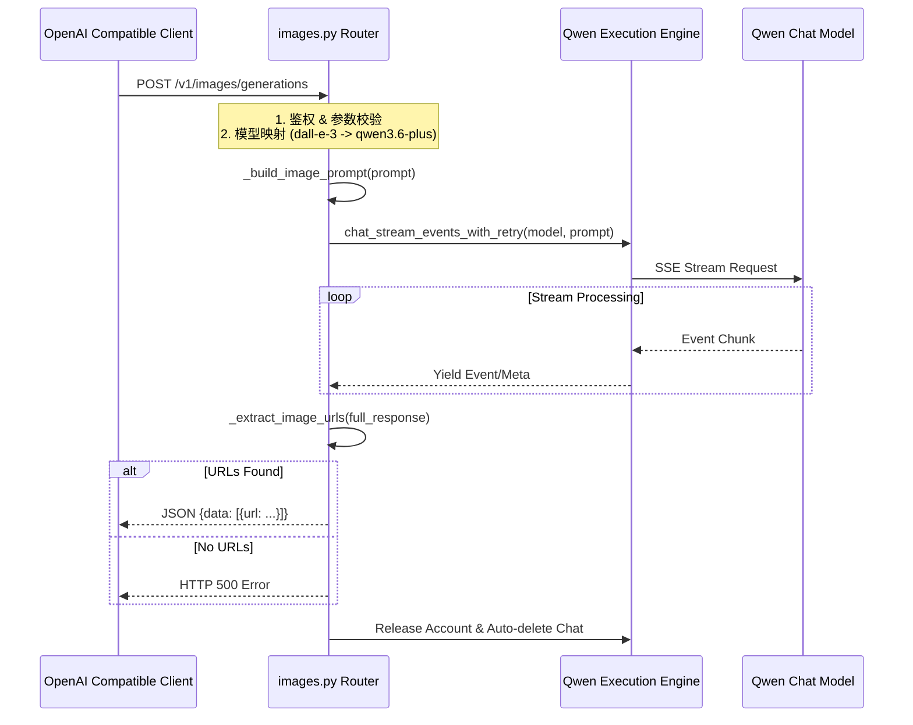
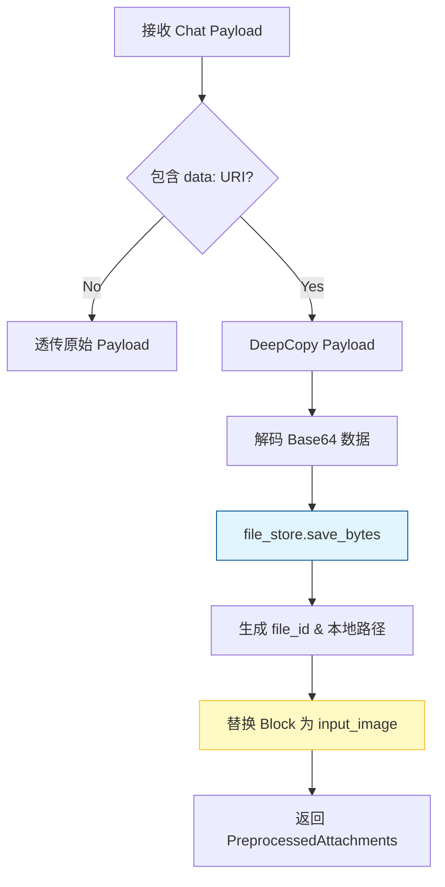

本文档深入解析 qwen2API 网关中图片生成（Text-to-Image）功能的实现机制。与传统的专用绘图 API 不同，本系统采用 **“对话即生成”** 的架构模式，将 OpenAI 标准的 `/v1/images/generations` 请求转化为对千问大模型的特定提示词交互，并通过正则表达式从流式响应中提取图片资源。同时，针对多模态输入场景，系统实现了基于 Base64 Data URI 的附件预处理机制，确保视觉意图能被正确识别与持久化存储。

## 核心架构：基于对话协议的图像生成桥接

qwen2API 的图片生成功能并非直接调用独立的文生图模型接口，而是通过 `backend/api/images.py` 模块构建了一个兼容层。该层将外部标准的图像生成请求“翻译”为内部聊天流式请求，利用千问模型（如 `qwen3.6-plus`）在对话中生成图片链接的能力来完成服务。这种设计解耦了对特定绘图 API 的依赖，使得任何具备画图能力的对话模型均可作为后端图像引擎。

该链路的核心在于**会话临时性**与**结果提取**。每次图片生成请求都会创建一个独立的聊天会话，在获取结果后，若配置了 `UPSTREAM_AUTO_DELETE_ENABLED`，系统会异步清理该会话以防止上游上下文污染或配额浪费。这种“阅后即焚”的策略保证了图像生成服务的无状态特性。

Sources: [images.py](backend/api/images.py#L74-L141)

## 模型映射与提示词工程策略

为了兼容生态中广泛使用的 `dall-e-3` 等模型标识，网关维护了一套静态映射表 `IMAGE_MODEL_MAP`。无论客户端请求何种图像模型名称，最终都会被路由至当前支持绘图能力的千问对话模型（默认为 `qwen3.6-plus`）。这种别名机制屏蔽了底层模型的变更细节，使上层应用无需随后端升级而修改代码。

| 请求模型标识 | 实际路由模型 | 备注 |
| :--- | :--- | :--- |
| `dall-e-3` / `dall-e-2` | `qwen3.6-plus` | 兼容 OpenAI 标准客户端 |
| `qwen-image` / `qwen-image-plus` | `qwen3.6-plus` | 兼容旧版自定义命名 |
| `qwen3.6-plus` | `qwen3.6-plus` | 直连原生模型名 |
| `(null)` / 其他 | `qwen3.6-plus` | 默认兜底策略 |

在意图传达方面，`_build_image_prompt` 函数充当了关键的**指令注入器**。由于底层是通用对话模型，必须通过强提示词强制其进入“绘图模式”并输出结构化结果。系统会在用户原始 Prompt 前拼接固定指令：“请直接生成图片，不要只输出文字描述。如果可以生成图片，请返回可访问的图片链接...”。这一设计有效抑制了模型仅回复文字描述的倾向，提高了图像生成的成功率与结果的可解析性。

Sources: [images.py](backend/api/images.py#L19-L71)

## 响应解析：非结构化文本中的资源提取

由于图像生成结果嵌入在自然语言流式响应中，而非结构化的 JSON 字段里，网关实现了一套鲁棒的正则提取引擎 `_extract_image_urls`。该引擎采用多级匹配策略，按优先级依次扫描 Markdown 图片语法、JSON 键值对以及裸 CDN 链接，并对结果进行去重处理。

1.  **Markdown 语法匹配**：优先捕获 `` 格式，这是大模型输出图片最标准的格式。
2.  **JSON 字段匹配**：兼容模型可能输出的 `{"url": "..."}` 或 `{"image_url": "..."}` 等结构化片段。
3.  **CDN 域名启发式匹配**：针对 `cdn.qwenlm.ai`、`wanx.alicdn.com` 等已知图床域名进行宽泛匹配，作为兜底机制防止因格式微小偏差导致提取失败。

这种多层防御式的解析逻辑确保了即使上游模型输出格式发生轻微漂移，网关仍能稳定获取图片资源。提取到的 URL 列表会根据请求参数 `n` 进行截断，最终封装为符合 OpenAI 规范的响应体返回给客户端。

Sources: [images.py](backend/api/images.py#L31-L50)

## 视觉意图识别与附件预处理链路

除了纯文本生图，系统还通过 `attachment_preprocessor.py` 支持多模态输入（如“根据这张照片生成类似风格”）。当检测到消息内容中包含 `data:` 开头的 Base64 图片编码时，预处理器会自动触发**资源实体化**流程，将内联数据转换为持久化的文件引用。

此过程不仅解决了上游接口不支持超长 Base64 传输的限制，还为后续的视觉理解任务建立了统一的文件索引。转换后的 `input_image` 类型块携带了 `file_id` 和 `mime_type`，使得下游的 Toolcore 或模型执行器能够以标准化的方式引用视觉资源，实现了从“数据传输”到“语义引用”的意图识别闭环。

Sources: [attachment_preprocessor.py](backend/services/attachment_preprocessor.py#L42-L93)

## 推荐阅读

若您希望进一步了解图片生成所依赖的底层执行环境或多模态文件的完整生命周期，建议继续阅读以下章节：

-   [Qwen客户端与执行引擎](17-qwenke-hu-duan-yu-zhi-xing-yin-qing)：了解 `chat_stream_events_with_retry` 的重试机制与账号调度逻辑。
-   [附件预处理与上下文管理](21-fu-jian-yu-chu-li-yu-shang-xia-wen-guan-li)：深入探讨视觉文件在上下文窗口中的管理与卸载策略。
-   [文件存储与上传](22-wen-jian-cun-chu-yu-shang-chuan)：解析 `file_store` 的本地持久化实现与哈希去重机制。
-   [账号池：并发控制与限流冷却](10-zhang-hao-chi-bing-fa-kong-zhi-yu-xian-liu-leng-que)：理解图像生成高耗时请求下的账号资源隔离策略。