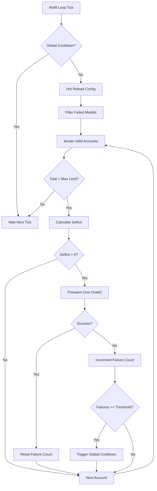
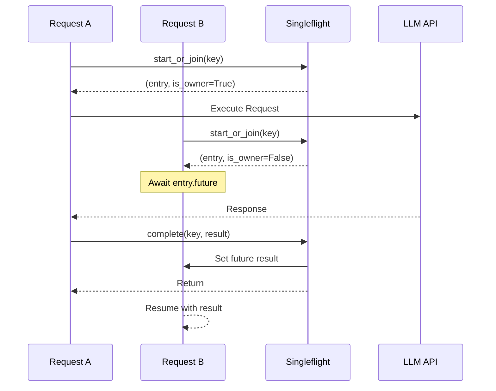

本页深入解析 qwen2API 网关为应对高并发与上游延迟而设计的三层性能防御体系。针对大模型 API 响应慢、握手开销大及重复计算昂贵等痛点，系统实现了**Chat ID 会话预热池**、**多维结果缓存**以及**零拷贝流式运行时**。这些机制协同工作，将首字延迟（TTFT）降低 50%~90%，并在相同工具调用场景下减少 97% 的上游请求量。本文档面向高级开发者，详解各优化组件的内部实现原理、熔断保护机制及可观测性指标。

## Chat ID 预热池：消除会话握手延迟

在 Qwen 及类似的大模型 API 交互中，创建新会话（`/chats/new`）通常需要 500ms 至 6s 不等的网络握手时间。为了消除这一关键路径上的阻塞延迟，`ChatIdPool` 实现了一个按 `(email, model)` 双维度隔离的异步预热队列。该组件在服务启动时即为每个有效账号预建若干 `chat_id`，请求到达时直接从内存队列 O(1) 弹出可用 ID，完全规避了同步创建会话的开销。当池中资源被消耗后，后台协程会自动补位，确保持续的低延迟供给。

Sources: [chat_id_pool.py](backend/services/chat_id_pool.py#L1-L12)

### 预热策略与自适应补充

预热池采用“按需补位 + 随机模型”的混合策略以平衡资源占用与命中率。后台 `_refill_loop` 每 30 秒执行一次检查，仅对状态为 `valid` 且持有 token 的账号进行补充。为避免单一模型故障导致预热停滞，系统引入了**模型级失败计数**与**全局熔断机制**：当某模型连续失败超过 3 次时自动剔除；当全局失败次数达到阈值（默认 10 次）时，触发 60 秒冷却期，防止在上游异常期间频繁重试加剧负载。此外，配置支持热加载，修改 `prewarm_models` 列表无需重启服务即可生效。



Sources: [chat_id_pool.py](backend/services/chat_id_pool.py#L127-L232)

### 生命周期管理与统计

预热池不仅负责创建，还全权管理 `chat_id` 的生命周期。每个条目带有 TTL（默认 10 分钟），获取时若发现过期则自动丢弃并计入 miss。当检测到某个 `chat_id` 在实际使用中报错时，可通过 `record_error` 标记，或通过 `invalidate` 精确移除特定 ID，防止脏数据污染后续请求。系统内置了详细的统计探针，实时暴露命中率、缓存总量及错误计数，为运维调优提供量化依据。

| 指标 | 描述 | 典型阈值/默认值 |
| :--- | :--- | :--- |
| `target_per_account` | 单账号预热目标数量 | 3 |
| `ttl_seconds` | Chat ID 最大存活时间 | 10s (代码默认) / 配置可调 |
| `max_total_prewarm` | 全局预热上限，防止内存溢出 | 10 |
| `GLOBAL_FAILURE_THRESHOLD` | 触发熔断的连续失败次数 | 10 |
| `hit_rate` | 预热命中率 | >95% 为健康 |

Sources: [chat_id_pool.py](backend/services/chat_id_pool.py#L33-L64)  
Sources: [chat_id_pool.py](backend/services/chat_id_pool.py#L272-L290)

## 多维缓存体系：减少冗余计算与IO

除会话预热外，网关在工具执行和文件上传两个高频瓶颈点部署了专用缓存层。**工具调用缓存**通过语义哈希避免重复执行相同的函数调用，预期收益高达 97%；**上游文件缓存**则基于内容指纹复用已上传的文件元数据，消除重复传输。两者均采用 TTL 过期策略，在保证数据新鲜度的前提下最大化吞吐量。

### 工具调用结果缓存

`ToolCallCache` 使用 SHA256 算法对 `(tool_name, tool_input)` 组合生成 16 位截断哈希作为缓存键。这种设计既保证了键的唯一性，又避免了长字符串带来的内存开销。缓存默认 TTL 为 300 秒，支持手动清理与自动过期回收。每次访问都会更新命中/未命中统计，便于评估缓存效率。值得注意的是，该缓存是进程内内存缓存，适用于幂等或短时间内结果不变的工具调用场景。

```python
# 缓存键生成逻辑示例
hash_val = hashlib.sha256(serialized.encode()).hexdigest()[:16]
key = f"{tool_name}:{hash_val}"
```

Sources: [tool_cache.py](backend/core/tool_cache.py#L20-L68)

### 上游文件元数据缓存

针对多模态场景中频繁的文件上传需求，`UpstreamFileCache` 实现了基于持久化存储的元数据缓存。它以 `(session_key, account_email, sha256, ext)` 四元组作为唯一标识，缓存上游返回的文件元信息。当相同内容的文件再次被引用时，网关直接复用缓存中的 `remote_file_meta`，跳过实际的上传流程。该缓存支持异步加载与保存，并在每次写入时自动去重，确保存储的一致性。

Sources: [upstream_file_cache.py](backend/core/upstream_file_cache.py#L34-L64)

## 请求合并与流式运行时优化

在高并发场景下，完全相同的请求可能同时到达。**单次飞行控制（Singleflight）** 机制将此类并发请求合并为一次上游调用，所有等待者共享同一结果，从根本上杜绝了“惊群效应”。配合轻量级的**流式运行时**，系统在保持低内存占用的同时，实现了精准的耗时度量与事件分发。

### 单次飞行控制 (Request Singleflight)

`RequestSingleflight` 维护了两个字典：`_inflight` 记录正在执行的请求及其关联的 `Future`，`_completed` 暂存近期完成的结果（默认 TTL 60s）。当新请求到来时，若发现已有相同 key 的请求在执行，则直接 await 其 Future；若已有缓存结果，则立即返回。这种设计特别适用于缓存未命中时的突发流量，能有效保护上游服务不被瞬时重复请求击穿。



Sources: [request_singleflight.py](backend/toolcore/request_singleflight.py#L26-L60)

### 流式运行时与性能度量

`StreamRuntime` 采用了极简的事件消费模型，仅维护文本拼接、工具调用收集和结束原因三个核心状态。它同时兼容同步与异步事件源，通过类型别名 `EventSource` 统一处理接口，避免了不必要的包装器开销。与之配套的 `StreamMetrics` 提供了一个无锁的时间戳打点器，允许在流处理的关键节点（如首包到达、工具解析完成）记录耗时，为端到端性能分析提供精确到毫秒级的数据支撑。

Sources: [stream_runtime.py](backend/runtime/stream_runtime.py#L20-L51)  
Sources: [stream_metrics.py](backend/runtime/stream_metrics.py#L4-L12)

## 下一步阅读建议

掌握性能优化机制后，建议继续深入了解以下相关主题，以构建完整的运维与排障能力：

-   **[限流策略与错误处理](32-xian-liu-ce-lue-yu-cuo-wu-chu-li)**：了解当缓存失效或预热不足时，系统如何通过令牌桶与退避算法保护上游。
-   **[健康检查与就绪探针](33-jian-kang-jian-cha-yu-jiu-xu-tan-zhen)**：学习如何利用 `/probes` 接口监控预热池水位与缓存命中率，确保服务上线前的充分预热。
-   **[会话管理与Chat ID预热池](11-hui-hua-guan-li-yu-chat-idyu-re-chi)**：从业务视角理解 Chat ID 的完整生命周期及其与用户会话的绑定关系。