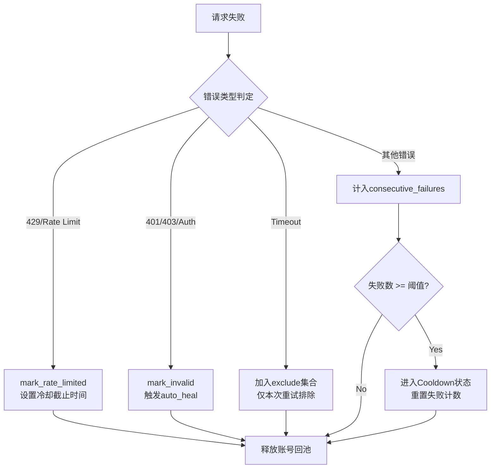

本页深入解析 qwen2API 网关在面对上游服务限制、网络波动及账号异常时的防御性架构。系统采用**多层级流量整形**与**自适应故障隔离**机制，确保在高并发场景下维持服务可用性。核心设计原则是将“限流”视为一种资源调度状态而非单纯的拒绝服务，通过精细化的账号池状态机、指数退避重试以及请求抖动（Jitter）策略，最大化利用上游账号的剩余配额并规避风控检测。对于高级开发者而言，理解这些机制是进行容量规划、故障排查及自定义调优的前提。

## 多维流量整形与账号级限流

qwen2API 的限流体系并非单一的全局阈值，而是由**并发控制**、**频率间隔**和**请求抖动**三个维度构成的立体防护网。这种设计旨在模拟真实用户行为模式，同时保证后端资源的公平分配。

### 并发与频率双重约束
每个上游账号在 `Account` 对象中维护了独立的运行时状态。系统通过 `MAX_INFLIGHT_PER_ACCOUNT` 严格限制单账号的并行请求数，防止因过度并发触发上游的连接级封禁。与此同时，`ACCOUNT_MIN_INTERVAL_MS` 强制规定了同一账号两次请求之间的最小时间间隔。在获取账号时，`next_available_at` 方法会综合计算限流冷却结束时间与最小间隔时间，只有当当前时间超过该值且并发槽位未满时，账号才被视为“可用”。这种双重检查机制确保了即使在高负载下，单个账号的请求速率也不会突破安全边界。

Sources: [account_pool.py](backend/core/account_pool.py#L58-L79)

### 请求抖动（Jitter）策略
为了避免多个网关实例或同一网关内的多个请求以固定频率撞击上游接口从而触发基于模式的自动化风控，系统在请求发起前注入了随机延迟。`_jitter_seconds` 函数根据 `REQUEST_JITTER_MIN_MS` 和 `REQUEST_JITTER_MAX_MS` 配置生成一个均匀分布的随机偏移量，并将其叠加到 `last_request_started` 时间戳上。这不仅平滑了瞬时流量峰值，还有效降低了请求序列的时间相关性，提升了账号在长期运行中的存活率。值得注意的是，抖动仅影响调度计时，不影响用于计算吞吐量（tok/s）的真实物理耗时统计。

Sources: [account_pool.py](backend/core/account_pool.py#L13-L17)
Sources: [config.py](backend/core/config.py#L24-L25)

### 配置参数矩阵
以下环境变量直接决定了流量整形的行为特征，建议根据上游服务的实际容忍度进行调整：

| 参数 | 默认值 | 作用域 | 说明 |
| :--- | :--- | :--- | :--- |
| `MAX_INFLIGHT_PER_ACCOUNT` | 1 | 账号级 | 单账号最大并发请求数，设为1最安全 |
| `ACCOUNT_MIN_INTERVAL_MS` | 0 | 账号级 | 请求最小间隔(ms)，建议 >1000 以规避检测 |
| `REQUEST_JITTER_MIN_MS` | 0 | 全局 | 随机延迟下限(ms)，配合上限使用 |
| `REQUEST_JITTER_MAX_MS` | 0 | 全局 | 随机延迟上限(ms)，建议设为下限的2-3倍 |
| `GLOBAL_MAX_INFLIGHT` | 0 | 全局 | 全局并发上限，0表示不限制 |

Sources: [config.py](backend/core/config.py#L16-L25)

## 自适应故障隔离与冷却机制

当请求失败时，系统不会简单地抛出错误，而是根据错误类型对账号执行差异化的状态标记与隔离策略。这种**故障分类处理**机制是保障账号池整体健康度的关键。

### 错误类型识别与状态流转
在 `QwenExecutor.chat_stream_events_with_retry` 的重试循环中，异常被捕获后会经过语义分析。系统通过关键词匹配（如 "429", "rate limit", "unauthorized", "timeout"）将错误归类为限流、鉴权失败或超时。针对 **429 Too Many Requests**，账号会被立即标记为 `rate_limited` 并进入动态冷却期；针对 **401/403**，账号被标记为 `invalid` 或 `pending_activation`，并触发异步自愈任务；针对 **超时**，账号虽不被永久标记，但会被加入本次请求的 `exclude` 集合，避免在后续重试中被重复选中。所有状态变更均伴随日志记录，便于事后审计。

Sources: [qwen_executor.py](backend/upstream/qwen_executor.py#L261-L290)

### 连续失败冷却（Cooldown）
除了上游显式返回的限流信号外，系统还实现了基于本地统计的**熔断保护**。当某账号的 `consecutive_failures` 达到 `ACCOUNT_MAX_FAILURES_BEFORE_COOLDOWN` 阈值时，会自动进入为期 `ACCOUNT_COOLDOWN_PERIOD_SECONDS` 的强制冷却期。在此期间，`is_available` 方法将返回 False，调度器完全跳过该账号。冷却期结束后，系统会自动重置失败计数器并恢复账号可用性。这一机制有效防止了因账号凭证失效或上游局部故障导致的无效请求风暴，节省了宝贵的重试配额。

Sources: [account_pool.py](backend/core/account_pool.py#L66-L74)
Sources: [config.py](backend/core/config.py#L30-L31)

### 故障处理决策流

Sources: [qwen_executor.py](backend/upstream/qwen_executor.py#L261-L293)
Sources: [account_pool.py](backend/core/account_pool.py#L214-L222)

## 智能重试与资源回收

重试不仅是重新发送请求，更是一个**资源再平衡**的过程。系统通过排除集（Exclude Set）和过期回收机制，确保重试操作能够真正触达可用的上游资源。

### 带状态感知的重试循环
`chat_stream_events_with_retry` 实现了最多 `MAX_RETRIES` 次的自动重试。每次重试前，调度器都会接收一个不断增长的 `exclude` 集合，其中包含了之前尝试过但失败的账号邮箱。这保证了重试逻辑具有**前进性**，不会在同一个已故障的账号上空转。如果在所有重试次数耗尽后仍无法获取可用账号或请求成功，系统将抛出明确的聚合异常，提示管理员检查账号池状态。此外，对于指定了 `fixed_account` 的特殊场景（如会话亲和性），系统会跳过自动选择逻辑，但在失败时仍会正确释放资源并向上抛出异常，不进行隐式重试。

Sources: [qwen_executor.py](backend/upstream/qwen_executor.py#L235-L295)
Sources: [config.py](backend/core/config.py#L20)

### 僵尸请求回收（Stale Reclaim）
在异步高并发环境中，协程取消或非正常退出可能导致账号的 `inflight` 计数器未能正确归零，造成“假忙”现象。`_reclaim_stale_inflight` 方法作为安全阀，定期扫描所有账号。若发现某账号的 `last_request_started` 距今已超过 `ACCOUNT_BUSY_TIMEOUT_SECONDS`（默认900秒），则强制将其 `inflight` 置零并记录警告日志。这一机制防止了因程序缺陷或极端网络条件导致的账号池资源泄漏，保障了系统的长期稳定性。

Sources: [account_pool.py](backend/core/account_pool.py#L186-L204)
Sources: [config.py](backend/core/config.py#L23)

## 客户端配额与认证拦截

在上游限流之外，网关自身也实施了面向下游调用者的**准入控制**。这一层防护独立于账号池，直接在 API 入口阶段生效。

### Token 级配额检查
`resolve_auth_context` 函数在处理每个入站请求时，不仅验证 API Key 的有效性，还会实时比对用户的 `used_tokens` 与 `quota`。一旦已用额度达到上限，立即返回 **402 Payment Required** 状态码，阻止请求进入后端处理链路。这种前置拦截避免了无效请求消耗网关的计算资源和上游账号的并发槽位。配额数据持久化存储在用户数据库中，并通过 `add_used_tokens` 在请求完成后增量更新，确保了计费的准确性与原子性。

Sources: [auth_quota.py](backend/services/auth_quota.py#L35-L63)

### 认证错误标准化
为了兼容多种客户端协议，系统支持从 `Authorization`、`x-api-key`、`x-goog-api-key` 及查询参数中提取凭证。无论采用何种传递方式，认证失败均统一转换为标准的 HTTP 401 响应。这种一致性简化了客户端的错误处理逻辑，同时也屏蔽了内部实现细节。对于管理员密钥（ADMIN_KEY）与普通用户密钥，系统在鉴权阶段即完成区分，确保管理接口与普通推理接口的安全隔离。

Sources: [auth_quota.py](backend/services/auth_quota.py#L17-L33)

## 运维观测与调优指南

有效的限流策略依赖于精准的反馈回路。系统内置了丰富的诊断接口，帮助开发者量化限流效果并定位瓶颈。

### 诊断数据解读
`account_diagnostics` 和 `_scheduler_snapshot` 提供了实时的账号池透视视图。关键字段包括：
*   **selection_block_reason**: 精确指示账号为何未被选中（如 `rate_limited`, `cooldown`, `busy`, `min_interval`）。这是判断限流是否过激的首要指标。
*   **next_available_in**: 预测账号恢复可用的剩余秒数，辅助评估当前排队等待时间。
*   **blocked_reasons**: 聚合统计各类阻塞原因的账号数量，若 `rate_limited` 占比持续过高，需考虑增加账号或降低并发；若 `busy` 占比高，则可能需要提升 `MAX_INFLIGHT` 或优化请求处理时长。

Sources: [account_pool.py](backend/core/account_pool.py#L259-L309)

### 调优最佳实践
1.  **渐进式加压**: 初始部署时建议将 `MAX_INFLIGHT_PER_ACCOUNT` 设为 1，`ACCOUNT_MIN_INTERVAL_MS` 设为 2000，观察 24 小时无 429 后再逐步下调间隔。
2.  **抖动必选**: 生产环境务必开启 Jitter，推荐 `MIN=500`, `MAX=2000`，这对共享账号池尤为重要。
3.  **冷却期适配**: `ACCOUNT_COOLDOWN_PERIOD_SECONDS` 应略长于上游实际的限流窗口。若不确定，保持默认 300 秒通常是安全的起点。
4.  **监控先行**: 在调整任何限流参数前，先通过诊断接口建立基线。盲目放宽限制往往导致账号批量封禁，反而降低整体吞吐。

Sources: [config.py](backend/core/config.py#L19-L31)

## 延伸阅读
*   了解账号池的底层存储与加载机制，请参阅 [账号池与状态存储](16-zhang-hao-chi-yu-zhuang-tai-cun-chu)
*   掌握 Chat ID 预热如何减少冷启动延迟，请参阅 [会话管理与Chat ID预热池](11-hui-hua-guan-li-yu-chat-idyu-re-chi)
*   查看完整的健康检查端点定义，请参阅 [健康检查与就绪探针](33-jian-kang-jian-cha-yu-jiu-xu-tan-zhen)