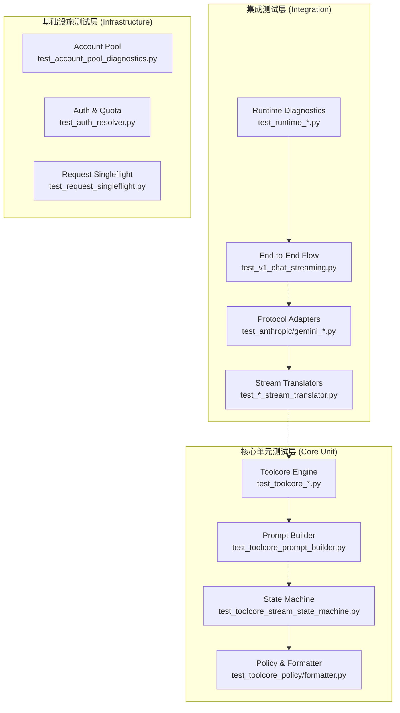

qwen2API 项目采用以**单元回归测试**与**协议集成测试**为核心的双层质量保障体系。鉴于本项目作为多协议（OpenAI/Anthropic/Gemini）统一网关的特殊性，测试体系不仅验证业务逻辑的正确性，更侧重于验证不同上游模型在工具调用、流式响应及提示词构建等关键环节的协议兼容性与状态机稳定性。当前测试套件包含 40+ 个专项测试文件，覆盖了从底层解析器到上层 API 适配的全链路验证，确保在高并发与复杂工具调用场景下的系统鲁棒性。

## 测试架构分层策略

项目的测试架构严格遵循“核心隔离、边界集成”的设计原则，通过物理文件命名与目录结构清晰划分测试关注点。这种分层设计确保了当上游 Qwen 模型行为变更或新增协议适配时，能够快速定位故障域并防止回归缺陷扩散。

该架构图展示了测试用例与系统模块的映射关系。**集成测试层**直接对应 `backend/api` 与 `backend/runtime` 目录，验证跨模块数据流转；**核心单元测试层**高密度覆盖 `backend/toolcore`，这是网关处理工具调用幻觉与指令解析的心脏；**基础设施测试层**则保障了账号池轮转、认证鉴权等非功能性需求的可靠性。这种结构使得开发者在修改 [prompt_builder.py](backend/toolcore/prompt_builder.py) 等核心组件时，能够立即通过对应的回归测试获得反馈，而无需启动完整服务。

Sources: [tests](tests#L1-L42), [prompt_builder_regression_unittest.py](backend/toolcore/prompt_builder_regression_unittest.py#L1-L50)

## 测试领域分布矩阵

为了应对企业级网关的复杂性，测试用例按功能领域进行了精细化拆分。下表总结了当前测试体系的关键覆盖维度，帮助中级开发者快速理解各测试文件的职责边界。

| 测试领域 | 关键测试文件示例 | 验证目标与核心价值 |
| :--- | :--- | :--- |
| **Toolcore 引擎** | `test_toolcore_stream_state_machine.py`, `test_toolcore_prompt_contract.py` | 验证工具调用状态机的流转正确性、提示词契约的完整性及指令解析的容错能力。这是防止模型幻觉的核心防线。 |
| **协议适配与转换** | `test_anthropic_toolcore_integration.py`, `test_openai_stream_translator.py` | 确保 OpenAI/Anthropic/Gemini 请求被正确归一化为内部标准格式，且流式 SSE 事件翻译符合各厂商规范。 |
| **运行时与诊断** | `test_runtime_diagnostics.py`, `test_runtime_usage.py` | 验证 Token 计量、流式指标统计及运行时异常捕获机制，保障计费与监控数据的准确性。 |
| **账号与资源管理** | `test_account_pool_diagnostics.py`, `test_upstream_auto_delete.py` | 测试账号池的并发控制、冷却策略及上游临时文件的自动清理逻辑，防止资源泄漏与限流失效。 |
| **技能与插件系统** | `test_skill_loader.py`, `test_skill_resolver.py` | 验证动态技能加载、目录扫描及依赖解析机制，确保扩展功能的热插拔安全性。 |
| **回归与兼容性** | `prompt_builder_regression_unittest.py`, `test_exec_alias_recovery.py` | 针对历史 Bug 与特定客户端（如 OpenClaw）的预设配置进行快照级验证，防止重构破坏既有兼容性。 |

此矩阵表明，项目并未采用单一的测试覆盖率指标，而是针对网关的**协议转换**、**状态管理**和**资源调度**三大风险点建立了纵深防御。特别是 `toolcore` 相关的 16 个测试文件，占据了测试总量的近 40%，反映了工具调用解析在本项目中的核心技术权重。

Sources: [tests](tests#L1-L42), [prompt_builder_regression_unittest.py](backend/toolcore/prompt_builder_regression_unittest.py#L10-L23)

## 测试运行与环境约定

本项目使用标准的 Python `unittest` 框架结合 `pytest` 运行器，所有测试均设计为无外部依赖的纯本地执行模式。测试代码通过 Mock 对象模拟上游 Qwen API 响应与文件系统交互，确保在 CI/CD 流水线中可实现秒级反馈。

对于中间件与状态机测试，项目采用了**契约驱动（Contract-Driven）** 的验证模式。例如在 [prompt_builder_regression_unittest.py](backend/toolcore/prompt_builder_regression_unittest.py) 中，测试用例不依赖真实模型输出，而是断言 `messages_to_prompt` 函数在特定 `client_profile` 下生成的 Prompt 字符串是否精确包含预期的 XML 标签与系统指令。这种确定性测试消除了 LLM 非确定性带来的测试噪声，是构建可靠网关测试体系的基石。

Sources: [prompt_builder_regression_unittest.py](backend/toolcore/prompt_builder_regression_unittest.py#L1-L50), [tests](tests#L1-L42)

## 延伸阅读建议

在掌握测试体系的整体架构后，建议按照以下路径深入具体实现细节：

1.  **深入核心用例**：阅读 [核心测试用例解读](35-he-xin-ce-shi-yong-li-jie-du)，了解 Toolcore 状态机与流式翻译器的具体测试构造技巧与断言策略。
2.  **搭建调试环境**：参考 [开发环境搭建与调试](36-kai-fa-huan-jing-da-jian-yu-diao-shi)，配置本地 pytest 运行参数与 Mock 数据生成工具，开始编写自己的测试用例。
3.  **理解被测对象**：若对测试中频繁出现的 Toolcore 概念感到陌生，请回溯 [工具调用解析引擎（Toolcore）](12-gong-ju-diao-yong-jie-xi-yin-qing-toolcore) 以建立理论基础。