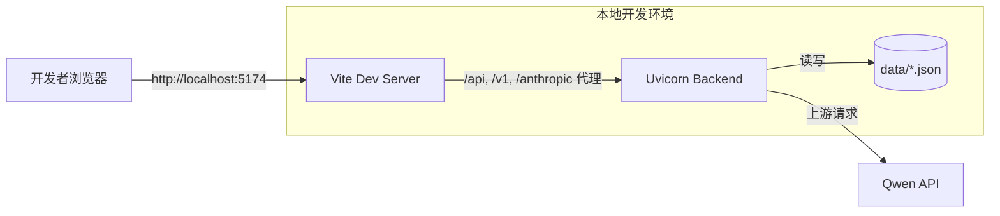
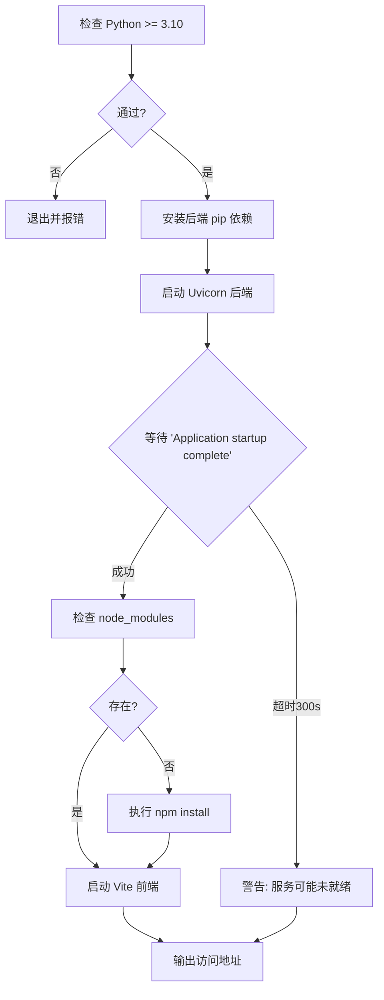

本文档专为初次接触 qwen2API 的开发者设计，旨在提供从零构建本地开发环境的完整指引。我们将涵盖前后端依赖安装、环境变量配置、一键启动脚本原理以及调试技巧，帮助您快速进入代码贡献状态。建议您在阅读本页面前，先了解 [项目概览：qwen2API企业网关](1-xiang-mu-gai-lan-qwen2apiqi-ye-wang-guan) 以建立整体认知，并在环境就绪后参考 [测试体系概览](34-ce-shi-ti-xi-gai-lan) 验证环境正确性。

## 本地开发架构概览

在开始搭建之前，理解本地开发模式下的组件交互至关重要。与生产环境的 Docker 容器化部署不同，本地开发采用**进程级分离**架构：前端 Vite 开发服务器与后端 Uvicorn 服务独立运行，通过 HTTP 代理实现通信。这种架构支持前端热更新（HMR）与后端重载，是高效调试的基础。

前端开发服务器固定监听 `5174` 端口，并配置了针对 `/api`、`/v1`、`/anthropic` 和 `/v1beta` 路径的反向代理规则，将所有 API 请求透明转发至后端默认的 `7860` 端口。这种配置使得前端代码无需关心跨域问题，且能无缝对接后端接口变更。后端服务则通过 `pydantic-settings` 自动加载 `.env` 文件中的配置，确保开发环境与生产环境的配置隔离。

Sources: [frontend/vite.config.ts](frontend/vite.config.ts#L14-L22), [backend/core/config.py](backend/core/config.py#L79-L80)

## 环境准备与依赖安装

qwen2API 对运行时版本有明确要求，请在安装依赖前务必核对。项目根目录提供了 `start.py` 自动化脚本，但理解其背后的手动步骤对于排查环境问题必不可少。

| 组件 | 最低版本要求 | 关键依赖 | 备注 |
| :--- | :--- | :--- | :--- |
| Python | 3.10+ | fastapi, uvicorn, httpx, tiktoken | 脚本会自动检查版本并退出 |
| Node.js | 18+ (推荐) | react, vite, tailwindcss | 用于前端构建与开发服务器 |
| 操作系统 | Windows / Linux / macOS | - | Windows 下脚本使用 `shell=True` |

后端依赖定义在 `backend/requirements.txt` 中，包含 `fastapi`、`uvicorn[standard]`、`httpx[http2]` 等核心库。前端依赖则通过 `frontend/package.json` 管理，使用 `npm` 进行安装。虽然 `start.py` 会自动执行 `pip install -r requirements.txt` 和 `npm install`，但在网络受限或需要虚拟环境隔离时，建议手动在 `backend` 和 `frontend` 目录下分别执行安装命令。特别注意，Windows 环境下 `start.py` 会使用 `shell=True` 调用 npm，若遇到执行策略问题，请确保 Node.js 已正确加入系统 PATH。

Sources: [start.py](start.py#L27-L45), [backend/requirements.txt](backend/requirements.txt#L1-L10), [frontend/package.json](frontend/package.json#L12-L41)

## 环境变量配置详解

本地开发必须创建 `.env` 文件来覆盖默认配置。项目提供了 `.env.example` 作为模板，其中包含了所有可配置项及其默认值。**切勿直接修改 `.env.example`**，应将其复制为 `.env` 后进行编辑。

对于初学者，以下三个变量是启动服务的必要条件：
1.  **ADMIN_KEY**: 管理后台访问密钥，本地开发可设为简单值如 `dev-admin`。
2.  **PORT**: 后端监听端口，默认为 `7860`，需与 `vite.config.ts` 中的代理目标保持一致。
3.  **ACCOUNTS_FILE**: 账号数据文件路径，本地开发建议使用相对路径 `./data/accounts.json`，避免指向不存在的绝对路径。

配置加载机制基于 `pydantic-settings`，它会优先读取环境变量，其次读取 `.env` 文件，最后使用代码中的默认值。例如 `LOG_LEVEL` 默认为 `INFO`，若在 `.env` 中设置为 `DEBUG`，则服务启动时将输出更详细的日志。数据文件路径（如 `CONTEXT_GENERATED_DIR`）均相对于项目根目录下的 `data` 文件夹，`start.py` 会在启动前自动创建 `logs` 和 `data` 目录以防止 IO 错误。

Sources: [.env.example](.env.example#L1-L26), [backend/core/config.py](backend/core/config.py#L10-L77), [start.py](start.py#L22-L25)

## 一键启动与服务编排

`start.py` 是本地开发的核心入口，它封装了环境检查、依赖安装、端口清理和服务启动的完整流程。执行 `python start.py` 后，脚本将按顺序完成以下任务：

该脚本具备**端口占用自动清理**能力。在启动后端前，它会检测 `PORT` 端口是否被占用，若在 Windows 下发现旧进程，会调用 `taskkill /F /PID` 强制终止，避免“Address already in use”错误。后端启动采用异步就绪检测机制：主线程启动子进程后，会通过独立线程读取 stdout，直到匹配到 `Application startup complete` 或 `服务已完全就绪` 字符串才认为初始化完成，最长等待 300 秒。这确保了前端启动时后端已真正可用，而非仅仅进程存在。

Sources: [start.py](start.py#L72-L154)

## 调试技巧与常见问题排查

### 后端调试
由于 `start.py` 将后端 stdout 重定向并打印到控制台，您可以直接在终端看到实时日志。若需断点调试，建议**不使用** `start.py`，而是直接在 IDE 中运行 `backend/main.py` 或配置 Uvicorn 启动项。注意需在 IDE 运行配置中添加环境变量 `PYTHONPATH=${workspaceFolder}`，否则会出现模块导入失败。`main.py` 中已将项目根目录加入 `sys.path`，但显式设置更为可靠。

### 前端调试
Vite 开发服务器支持模块热替换（HMR），修改 `frontend/src` 下的 TSX/CSS 文件后浏览器会自动刷新。若代理请求返回 502/504，首先检查后端是否在 `7860` 端口正常运行。可通过访问 `http://localhost:7860/docs` 验证后端 Swagger 文档是否可达。

### 常见启动失败对照表

| 现象 | 可能原因 | 解决方案 |
| :--- | :--- | :--- |
| `❌ 需要 Python 3.10+` | 当前 Python 版本过低 | 升级 Python 或使用 pyenv/conda 切换 |
| `npm install 失败` | Node.js 未安装或网络问题 | 检查 node 命令；配置 npm 镜像源 |
| `后端初始化超时` | 依赖缺失或配置文件错误 | 检查 `.env` 是否存在；手动运行 `uvicorn backend.main:app` 查看详细报错 |
| `端口被占用` | 上次进程未正常退出 | `start.py` 会自动清理；若失效可手动 `netstat -ano \| findstr :7860` 查杀 |
| `ModuleNotFoundError` | PYTHONPATH 未设置 | 在项目根目录执行命令；或在 IDE 中配置工作目录与 Python Path |

Sources: [start.py](start.py#L102-L154), [backend/main.py](backend/main.py#L23-L24)

## 下一步学习路径

当您的本地环境能够成功启动并访问 `http://127.0.0.1:5174` 时，建议按以下顺序深入：
1.  阅读 [环境变量与配置详解](4-huan-jing-bian-liang-yu-pei-zhi-xiang-jie) 掌握高级调优参数。
2.  通过 [测试体系概览](34-ce-shi-ti-xi-gai-lan) 了解如何运行单元测试验证代码修改。
3.  查阅 [后端入口与生命周期管理](14-hou-duan-ru-kou-yu-sheng-ming-zhou-qi-guan-li) 理解服务启动时的组件初始化顺序。