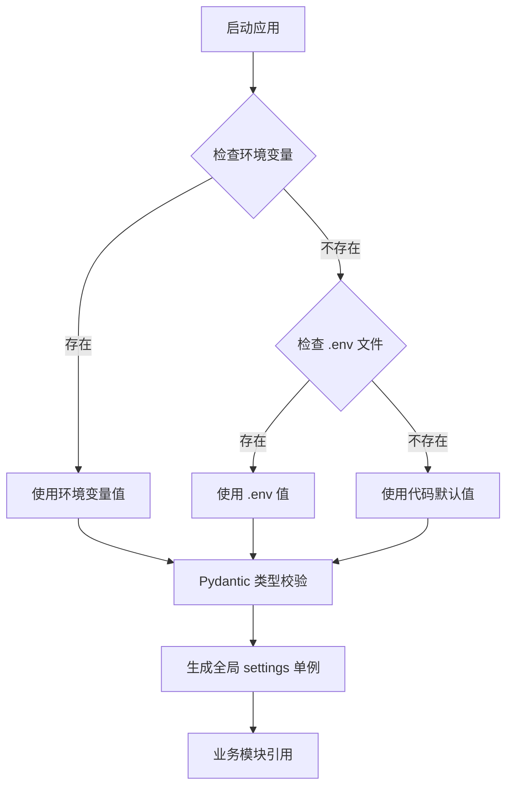

本页文档旨在为中级开发者提供 qwen2API 网关配置体系的完整参考。系统采用 **Pydantic Settings** 作为配置核心，支持通过环境变量、`.env` 文件以及代码默认值三级加载机制，确保在不同部署场景（Docker、本地开发、生产集群）下的灵活性与安全性。理解这些配置项是进行性能调优、故障排查及多协议适配的基础。建议读者在阅读本页前已完成 [快速开始：Docker一键部署](2-kuai-su-kai-shi-docker-jian-bu-shu) 或 [快速开始：本地源码运行](3-kuai-su-kai-shi-ben-di-yuan-ma-yun-xing)，并在掌握基础后继续深入 [配置管理：Settings与模型映射](15-pei-zhi-guan-li-settingsyu-mo-xing-ying-she) 了解内部实现细节。

Sources: [config.py](backend/core/config.py#L1-L10), [.env.example](.env.example#L1-L5)

## 配置加载架构与优先级

qwen2API 的配置系统基于 `pydantic_settings.BaseSettings` 构建，其加载遵循严格的优先级顺序：**环境变量 > .env 文件 > 代码默认值**。这种设计允许运维人员在不修改代码或镜像的情况下，通过注入环境变量覆盖任意配置。`Settings` 类在模块导入时实例化为全局单例 `settings`，所有业务模块均通过该对象访问配置，避免了重复解析与环境不一致问题。对于布尔型配置，系统统一支持 `1, true, yes, on`（不区分大小写）作为真值，增强了跨平台兼容性。

Sources: [config.py](backend/core/config.py#L10-L80)

## 服务基础与网络配置

基础服务配置决定了网关的监听行为与并发能力。`PORT` 和 `WORKERS` 是最常调整的参数，分别控制 HTTP 监听端口和 Uvicorn 工作进程数。在生产环境中，建议将 `WORKERS` 设置为 CPU 核心数的 2-4 倍以充分利用异步 IO 特性。`ADMIN_KEY` 用于保护管理后台接口，**务必在生产环境中修改默认值**以防止未授权访问。此外，`REQUEST_MAX_BODY_BYTES` 限制了请求体大小，防止恶意超大 JSON 导致内存溢出，默认 10MB 适用于绝大多数 LLM 交互场景。

| 变量名 | 类型 | 默认值 | 说明 |
| :--- | :--- | :--- | :--- |
| `PORT` | int | 8080 | HTTP 服务监听端口 |
| `WORKERS` | int | 3 | Uvicorn 工作进程数量 |
| `ADMIN_KEY` | str | "admin" | 管理后台鉴权密钥 |
| `LOG_LEVEL` | str | "INFO" | 日志级别 (DEBUG/INFO/WARNING/ERROR) |
| `REQUEST_MAX_BODY_BYTES` | int | 10485760 | 请求体最大字节数 (10MB) |

Sources: [config.py](backend/core/config.py#L12-L14), [config.py](backend/core/config.py#L35), [config.py](backend/core/config.py#L43), [.env.example](.env.example#L1-L4)

## 账号池调度与限流策略

这是网关高可用性的核心配置区。`MAX_INFLIGHT_PER_ACCOUNT` 定义了单个上游账号的最大并发请求数，设为 1 可避免触发上游的单账号速率限制；`GLOBAL_MAX_INFLIGHT` 则限制全局总并发（0 表示不限制）。为了防止请求过于集中导致的瞬时封禁，系统引入了抖动（Jitter）机制：`ACCOUNT_MIN_INTERVAL_MS` 强制同一账号两次请求间的最小间隔，而 `REQUEST_JITTER_MIN_MS` / `REQUEST_JITTER_MAX_MS` 则为每个请求添加随机延迟。当触发限流时，`RATE_LIMIT_BASE_COOLDOWN` 和 `RATE_LIMIT_MAX_COOLDOWN` 共同决定了账号冷却时间的指数退避范围。

| 变量名 | 类型 | 默认值 | 说明 |
| :--- | :--- | :--- | :--- |
| `MAX_INFLIGHT` | int | 1 | 单账号最大并发数 |
| `GLOBAL_MAX_INFLIGHT` | int | 0 | 全局最大并发数 (0=无限) |
| `ACCOUNT_MIN_INTERVAL_MS` | int | 0 | 同账号请求最小间隔(ms) |
| `REQUEST_JITTER_MIN_MS` | int | 0 | 请求抖动下限(ms) |
| `REQUEST_JITTER_MAX_MS` | int | 0 | 请求抖动上限(ms) |
| `RATE_LIMIT_BASE_COOLDOWN` | int | 600 | 限流冷却基准时间(s) |
| `RATE_LIMIT_MAX_COOLDOWN` | int | 3600 | 限流冷却最大时间(s) |
| `ACCOUNT_SELECTION_STRATEGY` | str | "least_loaded" | 账号选择策略 |

Sources: [config.py](backend/core/config.py#L16-L31), [.env.example](.env.example#L5-L11)

## 上游连接与超时控制

针对 Qwen 上游服务的网络特性，网关提供了精细化的超时与容错配置。`QWEN_UPSTREAM_REQUEST_TIMEOUT_SECONDS` 控制非流式请求的总超时，而 `QWEN_UPSTREAM_STREAM_TIMEOUT_SECONDS` 专门针对 SSE 流式响应，默认 300 秒以适应长文本生成。`OPENAI_JSON_SINGLEFLIGHT_ENABLED` 开启后，相同的非流式请求会被合并处理，避免重复消耗上游 Token，配合 `WAIT_TIMEOUT` 和 `RESULT_TTL` 可平衡实时性与缓存命中率。`UPSTREAM_AUTO_DELETE_ENABLED` 则用于在请求完成后自动清理上游临时资源，防止数据残留。

| 变量名 | 类型 | 默认值 | 说明 |
| :--- | :--- | :--- | :--- |
| `QWEN_UPSTREAM_REQUEST_TIMEOUT_SECONDS` | float | 60 | 普通请求超时(s) |
| `QWEN_UPSTREAM_STREAM_TIMEOUT_SECONDS` | float | 300 | 流式响应超时(s) |
| `OPENAI_JSON_SINGLEFLIGHT_ENABLED` | bool | true | 启用相同请求合并 |
| `OPENAI_JSON_SINGLEFLIGHT_WAIT_TIMEOUT_SECONDS` | float | 600 | 等待合并结果超时(s) |
| `OPENAI_JSON_SINGLEFLIGHT_RESULT_TTL_SECONDS` | float | 120 | 合并结果缓存TTL(s) |
| `UPSTREAM_AUTO_DELETE_ENABLED` | bool | false | 自动删除上游临时文件 |

Sources: [config.py](backend/core/config.py#L44-L55)

## 上下文管理与附件处理

为了突破 LLM 上下文窗口限制并优化 Token 消耗，网关实现了智能附件预处理机制。`CONTEXT_INLINE_MAX_CHARS` 定义了直接内联到 Prompt 中的文本阈值，超过此值但小于 `CONTEXT_FORCE_FILE_MAX_CHARS` 的内容将被自动上传至临时文件存储。`CONTEXT_ATTACHMENT_TTL_SECONDS` 控制这些临时文件的存活时间，过期后由垃圾回收器清理。`CONTEXT_ALLOWED_USER_EXTS` 白名单严格限制了用户上传的文件类型，防止可执行文件或敏感格式进入处理链路。所有生成的上下文文件默认存储在 `data/context_files` 目录下。

| 变量名 | 类型 | 默认值 | 说明 |
| :--- | :--- | :--- | :--- |
| `CONTEXT_INLINE_MAX_CHARS` | int | 4000 | 内联文本最大字符数 |
| `CONTEXT_FORCE_FILE_MAX_CHARS` | int | 10000 | 强制转文件的最大字符数 |
| `CONTEXT_ATTACHMENT_TTL_SECONDS` | int | 1800 | 附件缓存有效期(s) |
| `CONTEXT_UPLOAD_PARSE_TIMEOUT_SECONDS` | int | 60 | 附件解析超时(s) |
| `CONTEXT_GENERATED_DIR` | str | data/context_files | 生成文件存储目录 |
| `CONTEXT_ALLOWED_USER_EXTS` | str | txt,md,json... | 允许的用户文件扩展名 |

Sources: [config.py](backend/core/config.py#L67-L77), [.env.example](.env.example#L15-L22)

## 功能开关与高级调试

系统预留了多个功能标志（Feature Flags）用于灰度发布或问题诊断。`TOOLCORE_V2_ENABLED` 控制是否启用新一代工具调用解析引擎，该引擎对流式输出和复杂指令有更好的鲁棒性。`QWEN_CODE_FORCE_CODER_FOR_TOOL_CALLS` 和 `QWEN_CODE_FORCE_CODER_FOR_CODING_TASKS` 可在检测到代码相关任务时自动切换至专用 Coder 模型，提升生成质量。`DIAGNOSTIC_STACK_DUMP_ENABLED` 仅在排查死锁或异常挂起时开启，它会定期转储协程堆栈，**生产环境请保持关闭**以免影响性能。

| 变量名 | 类型 | 默认值 | 说明 |
| :--- | :--- | :--- | :--- |
| `TOOLCORE_V2_ENABLED` | bool | false | 启用 Toolcore V2 引擎 |
| `QWEN_CODE_CODER_MODEL` | str | qwen3-coder-plus | 指定代码专用模型 |
| `QWEN_CODE_FORCE_CODER_FOR_TOOL_CALLS` | bool | true | 工具调用强制使用Coder模型 |
| `QWEN_CODE_FORCE_CODER_FOR_CODING_TASKS` | bool | true | 编码任务强制使用Coder模型 |
| `DIAGNOSTIC_STACK_DUMP_ENABLED` | bool | false | 启用诊断堆栈转储 |

Sources: [config.py](backend/core/config.py#L36-L40)

## 数据持久化路径配置

所有运行时状态均以 JSON 文件形式持久化，便于备份与迁移。`ACCOUNTS_FILE` 存储上游账号凭证与状态，`USERS_FILE` 管理 API Key 与配额，`CAPTURES_FILE` 记录请求日志用于审计。在 Docker 部署中，这些路径通常映射到 `/workspace/data/` 卷下以确保容器重启后数据不丢失。若需自定义存储位置，只需修改对应环境变量即可，系统会自动创建缺失的父目录。注意 `CONFIG_FILE` 用于存储动态更新的运行时配置（如模型别名），与静态环境变量互补。

| 变量名 | 类型 | 默认值 | 说明 |
| :--- | :--- | :--- | :--- |
| `ACCOUNTS_FILE` | str | data/accounts.json | 账号池数据文件 |
| `USERS_FILE` | str | data/users.json | 用户与API Key数据 |
| `CAPTURES_FILE` | str | data/captures.json | 请求捕获日志 |
| `CONFIG_FILE` | str | data/config.json | 动态运行时配置 |
| `CONTEXT_CACHE_FILE` | str | data/context_cache.json | 上下文缓存索引 |
| `CONTEXT_AFFINITY_FILE` | str | data/session_affinity.json | 会话亲和性映射 |

Sources: [config.py](backend/core/config.py#L57-L75), [.env.example](.env.example#L12-L18)

## 前端独立部署配置

当前端与后端分离部署（如 Vercel + 云服务器）时，需在前端项目中设置 `VITE_API_BASE_URL` 指向后端地址。若采用 Docker Compose 单机部署或本地开发，该变量应留空，由 Vite 开发服务器或 Nginx 反向代理自动处理路由。这种设计使得同一份前端构建产物可通过环境变量适配不同部署拓扑，无需重新编译。

Sources: [.env.example](frontend/.env.example#L1-L6)

## 下一步阅读建议

掌握环境变量配置后，建议按以下路径深入理解系统行为：
1.  **[配置管理：Settings与模型映射](15-pei-zhi-guan-li-settingsyu-mo-xing-ying-she)**：了解 `MODEL_MAP` 如何实现多协议模型名的无缝转换。
2.  **[账号池：并发控制与限流冷却](10-zhang-hao-chi-bing-fa-kong-zhi-yu-xian-liu-leng-que)**：结合本文档的限流参数，深入理解账号调度算法。
3.  **[上下文缓存与文件管理](13-shang-xia-wen-huan-cun-yu-wen-jian-guan-li)**：探究附件预处理与上下文卸载的具体实现机制。
4.  **[Toolcore V2：指令解析与策略执行](23-toolcore-v2-zhi-ling-jie-xi-yu-ce-lue-zhi-xing)**：若启用了 `TOOLCORE_V2_ENABLED`，必读此页以掌握新引擎的行为差异。