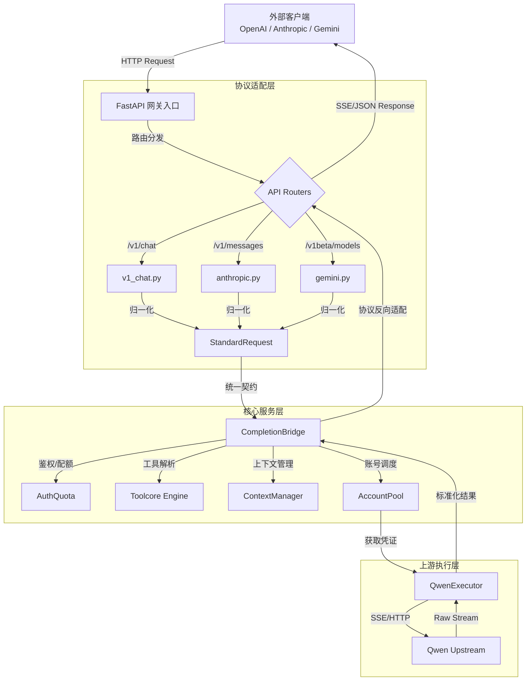

本文档旨在为中级开发者提供 qwen2API 企业网关的宏观架构视角。qwen2API 并非简单的 API 代理，而是一个基于 FastAPI 构建的高性能**协议转换与运行时编排网关**。其核心设计目标是将异构的 LLM 接口（OpenAI、Anthropic、Gemini）统一映射到 Qwen 上游服务，同时通过标准化的内部请求模型解耦协议适配与业务执行逻辑。本页将重点阐述网关的入口架构、多协议路由机制以及作为架构枢纽的 `StandardRequest` 标准化模型，帮助读者建立对系统数据流向的整体认知。

## 网关入口与生命周期管理

qwen2API 的运行时基础建立在 FastAPI 框架之上，通过 `lifespan` 上下文管理器实现了严格的依赖注入与资源生命周期控制。在应用启动阶段，网关不仅初始化了 Web 服务本身，还并行构建了包括账号池、会话亲和性存储、上游文件缓存、Chat ID 预热池在内的全套基础设施。这种“启动时预加载”策略确保了首个业务请求到达时所有关键组件均已就绪，避免了冷启动延迟。此外，网关内置了专门的 HTTP 中间件用于指标采集与安全防护，该中间件仅针对 `/v1/` 等业务路径生效，并通过正则表达式轻量级提取请求体中的 `model` 字段，避免了对大体积 JSON 请求体的全量解析，从而在保证可观测性的同时将性能开销降至最低。

Sources: [main.py](backend/main.py#L67-L149)
Sources: [main.py](backend/main.py#L163-L198)

## 多协议路由与适配器模式

网关通过模块化的 Router 挂载机制实现了对多种 LLM 协议的并存支持。在 `main.py` 中，系统显式注册了 `v1_chat` (OpenAI)、`anthropic` (Claude)、`gemini`、`responses_api` 等多个独立路由器，每个路由器对应一个完整的协议适配层。这种架构遵循了**适配器模式**：各协议端点负责解析特定的外部请求格式（如 Anthropic 的 Messages API 或 OpenAI 的 Chat Completions），并将其转换为网关内部统一的语义表示。值得注意的是，除了标准的 LLM 对话接口，网关还集成了 `embeddings`、`images`、`files_api` 等辅助能力路由，以及用于运维管理的 `probes` 和 `admin` 端点，形成了一个功能完备的企业级 API 表面。所有业务路由均共享同一套底层执行引擎与账号资源池，实现了协议多样性与后端统一性的平衡。

Sources: [main.py](backend/main.py#L201-L212)
Sources: [anthropic.py](backend/api/anthropic.py#L1-L44)

## StandardRequest：协议无关的内部契约

`StandardRequest` 是 qwen2API 架构中最核心的抽象，它定义了协议转换层与运行时执行层之间的**标准契约**。无论外部请求来自何种客户端，在经过适配器处理后都会被归一化为该数据结构。从代码定义可见，`StandardRequest` 不仅封装了基础的 `prompt`、`response_model` 和 `stream` 参数，还深度整合了工具调用（`tools`, `tool_choice_mode`, `required_tool_name`）、上下文附件（`attachments`, `uploaded_file_ids`, `context_fingerprint`）以及会话状态（`session_key`, `persistent_session`）等高阶语义。特别地，它通过 `client_profile` 字段保留了原始客户端的特征指纹，使得下游服务能够根据客户端类型（如 Claude Code、Qwen Code）进行差异化处理，而无需反向解析原始请求。这种设计彻底隔离了外部协议变更对核心执行逻辑的影响，是网关可扩展性的基石。

Sources: [standard_request.py](backend/adapter/standard_request.py#L69-L102)
Sources: [standard_request.py](backend/adapter/standard_request.py#L16-L66)

## 架构分层与数据流概览

为了更直观地理解网关的内部运作，下图展示了从外部请求到上游执行的完整数据流转过程。架构清晰地划分为三层：**协议适配层**负责“翻译”，**核心服务层**负责“编排”，**上游执行层**负责“通信”。

该架构图揭示了 qwen2API 的关键设计决策：所有协议特有的复杂性都在适配层被消化，进入核心服务层的数据流是完全标准化的。这使得诸如重试、限流、工具调用解析等横切关注点只需实现一次即可服务于所有协议。

Sources: [completion_bridge.py](backend/services/completion_bridge.py#L1-L45)
Sources: [main.py](backend/main.py#L91-L106)

## 推荐阅读路径

掌握架构总览后，建议按照以下路径深入具体模块：

1.  **协议实现细节**：若您关注特定接口的兼容性实现，请阅读 [OpenAI Chat Completions接口适配](6-openai-chat-completionsjie-kou-gua-pei) 或 [Anthropic Messages接口适配](7-anthropic-messagesjie-kou-gua-pei)。
2.  **核心资源管理**：理解网关如何管理上游凭证与并发，请参阅 [账号池：并发控制与限流冷却](10-zhang-hao-chi-bing-fa-kong-zhi-yu-xian-liu-leng-que)。
3.  **高级功能机制**：若需了解工具调用与提示词工程的黑盒，推荐直接跳转至 [工具调用解析引擎（Toolcore）](12-gong-ju-diao-yong-jie-xi-yin-qing-toolcore)。
4.  **配置与部署**：在实际动手前，请务必确认 [环境变量与配置详解](4-huan-jing-bian-liang-yu-pei-zhi-xiang-jie) 中的关键参数已正确设置。