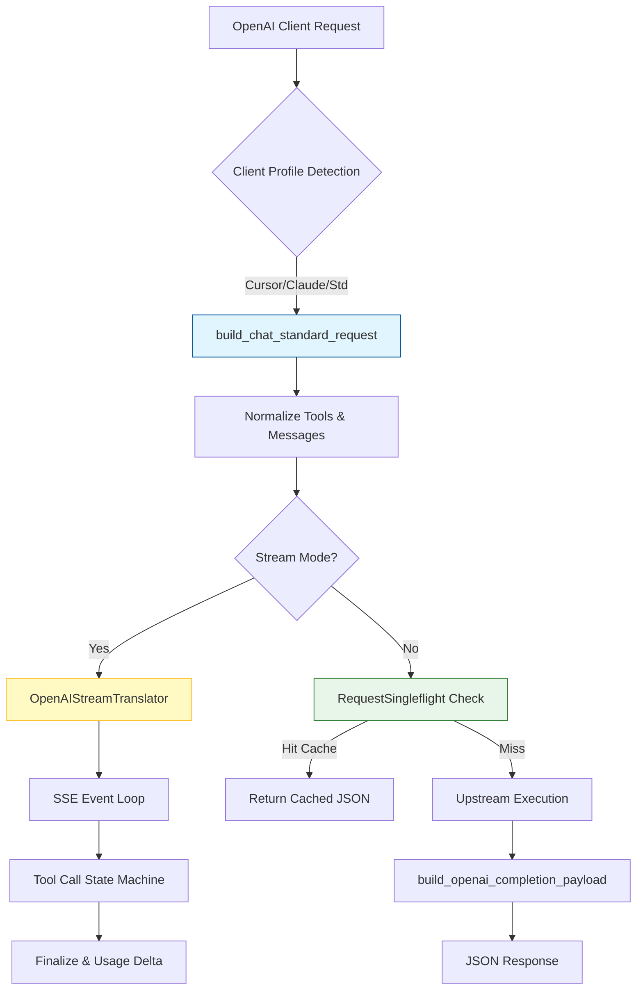

本页详解 qwen2API 网关中 `/v1/chat/completions` 接口的实现机制。作为系统最核心的流量入口，该模块不仅负责标准的 OpenAI 协议兼容，还承担了**请求归一化**、**客户端画像识别**、**流式响应翻译**以及**非阻塞单次飞行（Singleflight）去重**等关键架构职责。对于中级开发者而言，理解这一层是掌握网关如何将异构上游（Qwen/Anthropic/Gemini）统一封装为 OpenAI 标准服务的关键。

Sources: [v1_chat.py](backend/api/v1_chat.py#L1-L37)

## 核心处理流水线架构

OpenAI Chat Completions 的请求处理并非简单的透传，而是一个精密的多阶段转换管道。当请求到达 `v1_chat.py` 路由时，系统首先通过 `detect_openai_client_profile` 识别调用方特征（如 Cursor、Claude Code 或标准 SDK），随后进入 `build_chat_standard_request` 构建内部标准请求对象。在此过程中，原始的工具定义（Tools）和消息历史被归一化为中间表示，同时保留原始的 `_tool_catalog` 映射以确保响应时能还原客户端可见的工具名称。最终，执行引擎的结果通过 `OpenAIStreamTranslator` 实时转换为符合 OpenAI SSE 规范的增量数据块。

Sources: [v1_chat.py](backend/api/v1_chat.py#L52-L61), [standard_request_builder.py](backend/services/standard_request_builder.py#L34-L87)

## 请求归一化与工具目录保全

在适配层中，最易出错且最关键的设计是**工具目录（ToolCatalog）的双重映射保全**。由于上游模型可能使用内部桥接名称（如 `bridge-0`），而客户端期望看到语义化名称（如 `mcp__timeMcp__currentTime`），`build_chat_standard_request` 显式地从原始请求数据中提取并传递 `_tool_catalog`。如果仅依赖归一化后的 payload 重建目录，系统将丢失“桥接名→客户端名”的反向映射，导致返回给客户端的工具调用包含无法识别的内部 ID。此外，系统还会根据客户端画像自动过滤冲突的命令别名工具，防止子代理指令与可执行工具产生歧义。

| 归一化阶段 | 关键操作 | 目的 |
| :--- | :--- | :--- |
| 客户端推断 | `infer_client_profile` | 确定工具语法偏好与模型路由策略 |
| 请求清洗 | `normalize_chat_request` | 移除冗余字段，标准化消息格式 |
| 目录保全 | `preserved_tool_catalog` | 维持 MCP/Bridge 名称映射不丢失 |
| 提示词构建 | `messages_to_prompt` | 将 OpenAI 消息转为上游原生 Prompt |
| 工具选择校验 | `enforce_declared_tool_choice` | 确保 tool_choice 引用的工具真实存在 |

Sources: [standard_request_builder.py](backend/services/standard_request_builder.py#L43-L87)

## 流式响应翻译与状态机

`OpenAIStreamTranslator` 是流式适配的核心组件，它不仅仅是一个格式化器，更是一个**有状态的协议翻译机**。该类内部集成了 `ToolStreamStateMachine`，用于处理上游模型可能以文本形式输出的工具调用（Text-based Tool Calls）。针对不同的客户端画像，翻译器采用差异化的终结策略：对于 Claude Code 等特定客户端，采用 `BUFFERED_TOOL_CALLS_ONLY` 模式，仅在缓冲区确认完整工具调用后才发送；而对于通用客户端，则采用 `DIRECTIVE_DRIVEN_TOOL_CALLS` 模式，结合运行时指令动态决定何时截断内容流并切换至工具调用通道。这种设计有效防止了工具调用参数被当作普通文本输出导致的客户端解析失败。

Sources: [openai_stream_translator.py](backend/services/openai_stream_translator.py#L16-L58)

### 增量块生成与内容回滚机制

在流式传输过程中，翻译器维护了一个 `pending_content_chunks` 列表作为“后悔药”机制。当状态机检测到当前的文本流实际上是工具调用的前奏（例如检测到 `{` 或特定 XML 标签）时，系统会立即触发 `_discard_pending_content_chunks`，从待发送队列中物理移除已缓冲的文本块，转而开始发送 `tool_calls` 类型的 delta。这种**内容回滚**能力确保了 OpenAI 协议中 `content` 与 `tool_calls` 互斥的语义约束得到严格遵守，避免了混合类型输出导致的下游 SDK 崩溃。

Sources: [openai_stream_translator.py](backend/services/openai_stream_translator.py#L82-L102)

## 非流式请求的单次飞行去重

对于非流式（JSON）请求，网关实现了基于 `RequestSingleflight` 的智能去重机制。该机制通过组合 `session_key`、`prompt_hash`、`latest_user_hash` 以及工具配置生成唯一指纹。当多个并发请求具有完全相同的上下文和意图时，只有第一个请求会被真正转发到上游执行，后续请求将等待并共享同一结果。这不仅显著降低了上游 API 的配额消耗，还保证了在高并发场景下响应的一致性。值得注意的是，该去重键的构建排除了流式请求，因为流式响应的时序特性使其不适合简单的结果缓存复用。

Sources: [v1_chat.py](backend/api/v1_chat.py#L64-L89)

## 诊断信息与上下文指纹

为了支持生产环境的可观测性，适配层在请求入口处即构建了丰富的诊断元数据。`_build_openai_request_diagnostics` 函数会统计消息角色分布、工具调用密度以及最新用户输入的哈希值。同时，`_build_openai_context_fingerprint` 会对附件、上游文件及生成的本地文件进行综合哈希计算。这些指纹信息不仅用于 Singleflight 去重，还被注入到请求上下文中，使得运维人员能够在日志中精确追踪“相同输入为何产生不同输出”或“为何缓存未命中”等复杂问题，实现了从协议层到执行层的全链路溯源。

Sources: [v1_chat.py](backend/api/v1_chat.py#L126-L189)

## 延伸阅读建议

在掌握了 OpenAI Chat Completions 的适配逻辑后，建议按照以下路径深入相关模块：

-   **工具调用核心**：了解流式状态机如何从文本中提取结构化调用，请参阅 [工具调用解析引擎（Toolcore）](12-gong-ju-diao-yong-jie-xi-yin-qing-toolcore)
-   **流式状态机细节**：深入理解幻觉防护与文本/工具切换逻辑，请参阅 [流式状态机与工具调用幻觉防护](24-liu-shi-zhuang-tai-ji-yu-gong-ju-diao-yong-huan-jue-fang-hu)
-   **请求归一化**：查看消息历史如何被清洗和重组，请参阅 [请求归一化与单次飞行控制](26-qing-qiu-gui-hua-yu-dan-ci-fei-xing-kong-zhi)
-   **其他协议适配**：对比 Anthropic 或 Gemini 的适配差异，请参阅 [Anthropic Messages接口适配](7-anthropic-messagesjie-kou-gua-pei) 或 [Gemini GenerateContent接口适配](8-gemini-generatecontentjie-kou-gua-pei)