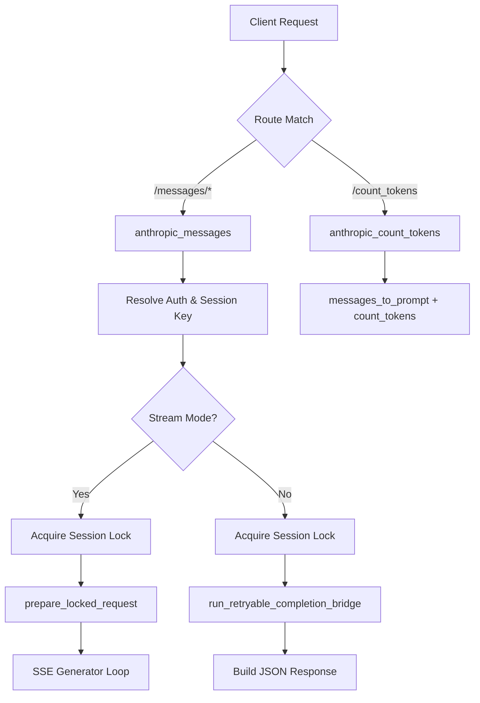
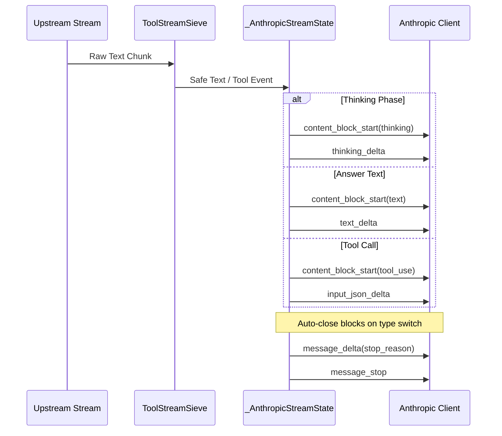

本页详解 qwen2API 网关中 Anthropic Messages API 的完整适配实现。作为协议转换层的核心组件，该模块负责将 Anthropic 原生请求（包括流式与非流式）无损转换为内部标准请求格式，并将 Qwen 模型的执行结果精确还原为符合 Anthropic 规范的 SSE 事件流或 JSON 响应。文档涵盖端点路由、请求归一化、工具调用双向映射、流式状态机及会话亲和性等关键机制，旨在帮助中级开发者理解并扩展 Anthropic 协议的集成能力。

## 端点路由与核心处理流程

Anthropic 适配器通过 FastAPI Router 暴露了三个主要路径前缀以兼容不同版本的客户端 SDK：`/messages`、`/v1/messages` 以及 `/anthropic/v1/messages`。所有请求入口均指向 `anthropic_messages` 异步处理函数，该函数首先解析认证上下文与会话密钥，随后根据 `stream` 参数分流至流式生成器或同步桥接逻辑。对于 Token 计数需求，还单独提供了 `/messages/count_tokens` 端点，直接复用提示词构建逻辑返回输入 Token 估算值。整个处理流程被包裹在 `request_context` 中以确保链路追踪 ID 的正确传播，并在会话锁保护下执行以防止并发状态冲突。

Sources: [anthropic.py](backend/api/anthropic.py#L202-L230)

Sources: [anthropic.py](backend/api/anthropic.py#L214-L292)

## 请求归一化与工具定义映射

Anthropic 的工具定义结构与 OpenAI/Qwen 存在显著差异，主要体现在参数字段命名（`input_schema` vs `parameters`）和工具选择策略上。`_normalize_anthropic_tools` 函数专门负责将 Anthropic 格式的工具列表转换为内部 `ToolDefinition` 对象，同时保留原始工具名称作为 `client_name` 以便响应时还原。系统还会自动生成 `bridge-N` 形式的模型侧工具名，避免特殊字符导致的上游兼容性问题。工具选择策略（`tool_choice`）经过 `normalize_tool_choice` 标准化后，由 `enforce_declared_tool_choice` 校验其有效性，确保强制调用模式仅作用于已声明的工具集合。

Sources: [request_normalizer.py](backend/toolcore/request_normalizer.py#L91-L116), [anthropic.py](backend/api/anthropic.py#L140-L168)

| Anthropic 字段 | 内部标准字段 | 转换说明 |
| :--- | :--- | :--- |
| `input_schema` | `parameters` | 直接映射 JSON Schema 对象 |
| `name` | `client_name` / `model_name` | 原名保留用于响应，生成 bridge-N 用于上游 |
| `tool_choice.type: "tool"` | `required_tool_name` | 提取具体工具名并校验存在性 |
| `system` (string/array) | `system` prompt | 合并多段系统提示为单一字符串 |

Sources: [anthropic.py](backend/api/anthropic.py#L140-L152), [request_normalizer.py](backend/toolcore/request_normalizer.py#L105-L112)

## 流式响应状态机与SSE事件合成

Anthropic 的流式协议要求严格的事件序列：`message_start` → `content_block_start/delta/stop` → `message_delta` → `message_stop`。适配器通过 `_AnthropicStreamState` 类维护块级状态，自动处理文本块与工具调用块的切换。当检测到思考内容（thinking）时，会动态插入 `thinking` 类型的内容块；普通回答文本则被缓冲并通过 `ToolStreamSieve` 过滤掉潜在的 DSML 标记后再发送。工具调用采用增量 JSON 传输模式，每个工具调用拥有独立的 `content_block_index`，且在流结束时会补发未在流中完整输出的工具块以保证结构完整性。

Sources: [anthropic.py](backend/api/anthropic.py#L47-L138), [anthropic.py](backend/api/anthropic.py#L325-L417)

Sources: [anthropic.py](backend/api/anthropic.py#L442-L524)

## 工具调用的双向名称翻译与安全过滤

由于 Anthropic 客户端期望收到与其发送完全一致的工具名称，而内部执行使用的是标准化的 `bridge-N` 标识符，因此必须在响应阶段进行逆向翻译。`_client_visible_tool_name` 函数利用 `tool_catalog` 将内部名称还原为客户端可见名称。在流式传输过程中，`ToolStreamSieve` 充当安全过滤器，实时剥离模型可能生成的原始 DSML/XML 工具标记，防止这些内部语法泄露给客户端。对于非流式响应或流结束后发现的额外工具调用，系统会在 `post-completion` 阶段统一构建 `content_block` 事件并追加到输出队列中，确保工具调用信息的零丢失。

Sources: [response_formatters.py](backend/services/response_formatters.py#L49-L56), [anthropic.py](backend/api/anthropic.py#L493-L516)

## 会话持久化与重试机制

为了支持多轮对话的上下文连续性，Anthropic 适配器集成了持久化会话管理。在 `prepare_locked_request` 阶段，系统会根据会话密钥规划会话轮次，尝试复用已有的上游 Chat ID 以减少重复的上下文传输。当绑定账户缺失导致复用失败时，会自动降级为全量提示词模式。流式执行循环内置了智能重试逻辑：若 `evaluate_retry_directive` 判定需要重试（如工具解析失败或临时网络错误），系统会根据是否复用了持久化会话来决定是重建完整提示词还是注入修正指令，并在重新获取账户资源后继续当前流式连接，对客户端保持透明。

Sources: [anthropic.py](backend/api/anthropic.py#L260-L286), [anthropic.py](backend/api/anthropic.py#L469-L487)

## 下一步阅读建议

掌握 Anthropic 接口适配后，建议按以下顺序深入相关模块以构建完整的协议转换知识体系：
- [Gemini GenerateContent接口适配](8-gemini-generatecontentjie-kou-gua-pei)：对比另一种主流协议的适配差异，理解归一化层的通用设计。
- [工具调用解析引擎（Toolcore）](12-gong-ju-diao-yong-jie-xi-yin-qing-toolcore)：深入了解 DSML 标记解析与工具指令生成的底层机制。
- [流式状态机与工具调用幻觉防护](24-liu-shi-zhuang-tai-ji-yu-gong-ju-diao-yong-huan-jue-fang-hu)：学习 ToolStreamSieve 的实现原理及其在防止模型幻觉中的作用。
- [响应格式化与流式转换](20-xiang-ying-ge-shi-hua-yu-liu-shi-zhuan-huan)：查看各协议共享的 Canonical Payload 构建逻辑。