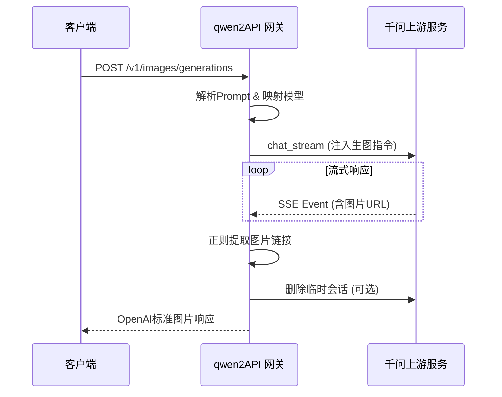
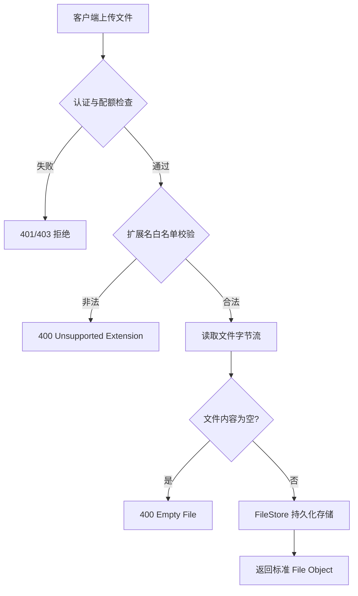

本页面向初学者开发者，详细介绍 qwen2API 网关中**图片生成**与**文件管理**两大核心非对话类接口的实现原理与使用规范。这两个模块是网关协议适配层的重要组成部分，分别负责将标准的 OpenAI 图像生成请求转换为千问（Qwen）的聊天生图模式，以及提供兼容 OpenAI 规范的文件上传与管理能力，为多模态上下文交互奠定基础。通过理解这两个接口，开发者可以掌握网关如何处理二进制数据流、如何进行跨协议语义转换以及如何管理临时资源生命周期。建议在学习本节前先阅读 [项目概览：qwen2API企业网关](1-xiang-mu-gai-lan-qwen2apiqi-ye-wang-guan)，后续可深入 [图片生成链路与意图识别](30-tu-pian-sheng-cheng-lian-lu-yu-yi-tu-shi-bie) 了解更复杂的意图路由机制。

## 图片生成接口架构与协议转换

图片生成接口（`/v1/images/generations`）并未直接调用独立的绘图 API，而是采用了一种**“以聊代画”**的协议转换策略。网关将用户的绘图 Prompt 封装为特定的系统指令，通过 `QwenClient` 发起一次特殊的聊天流式请求，诱导上游模型进入生图模式并返回包含图片 URL 的 Markdown 或 JSON 内容。这种设计使得网关无需维护额外的绘图服务鉴权体系，完全复用现有的聊天账号池与会话管理机制，实现了架构的极简统一。

在模型映射层面，网关通过 `IMAGE_MODEL_MAP` 字典将外部请求的 `dall-e-3`、`qwen-image` 等模型名称统一归一化为内部支持的 `qwen3.6-plus` 或其他配置模型。这种别名机制屏蔽了上游模型的版本差异，确保客户端代码的稳定性。当请求未指定模型时，系统自动回退至 `DEFAULT_IMAGE_MODEL`，保证了接口的健壮性。

Sources: [images.py](backend/api/images.py#L19-L28)

## 图片URL提取与响应标准化

由于上游返回的是非结构化的聊天文本，网关内置了多层防御性的正则表达式引擎 `_extract_image_urls` 来从流式事件中“打捞”图片资源。该函数依次尝试匹配 Markdown 图片语法、JSON 字段中的 URL 以及阿里云 CDN 域名特征，并对结果进行去重处理。这种多模式匹配策略有效应对了上游模型输出格式不固定的问题，确保了图片提取的高成功率。

| 提取策略 | 正则模式特征 | 适用场景 |
| :--- | :--- | :--- |
| Markdown | `` | 模型标准图文混排输出 |
| JSON Key | `"url": "..."`, `"image_url": "..."` | 结构化数据返回模式 |
| CDN 域名 | `wanx.alicdn.com`, `img.alicdn.com` | 直链引用或纯文本输出 |

最终，网关将提取到的 URL 列表截取前 `n` 个，封装为符合 OpenAI 规范的 `{"created": timestamp, "data": [{"url": ...}]}` 格式返回。若整个流程结束仍未提取到任何有效 URL，接口将抛出 500 错误，避免向客户端返回空数据导致的静默失败。

Sources: [images.py](backend/api/images.py#L31-L50)
Sources: [images.py](backend/api/images.py#L122-L129)

## 文件上传接口与安全校验

文件接口提供了 `/v1/files` 和 `/api/files/upload` 双路径支持，完全兼容 OpenAI 的文件对象规范。在接收上传请求时，网关首先通过 `resolve_auth_context` 验证用户身份与配额，随后执行严格的扩展名白名单校验 `_validate_upload`。只有存在于 `CONTEXT_ALLOWED_USER_EXTS` 配置项中的文件类型才被允许上传，这一机制从入口处阻断了可执行文件等潜在安全风险。

上传成功后，网关不仅返回标准的 `id`、`bytes`、`filename` 等元数据，还额外注入了 `content_block` 字段。该字段直接提供了可用于后续 Chat Completions 请求的 `input_file` 结构体，极大简化了前端或多模态应用的集成复杂度，开发者无需手动拼接文件引用格式。

Sources: [files_api.py](backend/api/files_api.py#L15-L23)
Sources: [files_api.py](backend/api/files_api.py#L46-L59)

## 上游文件同步与OSS直传机制

虽然本地文件接口提供了即时上传能力，但在实际的多模态对话中，文件往往需要同步至千问上游才能被模型读取。`UpstreamFileUploader` 服务承担了这一桥梁角色，它采用 **STS 临时凭证 + OSS 直传** 的高效架构。网关首先向上游申请 STS Token，获取临时的 AccessKey 和上传路径，然后利用 `oss2` SDK 将文件直接推送到阿里云 OSS，避免了文件在网关服务器的二次中转，显著降低了带宽开销与延迟。

针对网络环境的不确定性，上传器实现了智能容错逻辑。当检测到 DNS 解析失败或连接超时等特定异常时，系统会自动尝试构建区域级 Endpoint（如 `oss-cn-hangzhou.aliyuncs.com`）进行重试。此外，对于非图片类文件，上传器还会异步轮询 `/api/v2/files/parse/status` 接口，等待上游完成文档解析后才标记上传成功，确保了文件在后续对话中的可用性。

Sources: [upstream_file_uploader.py](backend/services/upstream_file_uploader.py#L92-L127)
Sources: [upstream_file_uploader.py](backend/services/upstream_file_uploader.py#L134-L144)

## 资源生命周期与自动清理

为了防止临时资源堆积，图片生成与文件接口均设计了完善的生命周期管理机制。在图片生成流程的 `finally` 块中，无论成功与否，网关都会释放占用的账号资源；若开启了 `UPSTREAM_AUTO_DELETE_ENABLED` 配置，还会异步触发 `delete_chat` 清理上游产生的临时会话。这种“即用即弃”的策略保证了账号池的高周转率，避免因生图会话残留导致的上下文污染或存储浪费。

文件删除接口同样遵循所有权校验原则，仅允许文件所有者或管理员执行删除操作。通过 `owner_token` 比对，网关确保了多租户环境下的数据隔离安全。这些细节设计体现了网关在企业级应用场景中对资源效率与安全合规的双重考量。

Sources: [images.py](backend/api/images.py#L136-L140)
Sources: [files_api.py](backend/api/files_api.py#L70-L77)

## 延伸阅读

掌握了基础的图片与文件接口后，建议按照以下路径继续深入学习：
-   了解文件上传后如何被注入到对话上下文中：[附件预处理与上下文管理](21-fu-jian-yu-chu-li-yu-shang-xia-wen-guan-li)
-   探究图片生成背后的复杂意图识别与路由逻辑：[图片生成链路与意图识别](30-tu-pian-sheng-cheng-lian-lu-yu-yi-tu-shi-bie)
-   学习账号池如何支撑高并发的生图与文件请求：[账号池：并发控制与限流冷却](10-zhang-hao-chi-bing-fa-kong-zhi-yu-xian-liu-leng-que)
-   查看完整的配置项说明以调整文件类型白名单或自动删除策略：[环境变量与配置详解](4-huan-jing-bian-liang-yu-pei-zhi-xiang-jie)